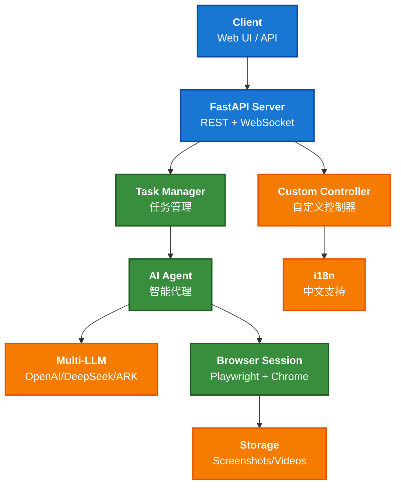

# 浏览器使用智能体  Browser Use Agent

## 应用介绍

Browser Use Agent是火山引擎函数服务（veFaaS）面向终端用户和 AI 套件开发者推出的浏览器自动化服务。仅输入检索任务，就可以由大模型分析拆解任务，调用浏览器实时搜索任务，最后整合输出任务结果。整个操作过程可以实时查看大模型的步骤规划和浏览器操作，同时支持人工介入浏览器操作，例如输入验证码、接收 Cookie、输入用户名和密码等。该服务主要支持浏览器自动化业务，并可以作为大模型本身或大模型应用扩展实时检索的工具。

## 效果预览

<video width="800" height="400" controls>
  <source src="./resources/video.mov" type="video/mp4">
</video>

## 直接体验
https://exp.volcengine.com/ai-cloud-native-agentkit

## 流程架构



## 关联模型及云产品

### 模型

|相关服务|描述|计费说明|
|---------|---------|---------|
|火山方舟大模型|详见下方|https://www.volcengine.com/docs/82379/1544106|

| 模型            | 说明 |
|-----------------|------|
| **模型资源 API Key** | 用于代码生成服务的资源 API Key。支持从当前账号下已有的 API Key 列表中选择，也可以自定义输入 API Key。获取方法，请参见 [API Key 管理](#)。<br><br>模型资源 API Key 对应的环境变量 Key（Env key）为：`ARK_API_KEY`。创建完应用后，您可以通过 `ARK_API_KEY` 查看或修改模型资源 API Key。 |
| **驱动检索模型** | 火山方舟大模型的模型 ID，如 `doubao-seed-1-6-250615`。获取方法，请参见 [获取 Model ID](#)。<br><br>驱动检索模型 对应的 Env key 为：`ARK_MODEL_ID`。创建完应用后，您可以通过 `ARK_MODEL_ID` 查看或修改 驱动检索模型。 |
| **抽取内容模型** | 用于抽取浏览器内容的火山方舟大模型的 Endpoint ID。根据实际需求选择 **预置推理接入点** 和 **自定义推理接入点**。更多说明，请参见 [通过 Endpoint ID 调用模型](#)。<br><br>抽取内容模型 对应的 Env key 为：`ARK_EXTRACT_MODEL_ID`。创建完应用后，您可以通过 `ARK_EXTRACT_MODEL_ID` 查看或修改 抽取内容模型。 |

### 云服务

| 相关服务 | 描述     | 计费说明 |
|----------|----------|----------|
| **函数计算** | 详见下方 | [函数计算计费说明](https://www.volcengine.com/docs/6662/107454) |
| **API 网关** | 详见下方 | [API 网关计费说明](https://www.volcengine.com/docs/6569/185249) |


- Browser Use Agent 后端
  - 函数服务：提供大模型驱动浏览器自动化、实时查看和操作浏览器的接口。
  - API 网关：通过 API 网关暴露接口。
- Browser Use Agent 前端
  - 函数服务：Browser Use Agent 交互控制台。
  - API 网关：通过 API 网关访问控制台。

# 环境准备
- 已开通本应用关联的所有云服务。
- IAM 用户需确保已授权 VeFaaSFullAccess、APIGFullAccess、STSAssumeRoleAccess 策略。如果缺少以上策略，请联系主账号或管理员进行授权。具体操作，请参见[创建用户并授权](https://www.volcengine.com/docs/6257/94013)。
- 已创建 Serverless 网关类型的 API 网关实例。详细操作，请参见[创建实例](https://www.volcengine.com/docs/6569/85693)。
- 首次使用函数服务，需确保已完成跨服务授权。如未授权，控制台会弹出跨服务授权页面引导您进行授权。
- Python版本要求：3.12
- [获取火山方舟 API KEY](https://www.volcengine.com/docs/82379/1298459#api-key-%E7%AD%BE%E5%90%8D%E9%89%B4%E6%9D%83)

# 快速入门

## 环境配置
- 下载代码

https://github.com/volcengine/ai-app-lab/tree/main/demohouse/vefaas-browser-use

- 虚拟环境安装

```shell
pip install virtualenv

virtualenv venv --python {your_python_execution_file}

source venv/bin/activate

pip install -r requirements.txt
```

- 环境变量设置

```shell
export ARK_API_KEY=""
export ARK_MODEL_ID=""
export ARK_EXTRACT_MODEL_ID=""
```

- 启动命令
```shell
✗ python index.py
using llm:  openai
2025-07-22 14:37:55 - INFO - no browser session endpoint provided, using local browser
INFO:     Started server process [14560]
INFO:     Waiting for application startup.
2025-07-22 14:37:55 - INFO - Stale task cleanup service started
2025-07-22 14:37:55 - INFO - Starting stale task cleanup service
INFO:     Application startup complete.
INFO:     Uvicorn running on http://0.0.0.0:8000 (Press CTRL+C to quit)
```

## 发起浏览器自动化任务

```shell
✗ curl -XPOST 127.0.0.1:8000/tasks   --header 'Content-Type: application/json' --data '{"messages":[{"role":"user","content":"visit apple.com.cn and search informatio on iPhone 16"}]}'
{"task_id":"49394edc-fc97-4ae6-a55a-e458f64a4297","status":"queued"}
```

可以查看拉起的浏览器


## [optional]查询任务执行详情

```shell
✗ curl 127.0.0.1:8000/tasks/49394edc-fc97-4ae6-a55a-e458f64a4297/stream
data: {"task_id": "49394edc-fc97-4ae6-a55a-e458f64a4297", "data": "data: {\"task_id\": \"49394edc-fc97-4ae6-a55a-e458f64a4297\", \"status\": \"started\"}\n\n"}

data: {"task_id": "49394edc-fc97-4ae6-a55a-e458f64a4297", "data": "data: {\"task_id\": \"49394edc-fc97-4ae6-a55a-e458f64a4297\", \"status\": \"browser_initialized\"}\n\n"}

data: {"task_id": "49394edc-fc97-4ae6-a55a-e458f64a4297", "data": "data: {\"task_id\": \"49394edc-fc97-4ae6-a55a-e458f64a4297\", \"status\": \"agent_initialized\"}\n\n"}

data: {"task_id": "49394edc-fc97-4ae6-a55a-e458f64a4297", "data": "data: {\"task_id\": \"49394edc-fc97-4ae6-a55a-e458f64a4297\", \"status\": \"conversation_update\", \"metadata\": {\"type\": \"message\", \"data\": {\"message\": \"开始新步骤...\"}}}\n\n"}

data: {"task_id": "49394edc-fc97-4ae6-a55a-e458f64a4297", "data": "data: {\"task_id\": \"49394edc-fc97-4ae6-a55a-e458f64a4297\", \"status\": \"conversation_update\", \"metadata\": {\"type\": \"planning_step\", \"data\": {\"step\": 1, \"goal\": \"Navigate to apple.com.cn to find the search feature and inquire about iPhone 16.\", \"memory\": \"User is interested in finding information about iPhone 16 on apple.com.cn. Planning to visit the site and use the search feature.\", \"evaluation\": \"Not applicable as this is the initial step.\", \"task_status\": \"running\", \"actions\": [{\"go_to_url\": {\"url\": \"https://www.apple.com.cn\", \"new_tab\": false}}]}}}\n\n"}

data: {"task_id": "49394edc-fc97-4ae6-a55a-e458f64a4297", "data": "data: {\"task_id\": \"49394edc-fc97-4ae6-a55a-e458f64a4297\", \"status\": \"conversation_update\", \"metadata\": {\"type\": \"message\", \"data\": {\"message\": \"执行动作 #1：{'go_to_url': {'url': 'https://www.apple.com.cn', 'new_tab': False}}\"}}}\n\n"}

data: {"task_id": "49394edc-fc97-4ae6-a55a-e458f64a4297", "data": "data: {\"task_id\": \"49394edc-fc97-4ae6-a55a-e458f64a4297\", \"status\": \"conversation_update\", \"metadata\": {\"type\": \"message\", \"data\": {\"message\": \"开始新步骤...\"}}}\n\n"}

data: {"task_id": "49394edc-fc97-4ae6-a55a-e458f64a4297", "data": "data: {\"task_id\": \"49394edc-fc97-4ae6-a55a-e458f64a4297\", \"status\": \"conversation_update\", \"metadata\": {\"type\": \"planning_step\", \"data\": {\"step\": 2, \"goal\": \"Click on the search button with index 25 to initiate the search for iPhone 16.\", \"memory\": \"Navigated to apple.com.cn successfully. Preparing to search for iPhone 16 information.\", \"evaluation\": \"Successfully navigated to the Apple China website. Verdict: Success\", \"task_status\": \"running\", \"actions\": [{\"click_element_by_index\": {\"index\": 25}}]}}}\n\n"}

data: {"task_id": "49394edc-fc97-4ae6-a55a-e458f64a4297", "data": "data: {\"task_id\": \"49394edc-fc97-4ae6-a55a-e458f64a4297\", \"status\": \"conversation_update\", \"metadata\": {\"type\": \"message\", \"data\": {\"message\": \"执行动作 #1：{'click_element_by_index': {'index': 25}}\"}}}\n\n"}

data: {"task_id": "49394edc-fc97-4ae6-a55a-e458f64a4297", "data": "data: {\"task_id\": \"49394edc-fc97-4ae6-a55a-e458f64a4297\", \"status\": \"conversation_update\", \"metadata\": {\"type\": \"message\", \"data\": {\"message\": \"开始新步骤...\"}}}\n\n"}

data: {"task_id": "49394edc-fc97-4ae6-a55a-e458f64a4297", "data": "data: {\"task_id\": \"49394edc-fc97-4ae6-a55a-e458f64a4297\", \"status\": \"conversation_update\", \"metadata\": {\"type\": \"planning_step\", \"data\": {\"step\": 3, \"goal\": \"Input 'iPhone 16' into the search field with index 30 and execute the search.\", \"memory\": \"Located the search bar on apple.com.cn to search for iPhone 16 information. Preparing to input 'iPhone 16' into the search bar.\", \"evaluation\": \"Successfully found the search input on the Apple site. Verdict: Success\", \"task_status\": \"running\", \"actions\": [{\"input_text\": {\"index\": 30, \"text\": \"iPhone 16\"}}]}}}\n\n"}

data: {"task_id": "49394edc-fc97-4ae6-a55a-e458f64a4297", "data": "data: {\"task_id\": \"49394edc-fc97-4ae6-a55a-e458f64a4297\", \"status\": \"conversation_update\", \"metadata\": {\"type\": \"message\", \"data\": {\"message\": \"执行动作 #1：{'input_text': {'index': 30, 'text': 'iPhone 16'}}\"}}}\n\n"}
```


