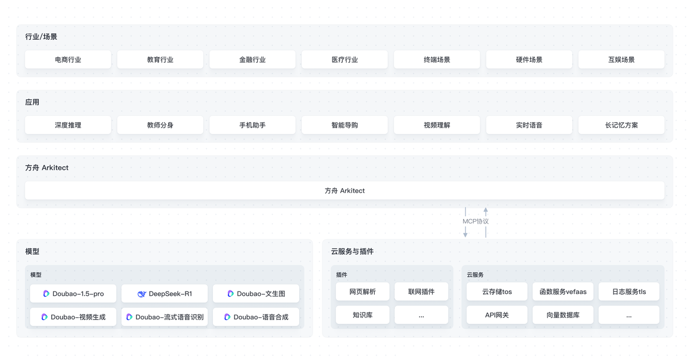

# AI App Lab

将大模型落地成真正发挥价值的场景化应用是一个复杂又极具挑战性的任务，不仅需要具备深入的行业业务背景，还需要解决模型接口调用、多种插件协同适配、多种模态（如图像、文本、语音等）深度融合交互、各类工具调用等技术难题。火山方舟推出的 AI App Lab 包含高代码 SDK Arkitect 和海量原型应用代码，助力中小企业开发者快速构建符合自身业务场景的 AI 大模型应用，打通大模型应用落地的最后一公里。  

## 架构图

## Arkitect

> https://github.com/volcengine/ai-app-lab/tree/main/arkitect  

火山方舟提供的用于开发高代码应用的 Python SDK，面向具有专业开发能力的开发者，提供开发大模型应用需要用到的工具集和流程集。更多介绍见 [高代码 SDK Arkitect](./arkitect/README.md)。  

## Demohouse

> https://github.com/volcengine/ai-app-lab/tree/main/demohouse  

从大模型可以落地的业务提效、企业经营效率提效两大场景切入，沉淀了教师分身、安卓终端、复杂问题思考等多个垂直领域的 AI 原型应用，并开源所有代码。助力中小企业“一键复制”，完成基础应用搭建，随后加入个性化的行业 Know-How 和企业内部业务逻辑，快速步入应用落地的实干阶段。  

| 应用                | 简介                                                                                     |
| ------------------- |----------------------------------------------------------------------------------------|
| [互动双语视频生成器](./demohouse/chat2cartoon/README.md)  | 只需输入一个主题，就能为你生成引人入胜且富有含义的双语视频。                                                         |
| [深度推理](./demohouse/deep_research/README.md)            | 利用 DeepSeek-R1 大模型对复杂问题进行多角度分析，并辅助互联网资料，快速生成最合适用户的解决方案。                                |
| [DeepDoubao](./demohouse/deepdoubao/README.md)      | 结合 DeepSeek R1 模型的强大推理能力与 Doubao 模型的高效对话能力，为用户提供智能问答服务。                                |
| [语音实时通话 - 青青](./demohouse/live_voice_call/README.md) | 嗨，我是你的朋友乔青青，快来和我语音通话吧！                                                                 |
| [长记忆方案](./demohouse/longterm_memory/README.md)          | 基于 DeepSeek-R1 模型的强大思考能力将对话内容抽取成记忆，记录用户偏好、性格、生日等，并在对话到相关话题时帮助 Doubao 角色模型生成更贴合角色人设的回复。 |
| [手机助手](./demohouse/pocket_pal/README.md)            | 移动端手机智能助手。                                                                             |
| [智能客服助手](./demohouse/shop_assist/backend/README.md)        | 以车载零配件网店客服场景为例设计的智能导购机器人。                                                              |
| [教师分身](./demohouse/teacher_avatar/README.md)            | 基于豆包视觉理解与 DeepSeek 深度推理双引擎的教育解决方案。                                                     |
| [视频实时理解](./demohouse/video_analyser/README.md)        | 多模态洞察，基于豆包-视觉理解模型实时视觉与语音理解。                                                            |
| [实时对话式 AI](./demohouse/rtc_conversational_ai/README.md)       | 超低延迟的 AI 实时对话应用，更流畅，更自然，更实时。                                                           |
| [AI-Media2Doc](https://github.com/hanshuaikang/AI-Media2Doc) | 一键将视频和音频转化为小红书/公众号/知识笔记/视频总结/思维导图等各种风格的文档, 可基于视频内容进行 AI 二次对话。                          |

## 相关指引

- [应用实验室体验广场](https://console.volcengine.com/ark/region:ark+cn-beijing/application)，免费体验海量 Demo  

- [创建火山方舟高代码应用](https://console.volcengine.com/ark/region:ark+cn-beijing/assistant)，快速部署你的云上智能体应用  

## License

- `./arkitect` 目录下代码遵循 [Apache 2.0](./APACHE_LICENSE) 许可.  

- `./demohouse` 目录下代码遵循[【火山方舟】原型应用软件自用许可协议](./ARK_LICENSE.md) 许可。  