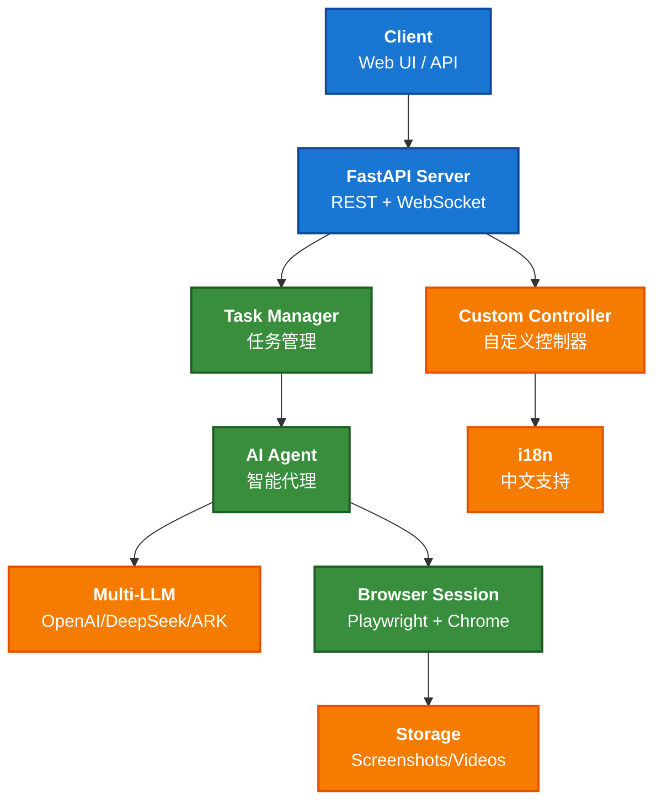

# Browser Automation Project

This project uses Playwright for browser automation, with a focus on reliable execution in Docker environments.

## Architecture / 架构图



## Setup

The project uses a Makefile to manage dependencies and operations, eliminating the need for a requirements.txt file.

### Local Development

To set up the project for local development:

```bash
pip install --upgrade git+https://github.com/browser-use/browser-use.git@main
```

Why? <https://github.com/browser-use/browser-use/issues/1066>

### Docker Setup

To build and run the project in Docker:

```bash
docker buildx build --platform linux/amd64 -t vefaas-enterprise-ap-southeast-1.cr.volces.com/zhengxi/browser-use:0.3 --push --provenance=false .   
```

Or manually:

```bash
docker build -t browser .
docker run -it -e OPENAI_API_KEY="your_openai_key" browser
```

## Makefile Commands

The Makefile provides several useful commands:

- `make install` - Install dependencies for local development
- `make install-docker` - Install dependencies optimized for Docker (used by Dockerfile)
- `make setup` - Set up the development environment
- `make run` - Run the application
- `make clean` - Clean up temporary files
- `make docker-build` - Build the Docker image
- `make docker-run` - Run the Docker container

## Troubleshooting

If you encounter dependency issues, particularly with `typing-extensions`:

1. Make sure you're using the Makefile for installation, which handles dependency order correctly
2. If manually installing, install `typing-extensions` first:

   ```
   pip install typing-extensions==4.12.2
   ```

## Browser Visibility in Docker

The project is configured to run a visible browser inside Docker:

- Uses Xvfb for a virtual display
- Screenshots are saved in the `videos/recording-*` directories
- Custom browser flags ensure proper rendering and visibility
