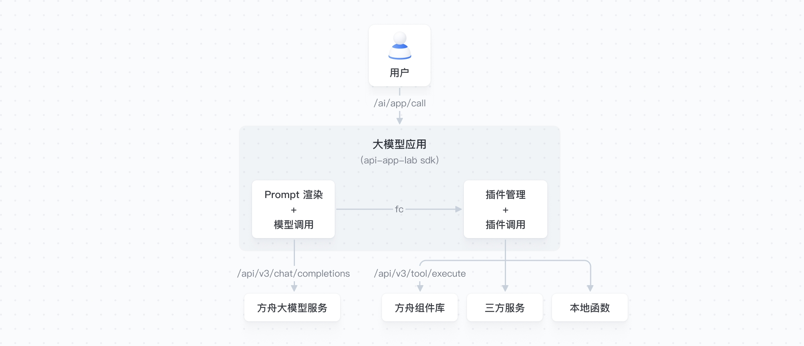

# 高代码 Python SDK Arkitect
[English](./README_en.md)

## SDK 介绍

### 概述

高代码 Python SDK Arkitect，面向具有专业开发能力的企业开发者，提供大模型应用开发需要用到的工具集和流程集。借助高代码 SDK Arkitect 和 AI 原型应用代码示例，您能够快速开发和扩展匹配您业务场景的大模型相关应用。

### 框架优势

- **高度定制化：** 提供高代码智能体应用编排方式，灵活服务客户高度定制化和自定义需求。
- **丰富优质的业务工具：** 面向企业客户提供高质量、有保障的业务工具，包括丰富的业务插件库与工具链，支持与先进的大模型进行组合串联，实现一个端到端解决问题的智能体应用。
- **一站式开发与托管服务：** 简化智能体应用部署和管理的流程，增强系统的稳定性。
- **安全可靠：** 提供方舟的安全加固实践，增强业务数据的安全性和保密性，减小数据泄漏或窃取风险。
- **AI 原型应用代码示例：** 开发者可快速上手和扩展的示例，基于示例您可以按需进行定制化开发。

### 应用场景

面向复杂的企业开发场景，搭建高定制化与自定义的智能体应用，赋能大模型在各行业场景的落地应用，实现企业智能化升级。

- **智能驾舱：** 为汽车行业用户提供车载智能交互, 包括角色扮演、聊天、联网查询（天气、视频、新闻等）、车机能力唤起等多功能的融合编排使用。
- **金融服务：** 为金融行业用户提供智能投顾、风险评估等服务，提升金融服务的效率和客户满意度。
- **电商库存管理：** 为电商行业提供高效的库存管理方案。包括商品库存管理与查询、分析与预测需求，保证供应链运营的流畅性和效率。
- **办公助理：** 支持企业客户在办公场景下文档写作、会议管理、数据分析等需求。
- **行业大模型应用：** 企业可根据业务和目标进行定制和拓展。包括但不限于泛互联网、工业、政务、交通、汽车、金融等各行业场景的大模型落地应用。

### 架构设计



## 支持特性

| 功能点                | 功能简介                                             |
| --------------------- | ---------------------------------------------------- |
| Prompt 渲染及模型调用 | 简化调用模型时，prompt渲染及模型调用结果处理的流程。 |
| 插件调用              | 支持插件本地注册、插件管理及对接FC模型自动化调用。   |
| Trace 监控            | 支持对接otel协议的trace管理及上报。                  |

## 应用列表

| 应用名称                                                 | 应用简介                                                     |
| -------------------------------------------------------- | ------------------------------------------------------------ |
| [互动双语视频生成器](../demohouse/chat2cartoon/README.md)  | 只需输入一个主题，就能为你生成引人入胜且富有含义的双语视频。                                                                                            |
| [深度推理](../demohouse/deep_research/README.md)            | 利用 DeepSeek-R1 大模型对复杂问题进行多角度分析，并辅助互联网资料，快速生成最合适用户的解决方案。                                                       |
| [DeepDoubao](../demohouse/deepdoubao/README.md)      | 结合 DeepSeek R1 模型的强大推理能力与 Doubao 模型的高效对话能力，为用户提供智能问答服务。                                                               |
| [语音实时通话 - 青青](../demohouse/live_voice_call/README.md) | 嗨，我是你的朋友乔青青，快来和我语音通话吧！                                                                                                            |
| [长记忆方案](../demohouse/longterm_memory/README.md)          | 基于 DeepSeek-R1 模型的强大思考能力将对话内容抽取成记忆，记录用户偏好、性格、生日等，并在对话到相关话题时帮助 Doubao 角色模型生成更贴合角色人设的回复。 |
| [智能客服助手](../demohouse/shop_assist/backend/README.md)        | 以车载零配件网店客服场景为例设计的智能导购机器人。                                                                                                      |
| [视频实时理解](../demohouse/video_analyser/README.md)        | 多模态洞察，基于豆包-视觉理解模型实时视觉与语音理解。                                                                                                   |
| [实时对话式 AI](../demohouse/rtc_conversational_ai/README.md)       | 超低延迟的 AI 实时对话应用，更流畅，更自然，更实时。                                                                                                    |


## 快速入门

### 基础聊天

1. 安装 arkitect

   ```bash
   pip install arkitect --index-url https://pypi.org/simple
   ```

2. 登录[方舟控制台](https://console.volcengine.com/ark/region:ark+cn-beijing/endpoint?projectName=default)，创建一个推理接入点（Endpoint），推荐使用Doubao-pro-32k [参考文档](https://www.volcengine.com/docs/82379/1399008#_2-%E5%88%9B%E5%BB%BA%E5%9C%A8%E7%BA%BF%E6%8E%A8%E7%90%86%E6%8E%A5%E5%85%A5%E7%82%B9%EF%BC%88endpoint%EF%BC%89)

3. 登录[方舟控制台](https://console.volcengine.com/ark/region:ark+cn-beijing/endpoint?projectName=default)，创建一个 API KEY [参考文档](https://www.volcengine.com/docs/82379/1399008#_1-%E8%8E%B7%E5%8F%96%E5%B9%B6%E9%85%8D%E7%BD%AE-api-key)

4. 创建`main.py`，修改文件中的 endpoint_id 为您新创建的推理接入点 ID。

```python
"""
默认llm逻辑
"""
import os
from typing import AsyncIterable, Union

from arkitect.core.component.context.context import Context

from arkitect.types.llm.model import (
    ArkChatCompletionChunk,
    ArkChatParameters,
    ArkChatRequest,
    ArkChatResponse,
    Response,
)
from arkitect.launcher.local.serve import launch_serve
from arkitect.telemetry.trace import task


@task()
async def default_model_calling(
    request: ArkChatRequest,
) -> AsyncIterable[Union[ArkChatCompletionChunk, ArkChatResponse]]:
    parameters = ArkChatParameters(**request.__dict__)
    ctx = Context(model="doubao-1.5-pro-32k-250115", parameters=parameters)
    await ctx.init()
    messages = [
        {"role": message.role, "content": message.content}
        for message in request.messages
    ]
    resp = await ctx.completions.create(messages=messages, stream=request.stream)
    if request.stream:
        async for chunk in resp:
            yield chunk
    else:
        yield resp


@task()
async def main(request: ArkChatRequest) -> AsyncIterable[Response]:
    async for resp in default_model_calling(request):
        yield resp

if __name__ == "__main__":
    port = os.getenv("_FAAS_RUNTIME_PORT")
    launch_serve(
        package_path="main",
        port=int(port) if port else 8080,
        health_check_path="/v1/ping",
        endpoint_path="/api/v3/bots/chat/completions",
        clients={},
    )

```

5. 设置 APIKEY 并启动后端

```bash
export ARK_API_KEY=<YOUR APIKEY>
python3 main.py
```

6. 发起请求

```shell
curl --location 'http://localhost:8080/api/v3/bots/chat/completions' \
--header 'Content-Type: application/json' \
--data '{
    "model": "my-bot",
    "messages": [
        {
            "role": "user",
            "content": "介绍你自己啊"
        }
    ]
}'
```

预期返回如下：

```json
{
    "error": null,
    "id": "02173*************************************",
    "choices": [
        {
            "finish_reason": "stop",
            "moderation_hit_type": null,
            "index": 0,
            "logprobs": null,
            "message": {
                "content": "我是豆包，由字节跳动公司开发。我能陪你谈天说地，无论是解答各种知识疑问，比如科学原理、历史事件；还是探讨文化艺术、娱乐八卦；亦或是在生活问题上给你提供建议和思路，像制定旅行计划、规划健身安排、分享美食烹饪方法等，我都很在行。随时都可以和我交流，我时刻准备着为你排忧解难、畅聊想法！  ",
                "role": "assistant",
                "function_call": null,
                "tool_calls": null,
                "audio": null
            }
        }
    ],
    "created": 1736847939,
    "model": "doubao-pro-32k-241215",
    "object": "chat.completion",
    "usage": {
        "completion_tokens": 95,
        "prompt_tokens": 12,
        "total_tokens": 107,
        "prompt_tokens_details": {
            "cached_tokens": 0
        }
    },
    "metadata": null
}
```

### 工具调用（Function Calling）

1. 安装 arkitect

   ```bash
   pip install arkitect --index-url https://pypi.org/simple
   ```

2. 登录[方舟控制台](https://console.volcengine.com/ark/region:ark+cn-beijing/endpoint?projectName=default)，创建一个推理接入点（Endpoint），请选择带 Function-call 能力的模型，推荐使用doubao-pro-32k functioncall-241028 [参考文档](https://www.volcengine.com/docs/82379/1399008#_2-%E5%88%9B%E5%BB%BA%E5%9C%A8%E7%BA%BF%E6%8E%A8%E7%90%86%E6%8E%A5%E5%85%A5%E7%82%B9%EF%BC%88endpoint%EF%BC%89)

3. 登录[方舟控制台](https://console.volcengine.com/ark/region:ark+cn-beijing/endpoint?projectName=default)，创建一个 API KEY [参考文档](https://www.volcengine.com/docs/82379/1399008#_1-%E8%8E%B7%E5%8F%96%E5%B9%B6%E9%85%8D%E7%BD%AE-api-key)

4. 创建`main.py`，修改文件中的 endpoint_id 为您新创建的推理接入点 ID。

```python
"""
fc+llm
"""

import os
from typing import AsyncIterable, Union

from arkitect.core.component.context.context import Context

from arkitect.core.component.context.model import ToolChunk
from arkitect.types.llm.model import (
    ArkChatCompletionChunk,
    ArkChatParameters,
    ArkChatRequest,
    ArkChatResponse,
    Response,
)
from arkitect.launcher.local.serve import launch_serve
from arkitect.telemetry.trace import task


# you can define your own methods here and let LLM use as tools
def adder(a: int, b: int) -> int:
    """Add two integer numbers

    Args:
        a (int): first number
        b (int): second number

    Returns:
        int: sum result
    """
    print("calling adder")
    return a + b


@task()
async def default_model_calling(
    request: ArkChatRequest,
) -> AsyncIterable[Union[ArkChatCompletionChunk, ArkChatResponse]]:
    parameters = ArkChatParameters(**request.__dict__)
    ctx = Context(
        model="deepseek-v3-241226",
        tools=[adder],
        parameters=parameters,
    )
    await ctx.init()
    messages = [
        {"role": message.role, "content": message.content}
        for message in request.messages
    ]
    resp = await ctx.completions.create(messages=messages, stream=request.stream)
    if request.stream:
        async for chunk in resp:
            if isinstance(chunk, ToolChunk):
                continue
            yield chunk
    else:
        yield resp


@task()
async def main(request: ArkChatRequest) -> AsyncIterable[Response]:
    async for resp in default_model_calling(request):
        yield resp


if __name__ == "__main__":
    port = os.getenv("_FAAS_RUNTIME_PORT")
    launch_serve(
        package_path="main",
        port=int(port) if port else 8080,
        health_check_path="/v1/ping",
        endpoint_path="/api/v3/bots/chat/completions",
        clients={},
    )

```

5. 设置 APIKEY 并启动后端

```bash
export ARK_API_KEY=<YOUR APIKEY>
python3 main.py
```

6. 发起请求

- [创建火山方舟高代码应用](https://console.volcengine.com/ark/region:ark+cn-beijing/assistant)，快速部署你的云上智能体应用  

预期返回如下：

- `./arkitect` 目录下代码遵循 [Apache 2.0](./APACHE_LICENSE) 许可.  

## 常见问题

### arkitect 和 volcenginesdkarkruntime 的区别?

- arkitect 是方舟高代码智能体 SDK，面向具有专业开发能力的企业开发者，提供智能体开发需要用到的工具集和流程集。
- volcenginesdkarkruntime 是对方舟的 API 进行封装，方便用户通过 API 创建、管理和调用大模型相关服务。

## LICENSE说明
- ```./arkitect``` 目录下代码遵循 [Apache 2.0](./APACHE_LICENSE) 许可.
- ```./demohouse``` 目录下代码遵循[【火山方舟】原型应用软件自用许可协议](ARK_LICENSE.md) 许可。