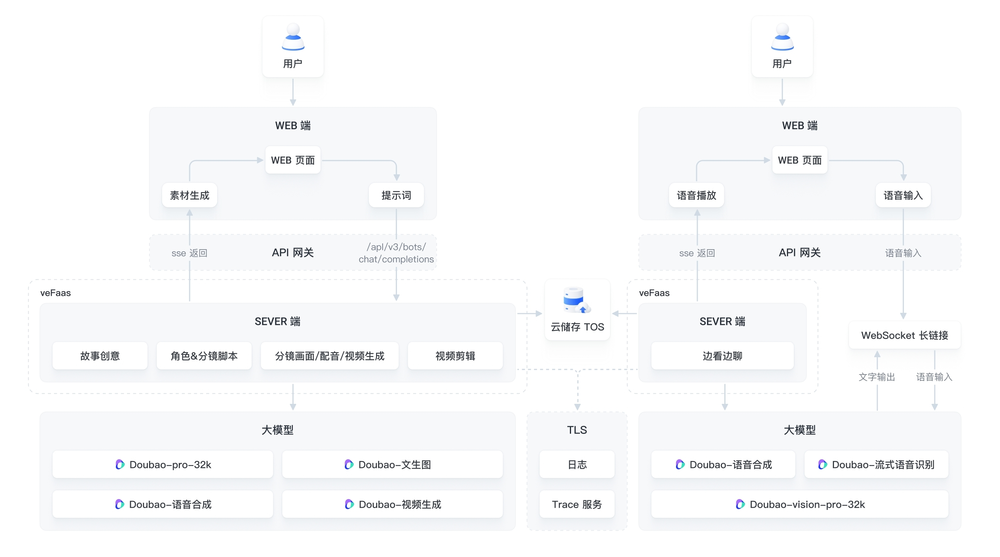
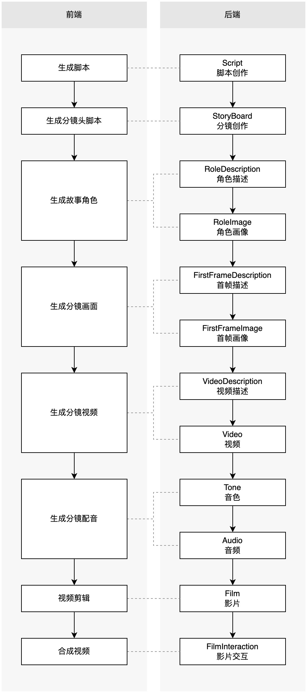
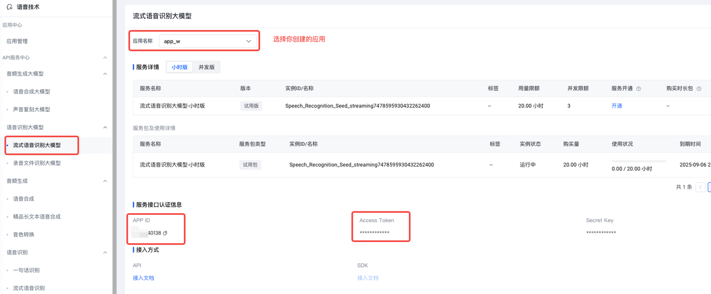

# 互动双语视频生成器 Chat2Cartoon

## 应用介绍

这是一款专门为内容素材创作打造的创新工具。它能够根据用户输入的主题，快速生成富有寓意的双语视频。体验者也可以进行例如修改 prompt、挑选图片/视频来干预最终视频效果。为体验者提供丰富多彩、富有教育意义的视听体验，在快乐中学习和成长。


### 效果预览
[视频地址](https://portal.volccdn.com/obj/volcfe/cloud-universal-doc/upload_252b008a6db53cc49c9d6cd8c1b74a2a.mp4)

### 直接体验
[控制台体验](https://console.volcengine.com/ark/region:ark+cn-beijing/application/detail?id=bot-20241211162948-5l2kk-procode-preset)

### 优势
- 便捷高效的长视频生成：具备一键生成分钟级视频的强大功能，操作流程极简，用户无需复杂设置，仅需输入需求轻松一点，即可快速获得满足需求的长视频作品，极大提升创作效率。
- 高质量的视频产出：运用最新豆包大模型确保生成视频的高质量，画面清晰流畅、故事引人入胜，寓意深刻的内容搭配精良制作，无论是视觉享受还是内涵深度都全方位满足用户的要求。
- 教育领域的创新赋能：依托先进大模型实现教育领域的深度落地，将双语教育与动画完美融合。

### 相关模型

- Doubao-pro-32k：根据用户的主题需求，生成故事大纲与分镜脚本，并提供角色设定、首帧图、视频、音频等素材的创作提示词。
- Doubao-文生图：根据提示词描述创作具体的故事角色和分镜画面。
- Doubao-语音合成：根据分镜台词及角色特点所匹配音色等创作提示词，生成配音文件。
- Doubao-视频生成：根据分镜首帧图及创作提示词，生成分镜动画视频。
- Doubao-vision-pro-32k：在充分理解当前视频动画画面和故事情节的基础上，针对用户提问提供精准回答。
- Doubao-流式语音识别：将用户的语音提问转写为文本，以便于视觉大模型对用户问题的理解与回复。

### 流程架构

后端服务可以本地启动，也可以部署到火山引擎函数服务。

## 环境准备

- Python 版本要求大于等于 3.8，小于 3.12
- Poetry 1.6.1 版本 [参考文档](https://python-poetry.org/docs/#installing-with-the-official-installer)
- Node 版本要求大于等于 16.2.0
- 获取语音技术产品的 APP ID 和 Access Token，获取方式参见【附录】
- 火山方舟 API KEY [参考文档](https://www.volcengine.com/docs/82379/1298459#api-key-%E7%AD%BE%E5%90%8D%E9%89%B4%E6%9D%83)
- 火山引擎 AK SK [参考文档](https://www.volcengine.com/docs/6291/65568)
- 火山 TOS 桶 [参考文档](https://www.volcengine.com/docs/6349/74830)
- 火山 TOS 桶配置跨域 [参考文档](https://www.volcengine.com/docs/6349/75033)
- 火山方舟文本生成模型，视觉理解模型和视频生成模型接入点 [参考文档](https://www.volcengine.com/docs/82379/1099522)

## 快速开始

本文为您介绍如何在本地快速部署 Chat2Cartoon 项目。

1. 下载代码库

   ```bash
   git clone https://github.com/volcengine/ai-app-lab.git
   cd demohouse/chat2cartoon
   ```
   
2. 修改 `backend/.env` 中配置，填入各配置变量的值

   | 配置变量名               | 说明                                    |
   |:--------------------|:--------------------------------------|
   | TTS_ACCESS_TOKEN      | 语音合成模型 Access Token                  |
   | TTS_APP_ID         | 语音合成模型 APP ID                          |
   | ARK_API_KEY         | 火山方舟 API Key，用于方舟模型接入点推理时做鉴权          |
   | VOLC_ACCESSKEY     | 火山引擎账号 Access Key，用于访问 TOS API，上载模型产物 |
   | VOLC_SECRETKEY     | 火山引擎账号 Secret Key，用于访问 TOS API，上载模型产物 |
   | TOS_BUCKET          | 指定生视频模型和配音模型产物的 TOS 储存桶名              |
   | LLM_ENDPOINT_ID     | 脚本创作，分镜，角色和视频描述，调用的大模型接入点 ID          |
   | VLM_ENDPOINT_ID     | 最终视频影片交互，调用的视觉理解大模型接入点 ID             |
   | CGT_ENDPOINT_ID     | 生视频大模型接入点 ID（暂时只支持 Doubao-视频生成模型）     |

    > LLM_ENDPOINT_ID 必须使用 Doubao-pro-32k 的接入点，否则项目效果会不稳定。

3. 安装项目的 python 依赖

   ```bash
   cd demohouse/chat2cartoon/backend

   python -m venv .venv
   source .venv/bin/activate
   pip install poetry==1.6.1

   poetry install
   ```

4. 启动后端服务

   ```bash
   poetry run python index.py
   ```

5. 启动前端服务
   ```bash
   cd demohouse/chat2cartoon/frontend
   npm install -g pnpm@8
   pnpm install
   cp ../.env ./
   pnpm dev
   ```

6. 给设置的 TOS 桶配置跨域，允许本地浏览器访问 TOS 桶上媒体资源

7. 访问 `http://localhost:8080` 即可体验。

## 目录结构
```
├── README.md
├── Makefile              # 安装依赖/执行单测脚本
├── .env                  # 环境变量（API Key, AKSK, 资源ID 等）
├── index.py              # 入口脚本
├── app
│   ├── __init__.py
│   ├── clients
│   │   ├── __init__.py
│   │   ├── downloader.py       # 下载生视频API返回的视频链接内容
│   │   ├── llm.py              # 访问语言大模型
│   │   ├── t2i.py              # 访问文生图API
│   │   ├── tos.py              # 访问TOS，上载视频和配音文件
│   │   └── vlm.py              # 访问视VLM大模型
│   ├── generators
│   │   ├── phases          # 各后端状态生成逻辑
│   │   ├── __init__.py
│   │   ├── phase.py        # 判断状态次序和解析各状态的请求内容
│   │   ├── factory.py
│   │   └── base.py
│   ├── models                  # pydantic 数据结构
│   ├── constants.py            # 固定值和解析 .env 文件里设置的环境变量
│   ├── message_utils.py
│   ├── mode.py  
│   └── output_parsers.py
├── lib         # 媒体文件
│   ├── background_music.mp3    # 视频背景音乐
│   └── DouyinSansBold.otf      # 字幕font
├── poetry.lock
├── pyproject.toml      # 项目依赖包管理
└── tests               # 单元测试/集成测试/e2e测试
    ├── assets        # 单测样本
    ├── e2e_tests     # 集成测试
    └── unit_tests    # 单元测试

```

## 技术实现

### 流程状态机


前后端的互动仍然是基于一连串的 http `/api/v3/bots/chat/completions` 请求，和 SSE 流式返回。
为了实现整体生成视频的流程，前端会把会议记录和当前流程阶段保存在浏览器本地。

#### 消息结构

前端发给后端的请求就类似一个典型的 LLM chat 请求，每次对话都带上所有的历史对话， 最后一个 `message` 则是当前最新的请求内容。
在正常无需重新生成媒体产物的场景，后端会按照历史对话解析当前的流程状态是什么，和判断下一个状态/步骤是什么，且执行下一个生成逻辑。
前端则需要在每次新请求的 `message` 内容里携带下一个生成逻辑需要的信息。每个步骤需要的信息如下：

| Phase                 | 前端步骤 | 需要的信息（message.content） | 组件依赖   |
|:----------------------|------|:---------------|--------|
| Script                | 脚本创建 | 故事主题           | 语言大模型  |
| StoryBoard            | 分镜创建 | 故事脚本           | 语言大模型  |
| RoleDescription       | 角色描述 | 故事脚本和分镜        | 语言大模型  |
| RoleImage             | 角色画像 | 角色描述           | 文生图模型  |
| FirstFrameDescription | 首帧描述 | 故事脚本，分镜和角色描述   | 语言大模型  |
| FirstFrameImage       | 首帧画像 | 首帧描述           | 文生图模型  |
| VideoDescription      | 视频描述 | 故事脚本，分镜和角色描述   | 语言大模型  |
| Video                 | 视频   | 首帧画像和视频描述      | 生视频模型  |
| Tone                  | 音色和对话 | 故事分镜           | 语言大模型  |
| Audio                 | 音频   | 音色和对话          | 语音技术   |
| Film                  | 影片   | 音频，对话和视频       | FFMPEG |

##### `user` 消息
user 请求的 `content` 格式都按照：`{模式} {内容}`
- 前缀：模式（Mode）
    - CONFIRMATION：确认进入到下一步
    - REGENERATION：对当前步骤或前序步骤进行修改
- 内容：完整状态的 JSON text 完整状态由前端维护，保存下来当前对话中的脚本信息（storyboards），视频信息（videos）， 
       音频信息（audios）等。在下一步需要时通过 `user` 消息传入。JSON 内容的格式可以参考 [app/models](./app/models) 目录里的代码。如果模式是 REGENERATION，内容需要加上 `phase={状态}` 
       的前缀来指定要重新生成的 Phase 产物，例如：`"REGENERATION phase=RoleImage {"role_descriptions":"「N个角色，角色描述」"}"`

##### `assistant` 消息
assistant 返回的 `content` 格式都按照：`phase={状态} {内容}`
- 前缀：`phase={状态}`，状态包括上述状态机中的 Phase 枚举值
- 内容：内容包括文本内容，例如 Script、StoryBoard 阶段由语言大模型返回的完整文本，或者 JSON text 内容，如 Video 阶段
       返回的数个 ContentGenerationTask 的 ID、 Audio 阶段返回的数个由语音技术模型返回的语音片段链接

一个完整的请求示如下：
```json
{
  "Messages": [
    {
      "content": "写个龟兔赛跑的故事",
      "role": "user"
    },
    {
      "content": "phase=Script\n\n「故事脚本。。。」",
      "role": "assistant"
    },
    {
      "content": "生成分镜脚本",
      "role": "user"
    },
    {
      "content": "phase=StoryBoard\n「N个分镜，角色，画面，中文台词，英文台词」",
      "role": "assistant"
    },
    {
      "content": "开始生成视频",
      "role": "user"
    },
    {
      "content": "phase=RoleDescription\n「N个角色，角色描述」",
      "role": "assistant"
    },
    {
      "content": "CONFIRMATION {\"role_descriptions\":\"「N个角色，角色描述」\"}",
      "role": "user"
    },
    {
      "content": "phase=RoleImage\n\n{\"role_images\": [{\"index\": 0, \"images\": [\"https://example-cloud-store.com/sample-image0.jpg\"]}]}\n\n",
      "role": "assistant"
    },
    {
      "content": "CONFIRMATION {\"script\":\"「故事脚本。。。」\",\"storyboards\":\"「N个分镜，角色，画面，中文台词，因为台词」\",\"role_descriptions\":\"「N个角色，角色描述」\"}",
      "role": "user"
    },
    {
      "content": "phase=FirstFrameDescription\n「N个分镜，角色，首帧描述」",
      "role": "assistant"
    },
    {
      "content": "CONFIRMATION {\"first_frame_descriptions\":\"「N个分镜，角色，首帧描述」\"}",
      "role": "user"
    },
    {
      "content": "phase=FirstFrameImage\n\n{\"first_frame_images\": [{\"index\": 0, \"images\": [\"https://example-cloud-store.com/sample-image0.jpg\"]}]}\n\n",
      "role": "assistant"
    },
    {
      "content": "CONFIRMATION {\"script\":\"「故事脚本。。。」\",\"storyboards\":\"「N个分镜，角色，画面，中文台词，英文台词」\",\"role_descriptions\":\"「N个角色，角色描述」\",\"first_frame_descriptions\":\"「N个分镜，角色，首帧描述」\"}",
      "role": "user"
    },
    {
      "content": "phase=VideoDescription\n「N个视频，角色，描述」",
      "role": "assistant"
    },
    {
      "content": "CONFIRMATION {\"video_descriptions\":\"「N个视频，角色，描述」\",\"first_frame_images\": [{\"index\": 0, \"images\": [\"https://example-cloud-store.com/sample-image0.jpg\"]}]}",
      "role": "user"
    },
    {
      "content": "phase=Video\n\n{\"videos\": [{\"index\": 0, \"video_gen_task_id\": \"cgt-xxxxxxxxxxxxxx-xxxxx\", \"video_data\": null}]}\n\n",
      "role": "assistant"
    },
    {
      "content": "CONFIRMATION {\"storyboards\":\"「N个分镜，角色，画面，中文台词，英文台词」\"}",
      "role": "user"
    },
    {
      "content": "phase=Tone\n\n{\"tones\": [{\"index\": 0, \"line\": \"「中文台词」\", \"line_en\": \"「英文台词」\", \"tone\": \"zh_female_shaoergushi_mars_bigtts\"}]}",
      "role": "assistant"
    },
    {
      "content": "CONFIRMATION {\"tones\": [{\"index\": 0, \"line\": \"「中文台词」\", \"line_en\": \"「英文台词」\", \"tone\": \"zh_female_shaoergushi_mars_bigtts\"}]}",
      "role": "user"
    },
    {
      "content": "phase=Audio\n\n{\"audios\": [{\"index\": 0, \"url\": \"https://tos-bucket.tos.cn-beijing.volces.com/request_id/sample-audio0.mp3\", \"audio_data\": null}]}\n\n",
      "role": "assistant"
    },
    {
      "content": "CONFIRMATION {\"storyboards\":\"「N个分镜，角色，画面，中文台词，英文台词」\",\"videos\":[{\"index\": 0, \"video_gen_task_id\": \"cgt-xxxxxxxxxxxxxx-xxxxx\", \"video_data\": null}],\"audios\":[{\"index\": 0, \"url\": \"https://tos-bucket.tos.cn-beijing.volces.com/request_id/sample-audio0.mp3\", \"audio_data\": null}]}",
      "role": "user"
    }
  ]
}
```

## 附录

### 获取 TTS_APP_ID、TTS_ACCESS_TOKEN、ASR_APP_ID、ASR_ACCESS_TOKEN？

1. [完成企业认证](https://console.volcengine.com/user/authentication/detail/)

2. [开通语音技术产品](https://console.volcengine.com/speech/app)

3. [创建应用](https://console.volcengine.com/speech/app)，同时勾选大模型语音合成和流式语音识别大模型
    

4. 开通语音合成大模型，确保页面具有音色。注意：语音合成大模型从开通到可以使用有大概5-10分钟延迟
   
   

5. 流式语音识别大模型有试用包，可以不开通。如需提供稳定服务，建议开通正式版本。
   

6. 获取TTS_APP_ID 和TTS_ACCESS_TOKEN
   

7. 获取ASR_APP_ID、ASR_ACCESS_TOKEN
   
