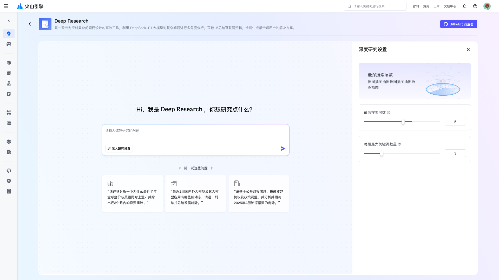
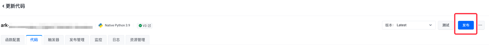
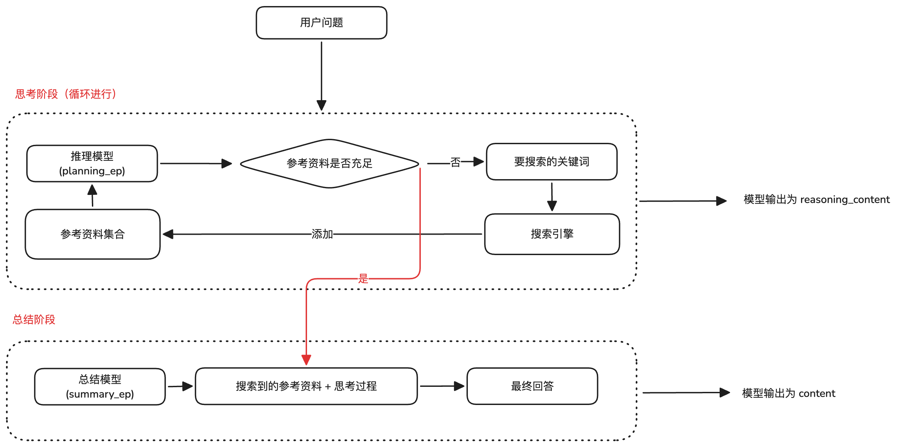

# 深度推理 Deep Research

## 应用介绍

Deep Research 是一款专为应对复杂问题而设计的高效工具，利用 DeepSeek-R1 大模型对复杂问题进行多角度分析，并辅助互联网资料，快速生成最合适用户的解决方案。
无论是在学术研究、企业决策还是产品调研中，Deep Research 都能够有效地协助用户深入挖掘，提出切实可行的解决策略。



## 费用说明

- 推理总结模型计费

  - DeepSeek-R1 大模型：开通赠送500,000 tokens <a href="https://www.volcengine.com/docs/82379/1399514" target="_blank">免费额度</a>，超过部分按 token 使用量付费，详见 <a href="https://www.volcengine.com/docs/82379/1099320#%E5%A4%A7%E8%AF%AD%E8%A8%80%E6%A8%A1%E5%9E%8B" target="_blank">计费说明</a>

  
- 联网搜索服务计费，您可自由选择使用的联网搜索服务

  - 选择一：使用火山方舟零代码联网应用作为搜索引擎，计费项如下
  
    - Doubao-pro-32k/Doubao-1.5-pro-32k，开通赠送500,000 tokens <a href="https://www.volcengine.com/docs/82379/1399514" target="_blank">免费额度</a>，超过部分按 token 使用量付费，价格详见 <a href="https://www.volcengine.com/docs/82379/1099320#%E5%A4%A7%E8%AF%AD%E8%A8%80%E6%A8%A1%E5%9E%8B" target="_blank" >计费说明</a>
    
    - 联网内容插件，价格详见 <a target="_blank" href="https://www.volcengine.com/docs/82379/1338550">计费说明</a>
    
  - 选择二：使用开源搜索引擎 Tavily，由 Tavily 官方进行收费，计费规则详见 <a href="https://tavily.com/#pricing" target="_blank">计费说明</a>
  
  - 选择三：其他 Search API 或者企业内部 Search 接口，火山方舟侧不收取费用

## 环境准备

- Python - 版本要求大于等于 3.9.0，小于 3.12
- Poetry 1.6.1 版本，可参考以下命令安装

  ```
  pip install poetry==1.6.1
  ```

- <a target="_blank" href="https://console.volcengine.com/ark/region:ark+cn-beijing/apiKey">获取火山方舟 API KEY</a> | <a target="_blank" href="https://www.volcengine.com/docs/82379/1298459#api-key-%E7%AD%BE%E5%90%8D%E9%89%B4%E6%9D%83">参考文档</a>
- 在<a target="_blank" href="https://console.volcengine.com/ark/region:ark+cn-beijing/openManagement?LLM=%7B%7D&OpenTokenDrawer=false">开通管理页</a>开通 DeepSeek-R1 模型。
- （可选）如果通过火山方舟高代码应用部署本demo，<a target="_blank" href="https://console.volcengine.com/iam/keymanage/">需获取火山引擎 AK SK</a> | <a target="_blank" href="https://www.volcengine.com/docs/6291/65568"> 参考文档 </a>
- 搜索引擎选择：以下方式任选其一
  - 使用火山方舟零代码联网应用作为搜索引擎，推荐配置参见【附录】，操作步骤详情见 <a target="_blank" href="https://www.volcengine.com/docs/82379/1267885">参考文档</a>
  - 使用开源搜索引擎 Tavily，需获取 Tavily APIKEY <a target="_blank" href="https://docs.tavily.com/guides/quickstart"> 参考文档 </a>

## 快速入门

本文为您介绍如何在本地以及利用火山方舟高代码应用快速部署 Deep Research 项目，本项目可以通过以下两种方式进行部署：

| **方式**      | **说明**                  | **适用场景**                  |
|-------------|-------------------------|---------------------------|
| 本地部署运行     | 本地启动服务和webui      | 本地测试和局域网内部署API服务            |
| 部署火山方舟高代码应用 | 使用火山方舟高代码应用方式托管部署       | 低成本快速实现云端API服务部署 + 对话界面体验 |


### 方式一：本地部署运行

1. 下载代码库

    ```shell
    git clone https://github.com/volcengine/ai-app-lab.git
    cd demohouse/deep_research
    ```

2. 设置环境变量

   - 如果使用火山方舟零代码联网应用作为搜索引擎，需要设置如下环境变量

     ```shell
     # 填写火山方舟API KEY
     export ARK_API_KEY=xxx-xxxx-xxx-xxx
    
     # 思考模型名称，填写deepseek-r1-250120
     export REASONING_MODEL=deepseek-r1-250120
    
     # 设置使用火山方舟零代码联网应用作为搜索引擎
     export SEARCH_ENGINE=volc_bot
    
     # 配置火山方舟零代码联网应用的bot id
     export SEARCH_BOT_ID=bot-xxxxxx-xx
     ```

   - 如果使用 tavily 作为搜索引擎，需要设置如下环境变量

     ```shell
     # 填写火山方舟API KEY
     export ARK_API_KEY=xxx-xxxx-xxx-xxx
     
     # 思考模型名称，填写deepseek-r1-250120
     export REASONING_MODEL=deepseek-r1-250120
     
     # 设置使用tavily作为搜索引擎
     export SEARCH_ENGINE=tavily
     
     # 配置tavily的APIKEY
     export TAVILY_API_KEY=xxx-xxx-xxx-xxx
     ```

3. 安装项目依赖并运行

    > 说明
    >
    > 默认在 localhost:8888 提供符合 openAI 规范的 chatAPI 服务

    ```shell
    python -m venv .venv
    source .venv/bin/activate
        
    poetry install
    poetry run python -m server
    ```

4. 启动webui

    ```shell
    # 需要先设置连接本地服务器
    export API_ADDR=http://localhost:8888/api/v3/bots
    
    python -m venv .venv
    source .venv/bin/activate
    poetry install
    
    # 启动web ui
    poetry run python -m webui
    ```
5. 使用浏览器访问 `http://localhost:7860/` 即可使用

    

### 方式二：部署火山方舟高代码应用

1. 在<a href="https://console.volcengine.com/ark/region:ark+cn-beijing/assistant" target="_blank">火山方舟控制台</a>创建高代码应用 | <a target="_blank" href="https://www.volcengine.com/docs/82379/1333715">参考文档</a>，完成首次部署后点击【更新代码】进入函数详情页面

    

2. 在本地下载代码包

    ```shell
    git clone https://github.com/volcengine/ai-app-lab.git
    cd demohouse/deep_research
    ```

3. 打包本地代码为 `code.zip`

    ```shell
    cd demohouse/deep_research
    zip -r code.zip *
    ```

4. 上传`code.zip`，更新高代码应用的代码

5. 执行【安装依赖】

   

6. 在【函数配置】中按需调整环境变量：

   - 如果使用火山方舟零代码联网应用作为搜索引擎，需要设置如下环境变量
     - `ARK_API_KEY`: 填写环境准备章节获取的火山方舟API KEY
     - `REASONING_MODEL`: 填写`deepseek-r1-250120`
     - `SEARCH_ENGINE`: 填写`volc_bot`
     - `SEARCH_BOT_ID`: 填写火山方舟零代码联网应用的 bot id（可参考附录获取）
   - 如果使用 tavily 作为搜索引擎，需要设置如下环境变量
     - `ARK_API_KEY`: 填写环境准备章节获取的火山方舟API KEY
     - `REASONING_EP_ID`: 填写`deepseek-r1-250120`
     - `SEARCH_ENGINE`: 填写`tavily`
     - `TAVILY_API_KEY`: 配置tavily的APIKEY

   

7. （建议）在【函数配置】中调整函数执行超时时间为 900 s

    

8. 单击右上角【发布】，重新发布应用

   

9. 应用发布完成后，支持通过以下两种方式使用：

   - 通过高代码应用的控制台界面直接体验

     

   - 在本地通过 webui 体验

     1. 执行以下命令，在本地启动 webui，并连接远程服务。

       ```shell
       cd demohouse/deep_research
       # 安装项目依赖
       poetry install
       # 设置环境变量为前面步骤中的高代码应用botID
       export API_BOT_ID=bot-xxxx-xxx
       # 运行webui
       poetry run python -m webui
       ```
     2. 启动成功后可访问`http://localhost:7860`体验服务。
   
     

## 技术实现

本项目结合深度思考大模型和联网搜索能力，并向上封装成标准的 Chat Completion API Server。



在接收到用户的原始问题后，会进行两个阶段的处理：

1. **思考阶段（循环进行）**

   DeepSeek-R1 根据用户问题不断地使用搜索引擎，获取参考资料，直至模型认为收集到的参考资料已经足够解决用户问题。


2. **总结阶段**

   DeepSeek-R1 根据上一阶段产出的所有参考资料和思考过程中的模型输出，对用户的问题进行总结性回答。

   其中，思考阶段的模型输出会整合至`reasoning_content`字段中，总结阶段的模型输出会整合至`content`字段中。该架构严格遵循
   OpenAI
   Chat Completion API 规范设计，因此开发者可直接使用 OpenAI 标准 SDK 或兼容接口实现服务的无缝对接，显著降低了技术集成的复杂度。

## 目录结构

```
├── README.md
├── __init__.py
├── config.py
├── deep_research.py # 项目核心逻辑实现
├── docs
├── poetry.lock
├── prompt.py # 思考/总结 prompt
├── pyproject.toml
├── requirements.txt
├── run.sh # 用于部署火山方舟高代码应用，启动入口
├── search_engine
│   ├── __init__.py
│   ├── search_engine.py
│   ├── tavily.py # tavily 搜索引擎实现
│   └── volc_bot.py # 火山方舟零代码联网应用 搜索引擎实现
├── server.py # 服务启动入口
├── utils.py
└── webui.py # webui启动入口
```

## 附录

### 创建推荐配置的零代码联网应用

<a target="_blank" href="https://console.volcengine.com/ark/region:ark+cn-beijing/assistant">创建零代码应用</a>时，推荐以下配置：

- 推理接入点：Doubao-pro-32k / Doubao-pro-1.5-32k
- 联网内容插件：开启
  - 智能改写：关闭
  - 调用方式：选择强制开启
  - 参考资料回复：选择自定义回复，推荐回复示例如下：

```
- 不需要回复用户的问题，仅对「联网」中的信息进行总结，总结需要全面，但不要添加自己额外的信息。
- 回复请使用清晰、结构化（序号/分段等）的语言，确保可被用户理解和使用。
```

