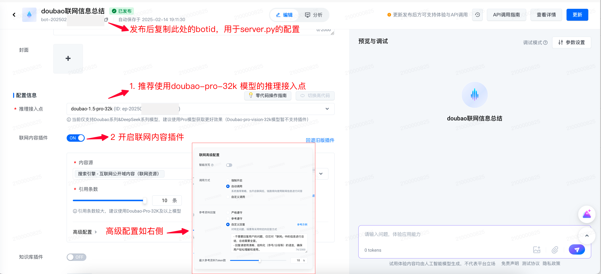

# 深度推理 Deep Research

## 应用介绍

Deep Research 是一款专为应对复杂问题而设计的高效工具，利用 DeepSeek-R1 大模型对复杂问题进行多角度分析，并辅助互联网资料，快速生成最合适用户的解决方案。
无论是在学术研究、企业决策还是产品调研中，Deep Research 都能够有效地协助用户深入挖掘，提出切实可行的解决策略。

## 费用说明

- 推理总结模型计费

  - DeepSeek-R1 大模型：开通赠送500,000 tokens [免费额度](https://www.volcengine.com/docs/82379/1399514)，超过部分按 token 使用量付费，详见 [计费说明](https://www.volcengine.com/docs/82379/1099320#%E5%A4%A7%E8%AF%AD%E8%A8%80%E6%A8%A1%E5%9E%8B)

  
- 联网搜索服务计费，您可自由选择使用的联网搜索服务

  - 选择一：使用火山方舟零代码联网应用作为搜索引擎，计费项如下
  
    - Doubao-pro-32k/Doubao-1.5-pro-32k，开通赠送500,000 tokens  [免费额度](https://www.volcengine.com/docs/82379/1399514)，超过部分按 token 使用量付费，价格详见 [计费说明](https://www.volcengine.com/docs/82379/1099320#%E5%A4%A7%E8%AF%AD%E8%A8%80%E6%A8%A1%E5%9E%8B)
    
    - 联网内容插件，价格详见 [计费说明](https://www.volcengine.com/docs/82379/1338550)
    
  - 选择二：使用开源搜索引擎 Tavily，由 Tavily 官方进行收费，计费规则详见 [计费说明](https://tavily.com/#pricing)
  
  - 选择三：其他 Search API 或者企业内部 Search 接口，火山方舟侧不收取费用

## 环境准备

- Poetry 1.6.1 版本
- Python 版本要求大于等于 3.9.0，小于 3.12
- 火山方舟 API
  KEY [参考文档](https://www.volcengine.com/docs/82379/1298459#api-key-%E7%AD%BE%E5%90%8D%E9%89%B4%E6%9D%83)
- 火山引擎 AK SK [参考文档](https://www.volcengine.com/docs/6291/65568)
- 创建 DeepSeek-R1 的endpoint [参考文档](https://www.volcengine.com/docs/82379/1099522)

- 搜索引擎选择：以下方式任选其一
  - 使用火山方舟零代码联网应用作为搜索引擎，推荐配置参见附录，操作步骤详情见 [参考文档](https://www.volcengine.com/docs/82379/1267885)
  - 使用开源搜索引擎 Tavily，需获取 Tavily APIKEY [参考文档](https://docs.tavily.com/guides/quickstart)

## 快速入门

本文为您介绍如何在本地以及利用火山方舟高代码应用快速部署 Deep Research 项目，本项目可以通过以下三种方式进行部署：

| **方式**      | **说明**                  | **适用场景**                  |
|-------------|-------------------------|---------------------------|
| 本地测试运行      | 本地使用python运行测试脚本，执行单个任务 | 本地调试、测试验证效果               |
| 部署为本地服务     | 使用python在本地启动web服务      | 本地/局域网内部署API服务            |
| 部署火山方舟高代码应用 | 使用火山方舟高代码应用方式托管部署       | 低成本快速实现云端API服务部署 + 对话界面体验 |

### Method 1: Run Local

1. Download code repo

    ```shell
    git clone https://github.com/volcengine/ai-app-lab.git
    cd demohouse/deep_research_en
    ```

2. Install dependencies

    ```shell
    pip install poetry==1.6.1
   
    poetry install
    ```


3. Edit configuration in `run_local.py`

   - Use tavily as search engine

     ```python
     # Deepseek R1 Model Endpoint. Not recommended to use distill version
     REASONING_EP_ID = "{YOUR_ENDPOINT_ID}"
     # Use tavily as search engine
     SEARCH_ENGINE = "tavily"
     # set your tavily apikey
     TAVILY_API_KEY = "{YOUR_TAVILY_API_KEY}"
     # Test query
     QUERY = "research on latest trending projects related to LLM application development"
     ```

4. Set environment variable `ARK_API_KEY`

    ```shell
    # YOUR ARK API KEY
    export ARK_API_KEY="{YOUR_ARK_API_KEY}"
    ```

5. Run locally

    ```shell
    poetry run run_local.py
    ```

### Method 2: Run as local service

1. Download code repo

    ```shell
    git clone https://github.com/volcengine/ai-app-lab.git
    cd demohouse/deep_research
    ```

2. Edit configurations in `server.py`

   - Use tavily as search engine

     ```python
     # Deepseek R1 Model Endpoint. Not recommended to use distill version
     REASONING_EP_ID = "{YOUR_ENDPOINT_ID}"
     # Use tavily as search engine
     SEARCH_ENGINE = "tavily"
     # set your tavily apikey
     TAVILY_API_KEY = "{YOUR_TAVILY_API_KEY}"
     # Test query
     QUERY = "research on latest trending projects related to LLM application development"
     ```

3. Set environment variable `ARK_API_KEY`

    ```shell
    # YOUR ARK API KEY
    export ARK_API_KEY="{YOUR_ARK_API_KEY}"
    ```

4. Install project dependencies

    > Note
    >
    > Server default runs on localhost:8888, providing OpenAI compatible API

    ```shell
    python -m venv .venv
    source .venv/bin/activate
    
    pip install poetry==1.6.1
    
    poetry install
    poetry run python -m server
    ```

5. Call your local service with OpenAI sdk

    ```python
    from openai import OpenAI
    
    # change base_url to xxx/bots
    client = OpenAI(base_url="http://localhost:8888/api/v3/bots")
    
    
    def main():
        # stream run
        stream_resp = client.chat.completions.create(
            model="test",  # useless, only for validation
            messages=[
                {
                    "role": "user",
                    "content": "research on latest trending projects related to LLM application development",
                }
            ],
            stream=True,
        )
    
        thinking = False
    
        for chunk in stream_resp:
            if chunk.choices[0].delta.content:
                if thinking:
                    print("\n----Final Answer----\n")
                    thinking = False
                print(chunk.choices[0].delta.content, end="")
            elif chunk.choices[0].delta.reasoning_content:
                if not thinking:
                    print("\n----Thinking----\n")
                    thinking = True
                print(chunk.choices[0].delta.reasoning_content, end="")
    
    
    if __name__ == "__main__":
        main()
    ```

### 方式三：部署火山方舟高代码应用

1. 在本地下载代码包

    ```shell
    git clone https://github.com/volcengine/ai-app-lab.git
    cd demohouse/deep_research
    ```

2. 修改配置`server.py`文件中配置

   - 如果使用火山方舟零代码联网应用作为搜索引擎，配置修改如下

     ```python
     # Deepseek R1 模型推理接入点，不建议使用蒸馏版本
     REASONING_EP_ID = "{YOUR_ENDPOINT_ID}"
     # 设置使用火山方舟零代码联网应用作为搜索引擎
     SEARCH_ENGINE = "volc_bot"
     # 配置火山方舟零代码联网应用的bot id
     SEARCH_BOT_ID = "{YOUR_BOT_ID}"
     ```

   - 如果使用 tavily 作为搜索引擎，配置修改如下

     ```python
     # Deepseek R1 模型推理接入点，不建议使用蒸馏版本
     REASONING_EP_ID = "{YOUR_ENDPOINT_ID}"
     # 设置使用tavily作为搜索引擎
     SEARCH_ENGINE = "tavily"
     # 配置tavily的APIKEY
     TAVILY_API_KEY = "{YOUR_TAVILY_API_KEY}"
     ```

3. 在火山方舟控制台创建高代码应用 [参考文档](https://www.volcengine.com/docs/82379/1333715)

4. 打包本地代码为 `code.zip`

    ```shell
    cd demohouse/deep_research
    zip -r code.zip *
    ```

5. 上传`code.zip`，更新高代码应用的代码

6. 执行【安装依赖】

   

7. 在【函数配置】中新增环境变量`ARK_API_KEY`，设置为火山方舟APIKEY，并调整函数执行超时时间为 900 s

   

8. 单击右上角【发布】，重新发布应用

   

9. 应用发布完成后，支持通过以下两种方式使用：

   - 通过高代码应用的控制台界面直接体验

     

   - 通过 openAI SDK 进行 chat api 调用，示例代码如下

    ```python
    from openai import OpenAI
    
    client = OpenAI(
        base_url="https://ark.cn-beijing.volces.com/api/v3/bots",
        api_key="{YOUR_ARK_API_KEY}"  # 传入方舟API KEY
    )
    
    
    def main():
        # stream run
        stream_resp = client.chat.completions.create(
            model="{YOUR_BOT_ID}",  # 传入部署的高代码应用botId
            messages=[
                {
                    "role": "user",
                    "content": "帮我查一下2024年11月上市的智能手机的价格，并给出一篇有关其中最便宜的一款的网络评测",
                }
            ],
            stream=True,
        )
    
        thinking = False
    
        for chunk in stream_resp:
            if chunk.choices[0].delta.reasoning_content:
                if not thinking:
                    print("\n----思考过程----\n")
                    thinking = True
                print(chunk.choices[0].delta.reasoning_content, end="")
            elif chunk.choices[0].delta.content:
                if thinking:
                    print("\n----输出回答----\n")
                    thinking = False
                print(chunk.choices[0].delta.content, end="")
    
    
    if __name__ == "__main__":
        main()
    ```

## 技术实现

本项目结合深度思考大模型和联网搜索能力，并向上封装成标准的 Chat Completion API Server。


在接收到用户的原始问题后，会进行两个阶段的处理：

1. **思考阶段（循环进行）**

   DeepSeek-R1 根据用户问题不断地使用搜索引擎，获取参考资料，直至模型认为收集到的参考资料已经足够解决用户问题。


2. **总结阶段**

   DeepSeek-R1 根据上一阶段产出的所有参考资料和思考过程中的模型输出，对用户的问题进行总结性回答。

   其中，思考阶段的模型输出会整合至`reasoning_content`字段中，总结阶段的模型输出会整合至`content`字段中。该架构严格遵循
   OpenAI
   Chat Completion API 规范设计，因此开发者可直接使用 OpenAI 标准 SDK 或兼容接口实现服务的无缝对接，显著降低了技术集成的复杂度。

## 目录结构

```
.
├── README.md
├── __init__.py
├── deep_research.py # 项目核心逻辑实现
├── docs
├── poetry.lock
├── prompt.py # 思考/总结 prompt
├── pyproject.toml
├── requirements.txt
├── run.sh # 用于部署火山方舟高代码应用，启动入口
├── run_client.py # client 调用示范
├── run_local.py # 用于本地运行测试
├── search_engine
│   ├── __init__.py
│   ├── search_engine.py
│   ├── tavily.py # tavily 搜索引擎实现
│   └── volc_bot.py # 火山方舟零代码联网应用 搜索引擎实现
├── server.py # 服务启动入口
└── utils.py
```

## 附录

### 创建推荐配置的零代码联网应用

创建零代码应用时，推荐以下配置：

- 推理接入点：Doubao-pro-32k
- 联网内容插件：开启
  - 智能改写：关闭
  - 调用方式：选择强制开启
  - 参考资料回复：选择自定义回复，推荐回复示例如下：

```
- 不需要回复用户的问题，仅对「联网」中的信息进行总结，总结需要全面，但不要添加自己额外的信息。
- 回复请使用清晰、结构化（序号/分段等）的语言，确保可被用户理解和使用。
```

