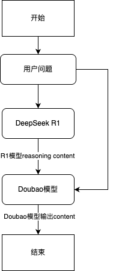

# DeepDoubao
## 应用介绍
这是一款结合 DeepSeek R1 模型的强大推理能力与 Doubao 模型的高效对话能力的应用，为用户提供智能问答服务。结合 Deepseek R1 模型的推理能力与 Doubao 自然流畅的对话总结能力，为用户带来精准、专业且具有互动性的智能体验。

### 应用优势
DeepSeek R1 模型强大的思考能力，搭配豆包模型扎实的对话总结基础能力，优势互补。在处理复杂流程、参考问答、信息抽取等任务时，两者协作，能更精准高效地执行，取得比纯 R1 模型更好的结果。

### 相关模型
- 思考模型：使用 DeepSeek-R1/250120，生成推理步骤和依据，辅助回答用户问题。
- 回答模型：结合思考步骤，对用户的初始问题进行回答总结。不同场景可以选择不同的回答模型：
  - 综合任务：Doubao-1.5-pro-32k/250115
  - 角色扮演：Doubao-pro-32k/character-241215

## 环境准备

- Python 版本要求大于等于 3.8，小于 3.12
- 已获取火山方舟 API Key [参考文档](https://www.volcengine.com/docs/82379/1298459#api-key-%E7%AD%BE%E5%90%8D%E9%89%B4%E6%9D%83)
- 已创建 DeepSeek-R1 的 endpoint  [参考文档](https://www.volcengine.com/docs/82379/1099522#594199f1)
- 已创建 Douba 的endpoint [参考文档](https://www.volcengine.com/docs/82379/1099522#594199f1)

## 快速开始

1. 下载代码库

   ```bash
    git clone https://github.com/volcengine/ai-app-lab.git
    cd demohouse/deepdoubao
   ```
2. 修改配置

   - 修改`backend/code/main.py` 中配置，填入
    ```text
     | 配置变量名                | 说明                            |
     | ------------------------ | -------------------------------|
     | DEEPSEEK_R1_ENDPOINT     | DeepSeek-R1 endpoint id        |
     | DOUBAO_ENDPOINT          | Doubao 模型 endpoint id         |
    ```

   - 修改 `backend/run.sh` 中配置，填入获取的API key
    ```text
     | 配置变量名    | 说明            |
     | ----------- | --------------- |
     | ARK_API_KEY | 火山方舟 API Key |
    ```


     
3. 安装后端依赖

   ```bash
   cd demohouse/deepdoubao/backend

   python -m venv .venv
   source .venv/bin/activate
   pip install poetry==1.6.1

   poetry install
   ```
4. 启动后端

   ```bash
   cd demohouse/deepdoubao/backend
   bash run.sh
   ```
   
5. 测试

   ```bash
   curl --location 'http://localhost:8888/api/v3/bots/chat/completions' \
    --header 'Content-Type: application/json' \
    --data '{
        "model": "test",
        "stream": true,
        "messages": [
            {
                "role": "user",
                "content": "写一个适合3岁宝宝的睡前故事"
            }
        ]
    }'
   ```
## 技术实现


本项目结合深度思考模型DeepSeek R1的思考能力，以及 Doubao 模型的对话能力，提供 Chat Completion API。API在接收到用户问题以后有两个步骤：
1. DeepSeek R1 模型输入用户问题进行思考，输出思考内容（reasoning content）。
2. Doubao 模型输入用户问题以及 R1 模型的思考过程，输出最终回答用户的结果。

## 目录结构
```text
./
├── README.md
├── assets
│   └── 技术路线.png
└── backend
    ├── code
    │   ├── __init__.py
    │   └── main.py        # 入口函数
    ├── poetry.lock
    ├── pyproject.toml
    └── run.sh             # 启动脚本  
```