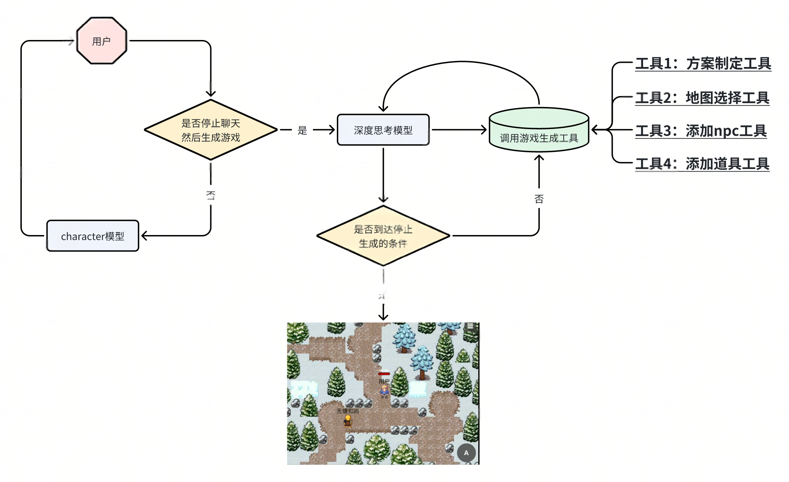

# 游戏agent

## 应用介绍

游戏agent由两部分组成，具体如下：

1. 剧情聊天部分：玩家与AI（这里采用的是doubao-1.5-pro-32k/character-250228）进行对话
2. 游戏生成部分：深度思考模型（这里采用的是doubao-1.5-thinking-pro/250415）根据玩家与AI的对话生成游戏内容以及游戏运行的逻辑

整体流程图：


## 环境准备

1. 这里采用uv进行环境配置，可以直接运行如下命令

   ```shell
   bash prepare-env.sh
   ```
2. 配置环境变量，需要配置一下的环境变量（比如放在 `~/.bashrc里`）：

   ```shell
   # 填写火山方舟API KEY
   export VOLC_API_KEY=xxx
   # 填写character模型的endpoint
   export VOLC_CHARACTER_MODEL_EP=xxx
   # 填写thinking模型的endpoint
   export VOLC_THINKING_MODEL_EP=xxx
   ```

这里 `VOLC_API_KEY`为API_KEY，获取方法参考：[获取API_KEY](https://www.volcengine.com/docs/82379/1541594)。

`VOLC_CHARACTER_MODEL_EP`和 `VOLC_THINKING_MODEL_EP`为模型的endpoint，具体可以参考[创建endpoint](https://www.volcengine.com/docs/82379/1099522?lang=zh)。

3. 安装rpgjs相关依赖
   当前项目基于[rpgjs](https://rpgjs.dev/)，需要安装rpgjs的依赖
   首先进入rpg-app目录：
   ```shell
   cd rpg-app
   ```

然后运行如下命令安装依赖：

```shell
npm install
```

## 启动服务

运行如下命令启动服务，命令行中会显示Localhost的url，复制到浏览器打开：

```shell
bash script/run_final_demo.sh
```
