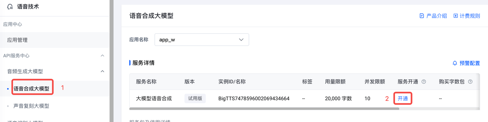
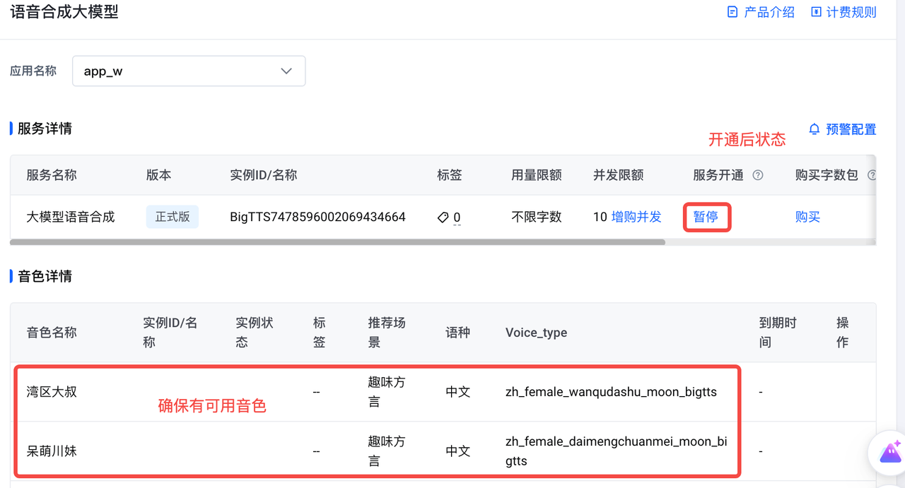
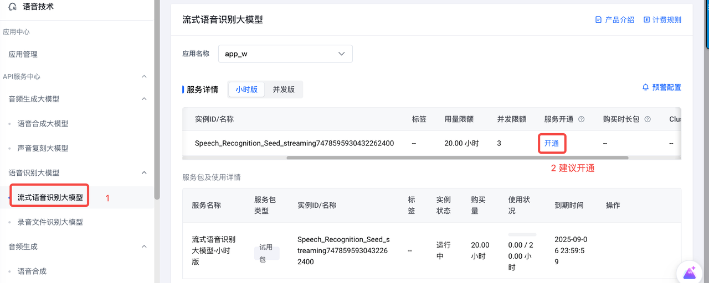
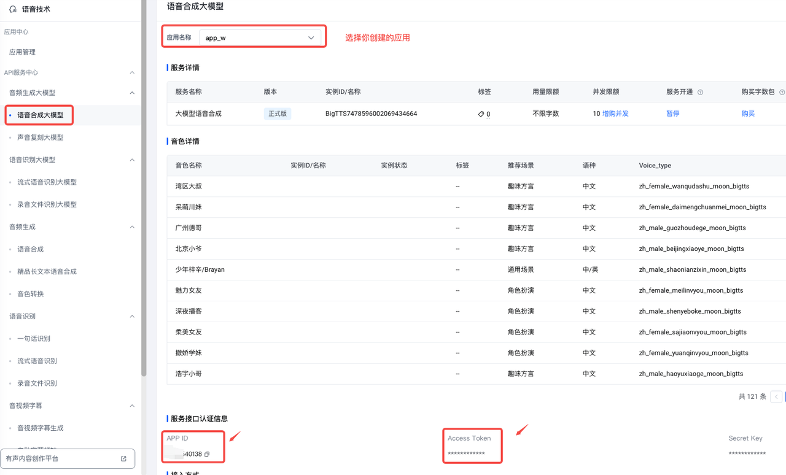

# 语音实时通话 - 青青

## 应用介绍
这款实时语音通话应用，依托豆包语音系列大模型打造。在这里，用户能与虚拟好友乔青青展开模拟通话，畅享真实的交流体验。
乔青青（Doreen），一位 20 岁的射手座新闻传播专业学生，性格率真爽朗、成绩优异，对追星、旅游、唱歌、摄影充满热情。无论是分享日常琐事，还是深入探讨趣味话题，她都能成为你的理想伙伴。而且，用户还能根据喜好，自由选择青青的音色，从清脆甜美的少女音，到活力满满的灵动嗓音，为这场交流增添更多个性化色彩 。
想认识这位多才多艺、热情开朗的青青吗？快来加入她的世界，与她一同探索生活的精彩，追逐梦想的光芒。

### 效果预览

[视频地址](https://portal.volccdn.com/obj/volcfe/cloud-universal-doc/upload_8c19a086a04ea8097bab34a5cf552e98.mp4)

### 直接体验

[控制台体验](https://console.volcengine.com/ark/region:ark+cn-beijing/application/detail?id=bot-20240805115108-nx28f-nocode-preset)

### 优势

- 沉浸式真人对话体验：生活化的沟通方式，让使用者在与乔青青交流时，仿佛她就在身边，能真切感受到她的爽朗性格，全方位模拟真人互动，深度沉浸。
- 低延时：实现近乎实时的对话响应，彻底告别长时间等待，高度模拟面对面的真实通话体验。
- WebSocket 方案：易于实现和部署，通用性强跨平台兼容性好，高效利用资源，开发灵活性高，成本低。

### 相关模型
- Doubao-pro-32k：深入还原角色的性格、背景和知识体系，以高度拟人化的方式回应用户提问，提供沉浸式的对话体验。
- Doubao-语音合成：根据用户偏好的音色定制生成拟人化、逼真的角色语音输出。
- Doubao-流式语音识别：将用户的语音提问转写为文本，以便于大模型对用户问题的理解与回复。

### 流程架构

本项目的整体流程架构如下：


## 环境准备

- Poetry 1.6.1 版本
- Python 版本要求大于等于 3.8，小于 3.12
- Node 18.0 或以上版本 
- PNPM 8.10 或以上版本
- 获取语音技术产品的 APP ID 和 Access Token，获取方式参见【附录】
- 火山方舟 API KEY [参考文档](https://www.volcengine.com/docs/82379/1298459#api-key-%E7%AD%BE%E5%90%8D%E9%89%B4%E6%9D%83)
- 火山引擎 AK SK [参考文档](https://www.volcengine.com/docs/6291/65568)
- 创建 Doubao-Pro 32K 的endpoint [参考文档](https://www.volcengine.com/docs/82379/1099522)

## 快速开始

本文为您介绍如何在本地快速部署 live voice call 项目。

1. 下载代码库

    ```shell
    git clone https://github.com/volcengine/ai-app-lab.git
    cd demohouse/live_voice_call
    ```

2. 修改配置

- 修改`backend/handler.py`

    ```python
    ASR_ACCESS_TOKEN = "{YOUR_ASR_ACCESS_TOKEN}"
    ASR_APP_ID = "{YOUR_ASR_APP_ID}"
    TTS_ACCESS_TOKEN = "{YOUR_TTS_ACCESS_TOKEN}"
    TTS_APP_ID = "{YOUR_TTS_APP_ID}"
    LLM_ENDPOINT_ID = "{YOUR_ARK_LLM_ENDPOINT_ID}"
    ```

- 修改本地环境变量注入方舟APIKEY

    ```shell
    export ARK_API_KEY={YOUR_API_KEY}
    ```

3. 启动服务端

    ```shell
    cd demohouse/live_voice_call/backend

    python -m venv .venv
    source .venv/bin/activate
    pip install poetry==1.6.1

    poetry install
    poetry run python -m handler
    ```

4. 启动web端

    ```shell
    cd demohouse/live_voice_call/frontend
    pnpm install
    pnpm run dev
    ```

5. 访问`http://localhost:8080`即可

## WebSocket交互协议说明

### 协议格式

Web端和服务端通过二进制协议进行交互，协议格式如下：

<table>
  <tr>
    <th>Byte \ Bit</th>
    <th>7</th>
    <th>6</th>
    <th>5</th>
    <th>4</th>
    <th>3</th>
    <th>2</th>
    <th>1</th>
    <th>0</th>
  </tr>
  <tr>
    <td>0</td>
    <td colspan="4">Protocol version</td>
    <td colspan="4">Header size</td>
  </tr>
  <tr>
    <td>1</td>
    <td colspan="4">Message type</td>
    <td colspan="4">Message type specific flags</td>
  </tr>
  <tr>
    <td>2</td>
    <td colspan="4">Message serialization method</td>
    <td colspan="4">Message compression</td>
  </tr>
  <tr>
    <td>3</td>
    <td colspan="8">Reserved</td>
  </tr>
  <tr>
    <td>4</td>
    <td colspan="8">[Payload, depending on the Message Type]</td>
  </tr>
  <tr>
    <td>...</td>
    <td colspan="8">...</td>
  </tr>
</table>


前4个字节共32位为Header部分，剩余字节为Payload部分，可以是二进制 或 JSON格式

各部分取值说明如下：

<table>
  <tr>
    <th>Part</th>
    <th>长度</th>
    <th>用途</th>
    <th>取值说明</th>
  </tr>
  <tr>
    <td>Protocol version</td>
    <td>4 bits</td>
    <td>标记协议版本</td>
    <td>固定为 <code>0b0001</code>，代表协议版本 V1</td>
  </tr>
  <tr>
    <td>Header size</td>
    <td>4 bits</td>
    <td>标记 Header 大小</td>
    <td>固定为 <code>0b0001</code>，代表 Header 大小为 1 * 4 个字节</td>
  </tr>
  <tr>
    <td rowspan="5">Message type</td>
    <td rowspan="5">4 bits</td>
    <td rowspan="5">标记消息类型</td>
    <td><code>0b0001</code> - full client request</td>
  </tr>
  <tr>
    <td>&emsp;常规上行请求消息，payload 为 JSON 格式</td>
  </tr>
  <tr>
    <td><code>0b0010</code> - audio only request</td>
  </tr>
  <tr>
    <td>&emsp;语音上行数据消息，payload 为二进制格式</td>
  </tr>
  <tr>
    <td><code>0b1001</code> - full server response</td>
  </tr>
  <tr>
    <td>Message type specific flags</td>
    <td>4 bits</td>
    <td>标记消息附加信息</td>
    <td>目前固定为 <code>0b0000</code>，代表无附加消息</td>
  </tr>
  <tr>
    <td>Message serialization method</td>
    <td>4 bits</td>
    <td>标记 payload 序列化方式</td>
    <td>
      <ul>
        <li><code>0b0000</code> - 无序列化</li>
        <li><code>0b0001</code> - JSON 格式</li>
      </ul>
    </td>
  </tr>
  <tr>
    <td>Message compression</td>
    <td>4 bits</td>
    <td>标记 payload 压缩格式</td>
    <td>
      <ul>
        <li><code>0b0000</code> - 无压缩</li>
        <li><code>0b0001</code> - Gzip 压缩</li>
      </ul>
    </td>
  </tr>
  <tr>
    <td>Reserved</td>
    <td>8 bits</td>
    <td>预留字段</td>
    <td>暂无用途</td>
  </tr>
</table>

### Payload一览

当MessageType为FullClientRequest或FullServerResponse时，Payload部分为JSON数据，格式如下：

```
{
    "event": "事件类型",
    "payload": {
      // 事件内容，根据不同的事件类型区分...
    }
}
```

<table>
    <thead>
        <tr>
            <th>事件类型</th>
            <th>事件方向</th>
            <th>完整Payload</th>
            <th>说明</th>
        </tr>
    </thead>
    <tbody>
        <tr>
            <td>BotReady</td>
            <td>下行</td>
            <td>
                <pre>
{
    "event": "BotReady",
    "payload": {
        "session": "...."
    }
}
                    </pre>
                </td>
                <td>链接建立成功，可以开始对话。如果前端 <code>query</code> 中没有该参数，则会新生成 <code>sid</code> 并返回给前端，用于存储当前对话上下文。</td>
            </tr>
            <tr>
                <td>BotUpdateConfig</td>
                <td>上行</td>
                <td>
                    <pre>
{
    "event": "BotUpdateConfig",
    "payload": {
        "speaker": "...."
    }
}
                    </pre>
                </td>
                <td>用户更新对话上下文信息，例如音色（下一轮生效）。</td>
            </tr>
            <tr>
                <td>SentenceRecognized</td>
                <td>下行</td>
                <td>
                    <pre>
{
    "event": "SentenceRecognized",
    "payload": {
        "sentence": "...."
    }
}
                    </pre>
                </td>
                <td>ASR 成功识别用户语音，返回给前端结果。此事件下发后，连接进入 <code>InProcess</code> 状态，在语音输出结束前，不会再接受新的用户语音输入。</td>
            </tr>
            <tr>
                <td>TTSSentenceStart</td>
                <td>下行</td>
                <td>
                    <pre>
{
    "event": "TTSSentenceStart",
    "payload": {
        "sentence": "...."
    }
}
                    </pre>
                </td>
                <td>当前句子开始语音合成，后续会发送 <code>AudioOnly</code> 事件输出二进制的语音数据。</td>
            </tr>
            <tr>
                <td>TTSDone</td>
                <td>下行</td>
                <td>
                    <pre>
{
    "event": "TTSDone",
    "payload": {}
}
                    </pre>
                </td>
                <td>TTS 语音输出完成。此事件下发后，连接重新恢复 <code>Idle</code> 状态，此时可以开始接受新的用户语音输入。</td>
            </tr>
            <tr>
                <td>BotError</td>
                <td>下行</td>
                <td>
                    <pre>
{
    "event": "BotError",
    "payload": {
        "error": {
            "code": "...",
            "message": "..."
        }
    }
}
                    </pre>
                </td>
                <td>服务端出现错误。</td>
            </tr>
        </tbody>
</table>

### 交互时序示意


## 附录

### 获取 TTS_APP_ID、TTS_ACCESS_TOKEN、ASR_APP_ID、ASR_ACCESS_TOKEN？

1. [完成企业认证](https://console.volcengine.com/user/authentication/detail/)

2. [开通语音技术产品](https://console.volcengine.com/speech/app)

3. [创建应用](https://console.volcengine.com/speech/app)，同时勾选大模型语音合成和流式语音识别大模型
    

4. 开通语音合成大模型，确保页面具有音色。注意：语音合成大模型从开通到可以使用有大概5-10分钟延迟
   
   

5. 流式语音识别大模型有试用包，可以不开通。如需提供稳定服务，建议开通正式版本。
   

6. 获取TTS_APP_ID 和TTS_ACCESS_TOKEN
   

7. 获取ASR_APP_ID、ASR_ACCESS_TOKEN
   
