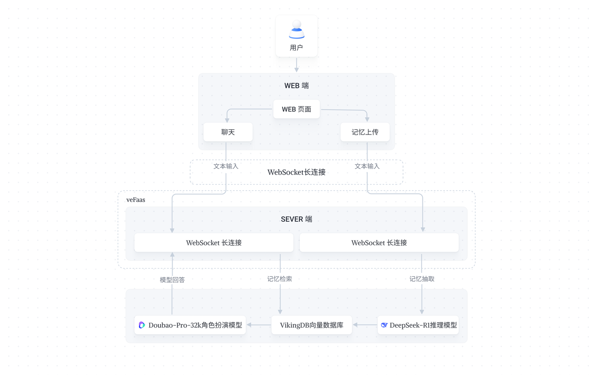
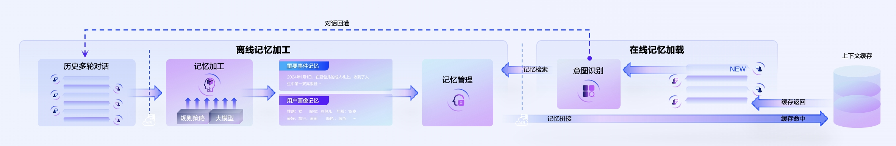

# 场景介绍
长期记忆能够激发大模型提供更具个性化的互动能力，解决当前大模型在陪伴社交、AI 教育、车机助手、智能硬件等场景下记忆缺失、对话断层、沟通失真的问题。长期记忆方案，基于 DeepSeek-R1 模型的强大思考能力将对话内容抽取成记忆，记录用户偏好、性格、生日等，并在对话到相关话题时帮助 Doubao 角色模型生成更贴合角色人设的回复。

<br>

当前应用基于开源 mem0 项目结合火山大模型服务搭建。
<br>

# 架构图

<br>

# 费用说明
## 模型
| **相关服务** | **描述** | **计费说明** |
| --- | --- | --- |
| DeepSeek-R1 | DeepSeek-R1 在后训练阶段大规模使用了强化学习技术，在仅有极少标注数据的情况下，极大提升了模型推理能力 | [计费说明](https://www.volcengine.com/docs/82379/1099320) |
| Doubao-pro-32k | 是豆包推出行业领先的专业版大模型。模型在参考问答、摘要总结、创作等广泛的应用场景上能提供优质的回答，是同时具备高质量与低成本的极具性价比模型 | [计费说明](https://www.volcengine.com/docs/82379/1099320) |
| Doubao-embedding | 由字节跳动研发的语义向量化模型，主要面向向量检索的使用场景，支持中、英双语，最长 4K 上下文长度。向量维度 2048 维，支持 512、1024 降维使用。| [计费说明](https://www.volcengine.com/docs/82379/1099320) |
## 云产品
| **相关服务** | **描述** | **计费说明** |
| --- | --- | --- |
| [向量数据库VikingDB](https://www.volcengine.com/docs/84313/1254439) | 基于火山引擎的云基础设施搭建，用于生产、存储、索引和分析来自机器学习模型产生的海量向量数据的数据库系统 | [计费说明](https://www.volcengine.com/docs/84313/1414459) |
| [函数服务](https://www.volcengine.com/product/vefaas) | 事件驱动的无服务器函数托管计算平台 | [计费说明](https://www.volcengine.com/docs/6662/107454) |
| [API网关](https://www.volcengine.com/product/apig) | 基于云原生、高扩展、高可用的云上网关托管服务 | [计费说明](https://www.volcengine.com/docs/6569/185249) |
| [日志服务](https://www.volcengine.com/product/tls) | 提供针对日志类数据的一站式服务 | [计费说明](https://www.volcengine.com/docs/6470/1215813) |
<br>

# 部署说明
## 环境准备
* 要求 3.9 ≤ Python 版本 ＜ 3.12
* Node 18.0 或以上版本 
* PNPM 8.10 或以上版本
* 已创建 Doubao-pro-32K-character-241215 的endpoint [参考文档](https://www.volcengine.com/docs/82379/1099522#594199f1)
* 已创建 DeepSeek-R1 的endpoint [参考文档](https://www.volcengine.com/docs/82379/1099522#594199f1)
* 已创建 Doubao-embedding 的endpoint [参考文档](https://www.volcengine.com/docs/82379/1099522#594199f1)
* 开通 VikingDB 向量库（华北）[参考文档](https://www.volcengine.com/docs/84313/1254444)
* 创建AK、SK，创建子账号及策略配置 [参考文档](https://www.volcengine.com/docs/84313/1254467)
<br>

## 快速入门
1. 下载代码库
```Bash
 git clone https://github.com/volcengine/ai-app-lab.git
 cd demohouse/longterm_memory
```

2. 修改配置
* 修改`backend/code/config.py` 中配置，填入刚刚获取的 endpoint id 、AK、SK

3. 安装后端依赖

```Bash
cd demohouse/longterm_memory/backend

python -m venv .venv
source .venv/bin/activate
pip install poetry==1.6.1

poetry install
```

4. 启动后端
```Bash
cd demohouse/longterm_memory/backend
bash run.sh
```

5. 启动前端
```Bash
cd demohouse/longterm_memory/frontend
pnpm install
pnpm run dev
```

<br>

## 技术实现
1. 核心架构与能力整合
* 本项目通过 DeepSeek-R1 大模型的深度推理能力（透明化思维链与多步逻辑验证）、豆包 character 模型的对话交互优势，以及 VikingDB 向量库的高效检索能力，构建了一套大模型长期记忆解决方案
2. 技术实现路径
* 事实提取：利用 DeepSeek-R1 的深度思考能力，从历史对话中精准提取关键事实，确保信息结构化存储
* 向量存储：将提取的事实通过 VikingDB 进行向量化编码，支持跨会话、超长上下文的高效关联检索
* 记忆增强：当对话超出模型窗口限制或开启新会话时，系统通过向量相似度匹配，召回最相关历史事实，辅助豆包模型生成连贯且个性化的回复
3. 核心创新优势
* 推理透明性：DeepSeek-R1 的显性化思维链，使事实提取过程可追溯，降低 “AI 幻觉” 风险
* 低成本高效性：基于 DeepSeek-R1 开源架构的推理成本较低 ，结合 VikingDB 的优化检索算法，实现高性价比的长期记忆管理
* 场景适配性：豆包 character 模型对话能力，配合记忆增强机制，可灵活应用于教育、客服、医疗等复杂场景

## 目录结构
```Bash
├── README.md
├── asset
├── frontend 
└── backend
    ├── code
    │   ├── __init__.py
    │   ├── prompt.py    # 相关prompt
    │   ├── config.py    # 配置文件
    │   └── main.py        # 入口函数
    ├── mem0ai-0.1.48.1-py3-none-any.whl # 开源代码mem0代码包
    ├── poetry.lock
    ├── pyproject.toml
    └── run.sh             # 启动脚本  
```

# 火山记忆库介绍
当前广场上架的记忆应用依托的是开源 mem0 框架，可以快速体验了解长期记忆的工作原理和效果。
此外，火山也提供自研**长期记忆云服务解决方案-火山记忆库**，架构图如下：

<div style="text-align: center"></div>

相比于 mem0 工具，火山记忆库是一套完整的云服务解决方案，支持 restful API 集成使用，支持业务规模更大、稳定性更强、记忆交互效果更好
* 在范式上，相比于 mem0 增加对“用户画像”记忆的抽取，加深用户理解
* 在能力上，支持记忆场景下的意图识别、问题改写、记忆冲突处理、记忆清理等模块
* 在场景上，覆盖单聊、群聊等众多业务场景需求


<br>

# 联系我们
火山记忆库产品试用，请填写：[试用申请](https://bytedance.larkoffice.com/share/base/form/shrcnZAygxD8aadX5TC6Q6xoQxe)

应用开发，点击加入飞书群： [应用实验室开发者沟通群](https://applink.larkoffice.com/client/chat/chatter/add_by_link?link_token=a5aq182d-ad9b-4867-8464-609f1ee8cb34)
<div style="text-align: center"></div>


<br><br><br><br><br><br>