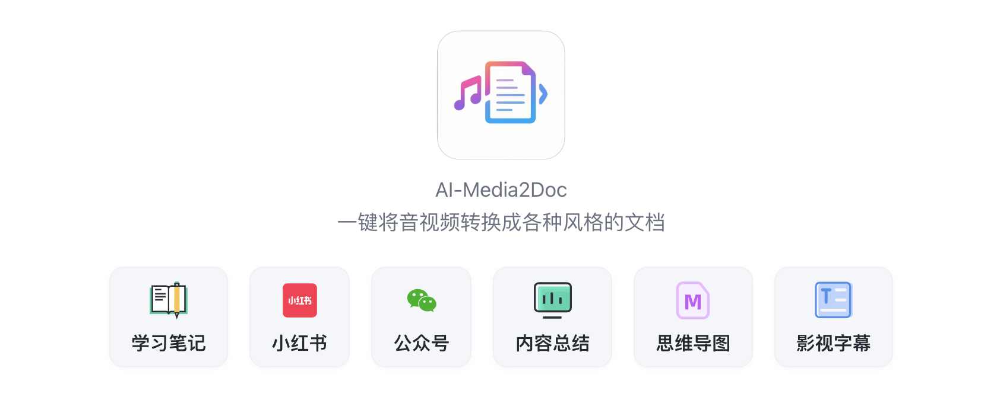
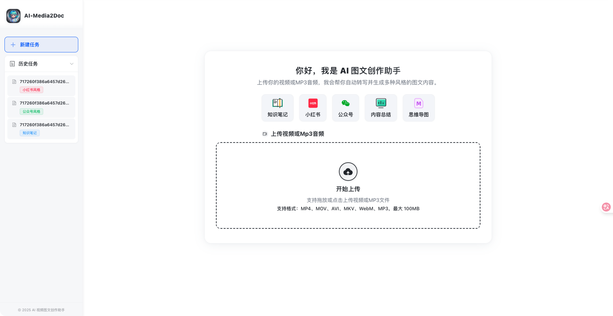
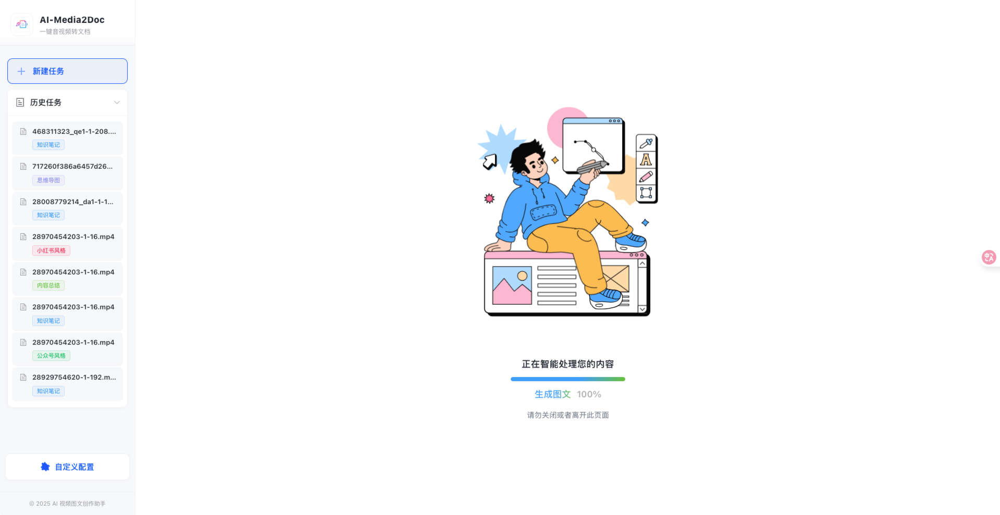
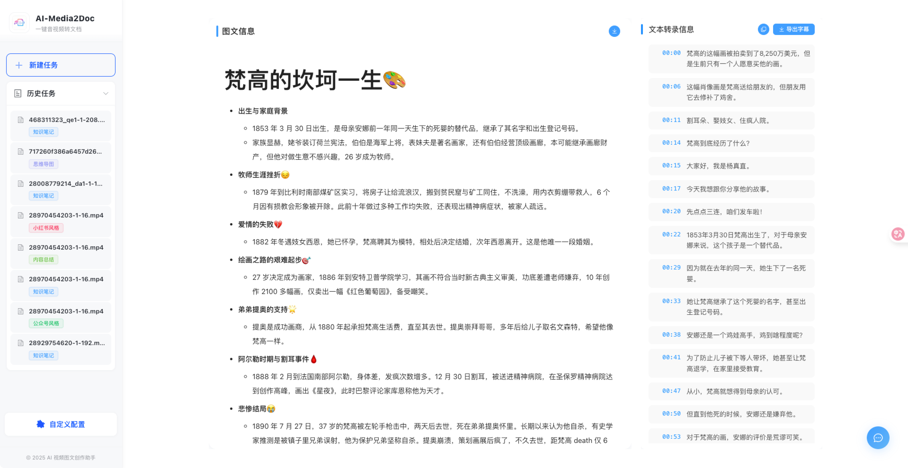
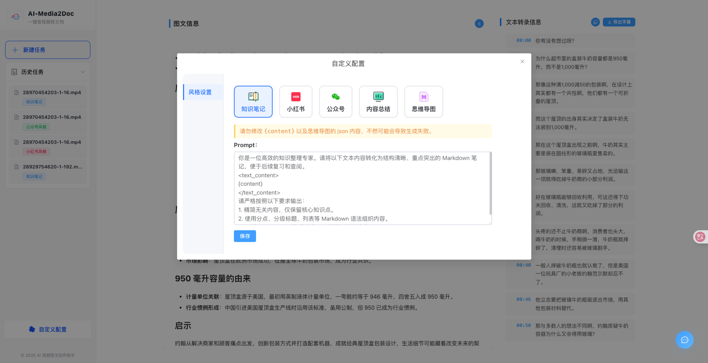
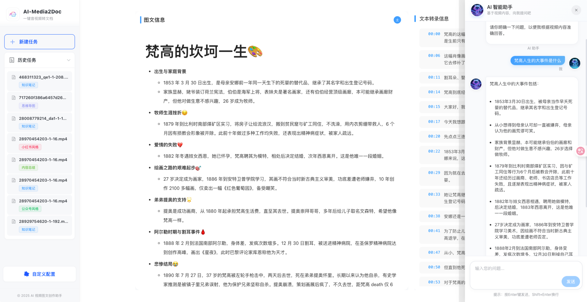

<h1 align="center">
  <p>
  
    </p>
</h1>

<p align="center">
  <a href="./LICENSE"></a>
  
  
</p>


### 📖 简介

AI 视频图文创作助手是一款 Web 工具, 基于 AI 大模型, 一键将视频和音频转化为各种风格的文档, 无需登录注册, 前后端本地部署，以极低的成本体验 AI 视频/音频转风格文档服务。

### ✨ 核心功能

- ✅ **完全开源**：MIT 协议授权，支持本地部署。
- 🔒 **隐私保护**：无需登录注册，任务记录保存在本地
- 💻 **前端处理**：采用 ffmpeg wasm 技术，无需本地安装 ffmpeg
- 🎯 **多种风格支持**：支持小红书/公众号/知识笔记/思维导图/内容总结等多种文档风格支持。
- 🤖 **AI 对话**：支持针对视频内容进行 AI 二次问答。
- 🎬 **支持字幕导出**: 结果一键导出为字幕文件。
- 🎨 **支持自定义 Prompt**：支持在前端自定义配置 prompt。
- 🐳 **一键部署**：支持 Docker 一键部署。
- 🔒 **支持设置访问密码**: 后端设置访问密码之后, 前端用户需要填写该密码才可以正常使用。


### 🔜 未来计划

- 📷 支持智能截取视频关键帧，实现真正的图文并茂
- 🎙️ 音频识别支持使用 fast-whisper 本地大模型处理，进一步降低成本
- 🎨 支持在前端自定义配置 prompt。


### 项目截图

#### 全新设计的首页, 尽力之作

<p align="center">
    
</p>

#### 更加简洁的加载页
<p align="center">

</p>


#### 全新设计的结果页, 支持一键导出为字幕。
<p align="center">

</p>

#### 支持自定义 prompt
<p align="center">

</p>


#### 可基于视频内容进行 AI 二次对话

<p align="center">

</p>


### 📦 docker 本地一键部署
0️⃣：安装 `docker`, 这个网上有教程

1️⃣：镜像构建, 在项目根目录下执行:
```shell
$ make docker-image
```
2️⃣：请根据 [后端部署指引 / 配置项说明](https://github.com/hanshuaikang/AI-Media2Doc/blob/main/backend/README.md#%E5%9C%A8%E7%81%AB%E5%B1%B1%E5%BC%95%E6%93%8E%E8%8E%B7%E5%8F%96%E5%AF%B9%E5%BA%94%E7%9A%84%E7%8E%AF%E5%A2%83%E5%8F%98%E9%87%8F%E7%9A%84%E5%80%BC) 完善根目录下的 `variables.env` 文件。 

3️⃣：运行项目,在项目根目录下执行:

```shell
$ make run
```
