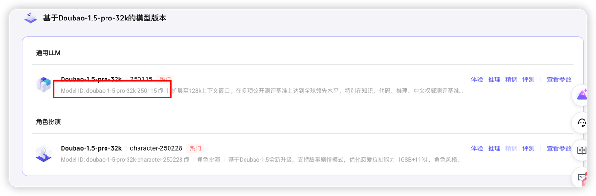
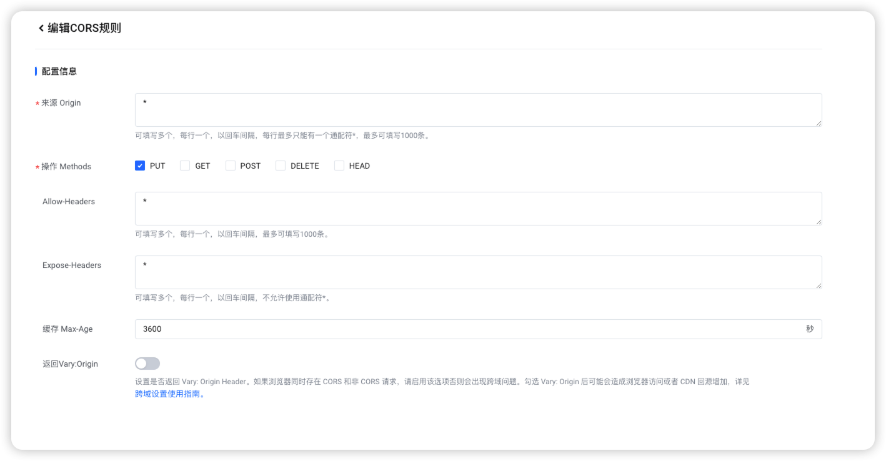
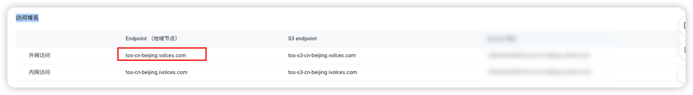

# 后端部署教程

后端依赖于字节跳动火山引擎高代码 SDK Arkitect [高代码 SDK Arkitect](https://github.com/volcengine/ai-app-lab/blob/main/arkitect/README.md)。 
在启动后端服务之前, 需要先安装好 Arkitect 的依赖, 并且申请字节 Tos 对象存储服务 以及 对应大模型的 API 调用权限

**注意 ⚠️： 请至少保证你本地的 Python 版本为 3.9 及以上, 否则可能会出现依赖无法安装, 项目启动失败等问题。**

## 1. 安装依赖
```bash
pip install -r requirements.txt
```

## 2. 配置环境变量


```bash
export MODEL_ID=xxxx
export ARK_API_KEY=xxxx
export TOS_ACCESS_KEY=xxxx
export TOS_SECRET_KEY=xxxx
export TOS_ENDPOINT=xxxx
export TOS_REGION=xxxx
export TOS_BUCKET=xxxx
export AUC_APP_ID=xxxx
export AUC_ACCESS_TOKEN=xxxx
export AUC_CLUSTER_ID=xxxx 
export WEB_ACCESS_PASSWORD=xxx
```
环境变量说明:

**WEB_ACCESS_PASSWORD**【选填】:前端访问后端服务的密码,后端指定之后需要在前端自定义设置-> 访问密码填写该密码才可以正常使用。


## 3. 启动服务
```bash
python main.py
```

## 在火山引擎获取对应的环境变量的值
主要分为三部分, 火山方舟/字节Tos/音频识别大模型

### 火山方舟
#### MODEL_ID

⚠️: 最新版本的 AI-Media2Doc 已经不再需要 ENDPOINT_ID, 由 MODEL_ID 代替。

登录[方舟控制台](https://console.volcengine.com/ark/region:ark+cn-beijing/openManagement?projectName=default)。进入开通管理, 选择开通一个大语言模型。
推荐使用 `doubao-1-5-pro-32k-250115` 。点击开通之后点击该大模型进入详情页，选择通用 LLM(没有就选主线模型), 复制红框内的 `模型 ID`，即为 `MODEL_ID` 的值。


<p>

</p>


#### ARK_API_KEY
在 API Key 管理中创建一个 API Key [参考文档](https://www.volcengine.com/docs/82379/1399008#_3-%E5%88%9B%E5%BB%BAAPIKey) 你就得到了 `ARK_API_KEY` 的值。

### 火山引擎对象存储服务
#### 创建 bucket 设置跨域规则
登录[对象存储控制台](https://console.volcengine.com/tos) 创建一个 bucket, 创建完毕之后进入该 bucket。点击右侧权限管理, 找到跨域访问设置, 新建一条跨域访问规则。
<p>

</p>
当然你也可以根据实际情况灵活选择。

#### TOS_ENDPOINT
点击 **桶列表** ->  **点进去你创建的那个 bucket** -> **点击概览** -> **眼睛往下看**

你会看到一个访问域名, TOS_ENDPOINT 的值就是红框框里面那个，不同的区域 TOS_ENDPOINT 的值可能不一样。
<p>

</p>


#### TOS_BUCKET
`TOS_BUCKET` 的值就是你创建的 bucket 的名称。

#### TOS_REGION
`TOS_REGION` 的值就是你创建的 bucket 的区域, 例如 `cn-beijing`。


#### TOS_ACCESS_KEY 和 TOS_SECRET_KEY
进入 [IAM控制台](https://console.volcengine.com/iam/keymanage) 创建一个访问密钥,
你就得到了 `TOS_ACCESS_KEY` 和 `TOS_SECRET_KEY` 的值。


### 音频识别大模型

火山方舟每个音频识别大模型都提供了 20 个小时的试用额度, 可以轮流试用。

登录录音文件识别大模型控制台(https://console.volcengine.com/speech/service), 点击右侧录音文件识别， 创建一个应用, 你就得到了 `AUC_APP_ID` 和 `AUC_ACCESS_TOKEN` 的值。


#### AUC_APP_ID
`AUC_APP_ID` 的值就是你创建的应用的 ID。

#### AUC_ACCESS_TOKEN
`AUC_ACCESS_TOKEN` 的值就是你创建的应用的 Access Token。


#### AUC_CLUSTER_ID
点击试用 `录音文件识别-通用-标准版` 或者其他的大模型，开通试用之后，`Cluster ID` 列就表示 AUC_CLUSTER_ID 的值。


