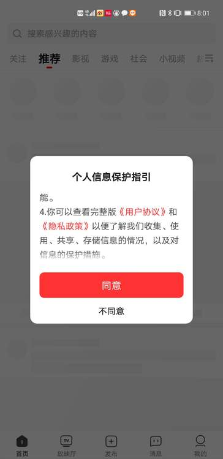

为帮助使用多模态SDK的开发者和运营者（以下简称“**您**”）在符合相关法律法规、政策及标准的规定下开展第三方SDK业务，更好地落实用户个人信息保护相关要求，同时，也便于您更清楚地理解多模态SDK服务数据业务的合规性和已采用的安全保护技术能力，特别是保护个人信息和隐私的方法和措施，作为多模态SDK的提供方， **北京火山引擎科技有限公司**  （以下简称“**火山引擎**”或“**我们**”），我们特制定《多模态SDK开发者使用合规规范》（以下称“本合规规范”），便于您使用多模态SDK过程中符合相应的合规要求。

# 1\. **开发者个人信息保护的合规要求**

以下内容主要针对您在使用多模态SDK的过程中，有关个人信息采集使用的重点合规要求的解读。

## 1.1 **SDK业务功能及可选信息配置说明**

**接入说明：**  SDK初始化不会获取个人信息。请务必在用户同意您APP中的隐私政策后，再进行多模态SDK的初始化；用户同意隐私政策之前，避免动态申请涉及用户个人信息的敏感设备权限；用户同意隐私政策前，您应避免私自采集和上报个人信息。当您的APP未向用户提供服务时，例如APP在后台运行时，请勿请求多模态SDK的相关服务。
具体的初始化时机可以详细查阅相关接入文档的内容，**接入文档链接：** 

APP端：
- [多模态 Android SDK 接入手册](../android/README.md)
- [多模态 iOS SDK 接入手册](../ios/README.md) 

Web端：
- [多模态 Web API 使用文档](../frontend/README.md)

### 1.1.1 信息采集

| **SDK** **名称** | **功能描述** | **个人信息类型** | **收集目的** |
| :--- | :--- | :--- | :--- |
| **多模态 SDK** （Android和iOS端） | **语音服务、实时音视频对话等功能与服务** | **【必要信息】** （接入 **多模态 SDK** 所需的基础信息） 设备信息：设备品牌（系统属性）、设备型号（系统属性）、操作系统（系统属性）、操作系统api版本（系统属性）、IDFV(IOS)、user agent、CPU信息（频率、型号、架构）、用户ID（开发者自定义）； 应用信息：应用版本； 系统或网络识别信息：IP地址、网络访问模式（WIFI状态）； | **【目的描述】** 功能适配、问题定位; |
|  |  | **【可选信息】** 图片、文本信息、语音信息 | **【目的描述】** 图片识别、图片分割、语音合成、语音识别等相关服务 |

SDK不同版本获取的字段信息会有差异，为了保证终端用户的安全和服务的可行性，火山引擎会不断更新SDK版本以提升安全性，SDK版本更新火山引擎会向您以发送站内信等方式告知，请您及时更新SDK版本，因更新不及时产生的任何问题，由您自行解决并承担全部责任。

### 1.1.2 权限申请

**多模态SDK** 还将向终端用户请求如下权限：
**【安卓操作系统应用权限列表】**

| **SDK** **名称** | **权限名称** | **权限功能说明** | **目的** |
| --- | --- | --- | --- |
| 多模态SDK | RECORD\_AUDIO | 【可选权限】 录音 | 语音转文本API需要使用 |

**【iOS操作系统应用权限列表】**

| **SDK** **名称** | **权限名称** | **权限功能说明** | **目的** |
| --- | --- | --- | --- |
| 多模态SDK | NSMicrophoneUsageDescription | 【可选权限】 访问麦克风 | 语音转文本API需要使用 |

SDK初始化及业务功能调用时机的要求：确保在用户同意您APP中的隐私政策后，再进行多模态SDK的初始化。用户同意隐私政策前，您应避免私自采集和上报个人信息。当您的APP未向用户提供服务时，例如APP在后台运行时，请勿请求多模态SDK的相关服务。

### 1.1.3 SDK可按照不同频次、精度收集个人信息的配置说明

**SDK收集个人信息不涉及频次、精度配置**
收集频次方面，多模态SDK的数据采集仅在App调用/最终用户触发相关功能时触发，不涉及定时逻辑等频次控制选项。收集精度方面，多模态SDK不涉及可根据精度收集个人信息的情形。

## 1.2 SDK隐私政策披露示例

**SDK名称：**  多模态SDK

**涉及个人信息：**  设备品牌、设备型号、操作系统、操作系统api版本、IDFV(IOS)、user agent、CPU信息、应用版本、IP地址、网络访问模式（WIFI状态）； 图片、文本信息、语音信息；（仅供参考，请以实际合作情况为准） 

**合作方主体：**  北京火山引擎科技有限公司 

**使用目的：**  提供多模态能力以及部分端侧模型能力 

**使用场景：**  了解多模态能力的使用、快速搭建多模态能力原型 

**收集方式：**  SDK自行采集 

**官网链接：**  [https://www.volcengine.com/](https://www.volcengine.com/) 

**隐私政策链接：**  [点击跳转](./多模态%20SDK%20隐私政策.md)

## 1.3 终端用户同意方式的示例

APP首次运行时应当有隐私弹窗，隐私弹窗中应公示简版隐私政策内容并附完整版隐私政策链接，并明确提示用户阅读并选择是否同意隐私政策；隐私弹窗应提供同意按钮和拒绝同意的按钮，并由用户主动选择。

**披露示例：** 

## 1.4 终端用户行使权利的配置说明

开发者在产品中集成多模态SDK后，多模态SDK的正常运行会收集必要的用户信息用于语音服务、实时音视频对话等目的。开发者应根据相关法律法规为用户提供行使个人信息主体权利的路径或功能，需要多模态SDK配合的，请与多模态SDK及时进行联系，我们将与开发者协同妥善解决终端用户的诉求。

2. # 您使用多模态SDK服务时的合规注意事项
	

您接入多模态SDK前，应当仔细阅读多模态SDK服务相关协议约定、本规范、用户协议、隐私政策等内容，并依据相关内容对您APP的《隐私政策》及您APP采集、处理个人信息的情况进行合规自查。 （1）您知悉并认可：多模态SDK本身所采集的数据并不能识别特定自然人的身份。我们按照相关合作协议的约定代表您采集、处理数据，您作为个人信息处理者应承担个人信息保护的法律责任。 （2）您已认真阅读并理解多模态SDK相关协议约定、本合规规范、用户协议、隐私政策、采集个人信息及获取用户权限的接入/配置说明等约定，并承诺针对多模态SDK采集、处理相关个人信息，您已取得了用户的授权和同意，并保证您不会违反国家相关法律法规、相关国家标准以及双方约定的目的。 （3）您承诺遵守未成年人保护及儿童个人信息保护的相关法律法规，如果您的APP可能会对不满十四周岁的儿童用户提供服务，您承诺已采取相关措施并保证已获得其监护人的授权同意。 （4）您的APP隐私政策应当符合与数据安全、个人信息保护相关的国家法律法规、国家标准、相关监管要求及您与火山引擎约定，并将多模态SDK的相关信息在隐私政策中向您的用户进行充分告知。开发者在产品中集成多模态SDK后，多模态SDK的正常运行会收集必要的用户信息用于语音服务、实时音视频对话等目的。 请开发者根据集成多模态SDK的实际情况，在您APP的隐私政策中，对多模态SDK以及数据采集情况进行披露。建议：确认您所接入的多模态SDK版本和功能模块；根据上述版本和模块，从隐私政策中确定与多模态SDK交互的数据内容；在您APP的隐私政策中，以文字或列表的方式向公众披露多模态SDK的相关信息。 您应当保证《隐私政策》的独立性和明显提示性，即《隐私政策》应单独成文，APP首次运行时会通过弹窗等明显方式提示用户阅读《隐私政策》， **用户确认同意《隐私政策》后，再启用多模态SDK进行个人信息的采集与处理** 。 您保证已在APP的隐私政策中明确告知用户已选择火山引擎作为合作方进行数据分析合作，并向您的用户告知多模态SDK采集使用个人信息的目的、方式和范围等情况。 （5）如因您违反火山引擎的协议约定、本合规规范、用户协议、隐私政策等约定，导致您的用户或第三方对火山引擎主张任何形式的索赔或权利要求，或导致火山引擎因此产生任何法律纠纷的，您将负责解决并承担全部责任，如因此给火山引擎及其关联主体造成损失的，您应赔偿因此给火山引擎及其关联主体造成的全部损失。

3. # 火山引擎的数据安全保护能力
	

火山引擎非常重视数据安全，将努力采取合理的安全措施（包括技术方面和管理方面）来保护数据安全，防止您提供的数据信息被不当使用或未经授权的情况下被访问、公开披露、使用、修改、损坏、丢失或泄漏。我们会使用不低于行业同行的加密技术、匿名化处理及相关合理可行的手段保护数据安全，并使用安全保护机制防止您的数据信息遭到恶意攻击，并建立专门的安全部门、安全管理制度、数据安全流程保障您的个人信息安全。我们采取严格的数据使用和访问制度，确保只有授权人员才可访问您的个人信息，并适时对数据和技术进行安全审计。尽管已经采取了上述合理有效措施，并已经遵守了相关法律规定要求的标准，但请您理解，由于技术的限制以及可能存在的各种恶意手段，在互联网行业，即便竭尽所能加强安全措施，也不可能始终保证信息百分之百的安全，我们将尽力确保您提供给我们的数据信息的安全性。
您知悉并理解，您接入我们的服务所用的系统和通讯网络，有可能因我们可控范围外的因素而出现问题。因此，我们强烈建议您采取积极措施保护数据信息的安全，包括但不限于使用复杂密码、定期修改密码、不将自己的账号密码及相关数据信息透露给他人。我们会制定应急处理预案，并在发生数据安全事件时立即启动应急预案，努力阻止这些安全事件的影响和后果扩大。一旦发生数据安全事件（泄露、丢失）后，我们将按照法律法规的要求，及时向您告知：安全事件的基本情况和可能的影响、我们已经采取或将要采取的处置措施、您可自主防范和降低风险的建议、对您的补救措施。我们将及时将事件相关情况以推送通知、邮件、信函、短信及相关形式告知您，难以逐一告知时，我们会采取合理、有效的方式发布公告。同时，我们还将按照相关监管部门要求，上报用户信息安全事件的处置情况。但一旦您离开火山引擎及相关服务，浏览或使用其他网站、服务及内容资源，我们将没有能力和直接义务保护您在火山引擎及相关服务之外的软件、网站提交的任何数据信息，无论您登录、浏览或使用上述软件、网站是否基于多模态SDK服务的链接或引导。