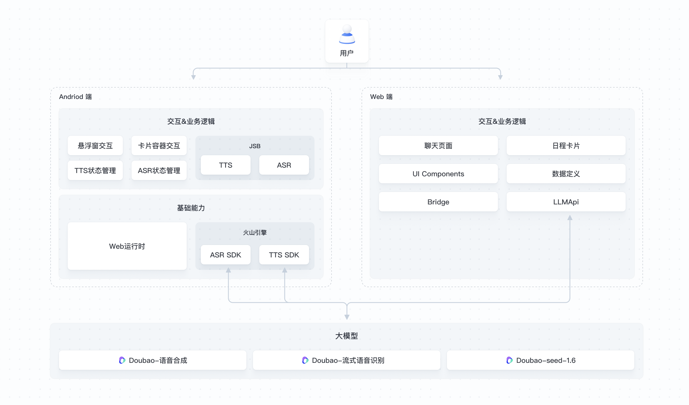

# 手机助手 Pocket Pal

### 应用介绍

基于豆包-图像理解模型的同屏交互系统，专为移动端即时需求设计的创作中枢，用户在任意界面唤醒助手，即刻获得日程智能管理、朋友圈创意文案生成等全场景服务，实现「所见即所说」的立体交互，精准理解用户需求，覆盖大量生活高频场景。

以下是核心应用场景介绍：
- 实时翻译：在外就餐时，面对外国菜单，轻松实现实时翻译。
- 物体识别：借助相机，快速进行食物卡路里测算。
- 识屏问答：遇到体检报告，通过识屏问答功能轻松解读。
- AI 帮写：依据配图，快速生成独具创意的朋友圈文案。
- 日程添加：依据聊天信息，自动添加日程，便捷高效。

#### 效果预览

[视频地址](https://lf3-static.bytednsdoc.com/obj/eden-cn/lm_sth/ljhwZthlaukjlkulzlp/ark/assistant/videos/pocket_pal_video.mp4)

#### 直接体验

扫码下载客户端体验（仅支持 Android 手机）：  


#### 应用优势

**高效便捷的手机助手**
点击即可实时唤醒智能语音助手，支持屏幕内容智能识别与场景化响应。用户无需反复切换应用，在任意界面唤起助手，即刻获得日程智能管理、朋友圈创意文案生成、多平台文档解读等全场景服务。

**跨维度的终端交互革命**
通过独家研发的手机同屏助手与豆包 - 图像理解模型双端联动，实时捕捉并解析屏幕动态信息。突破传统语音助手单一指令模式，实现「所见即所说」的立体交互，精准理解用户需求语境，覆盖生活办公高频场景。

**智能生态的深度融合**
将 AI 能力无缝嵌入移动端交互系统，开创性地融合语音控制、视觉解析、语义预判三重能力。无论是社交平台内容创作，还是复杂数据报告解读，均可通过自然对话轻松完成，重新定义人机协作方式。

#### 相关模型

- Doubao-流式语音识别：将用户的语音提问转写为文本，以便于大模型对用户问题的理解与回复。
- Doubao-Seed-1.6：负责对实时捕捉的屏幕截图进行视觉内容理解，结合当前画面进行深度思考并回答。
- Doubao-语音合成：负责将模型生成的文本回答转化为自然流畅的语音输出。

#### 流程架构


- TTS：语音合成
- ASR：流式语音识别
- JSB：用于实现JavaScript（JS）代码与原生应用（如Android）之间的通信桥梁

### 费用说明

| 相关服务 | 描述 | 计费说明 |
| --- | --- | --- |
| [Doubao-流式语音识别](https://console.volcengine.com/ark/region:ark+cn-beijing/model/detail?Id=seedasr-streaming) | 将用户的语音提问转写为文本，以便于视觉大模型对用户问题的理解与回复。 | [多种计费方式](https://www.volcengine.com/docs/82379/1099320) |
| [Doubao-Seed-1.6](https://console.volcengine.com/ark/region:ark+cn-beijing/model/detail?Id=doubao-seed-1-6) | 负责对实时捕捉的屏幕截图进行视觉内容理解，结合当前画面进行深度思考并回答。 | [多种计费方式](https://www.volcengine.com/docs/82379/1099320) 
| [Doubao-语音合成](https://console.volcengine.com/ark/region:ark+cn-beijing/model/detail?Id=ve-tts) | 负责将模型生成的文本回答转化为自然流畅的语音输出。 | [多种计费方式](https://www.volcengine.com/docs/82379/1099320) |\

### 技术实现

手机助手应用包括 Android 客户端和 Web 前端两部分：
- Android 端主要提供 Web 页面容器、悬浮球交互、语音合成、语音识别等能力。
- Web 前端提供与大模型的对话页面，包括大模型接口调用、会话管理、手势与 UI 交互等。

本项目开源了手机助手应用中的 Web 前端代码。Web 前端基于 React 技术栈实现，负责处理大模型对话（文本+图片）、大模型流式输出、用户语音输入等模块。开发者可参考此工程的大模型接口调用、会话管理等逻辑，将其方便地移植到其他前端工程，提高开发效率。
    
备注：由于本项目运行依赖部分内部实现，此开源工程暂时无法整体编译运行。

#### 核心模块

```plaintext
├── src
│   ├── api
│   │   ├── bridge.ts      # 原生 API 桥接层
│   │   └── llm.ts         # LLM 对话实现
│   ├── components
│   │   ├── ChatList       # 对话页UI与交互
│   │   ├── MeetingCard    # 日程卡片UI
│   └── widgets
│       ├── chat-list       # 对话页入口
│       └── event           # 日程卡片入口
```

#### 对话实现

1. 请求 LLM 接口：
    ```typescript
    // 拼接messages，包括系统prompt、历史消息、当前问题
    const messages = [
      {
        role: 'system',
        content: 'xxx'
      },
      // 历史消息
      ...historyMessages.slice(-5),
      // 当前问题
      {
        role: 'user',
        content: question
      }
    ];

    // 请求LLM api
    const handle = await appletRequest({
      url: `${this.BASE_URL}/bots/chat/completions`,
      method: 'POST',
      header: {
        'Content-Type': 'application/json',
        Authorization: `Bearer ${apiKey}`,
        Accept: 'text/event-stream'
      },
      body: {
        model: this.VLM_MODEL,
        messages: messages,
        stream: true
      },
      streamType: 'sse'
    });
    ```

2. UI 页面响应 LLM 流式返回：
    ```typescript
    await createLLMRequest(
      content,
      // LLM流式回复数据处理
      async (chunk) => {
        setMessages(prevMessages => {
          const lastMessage = prevMessages[prevMessages.length - 1];
          return [
            ...prevMessages.slice(0, -1),
            {
              ...lastMessage,
              // LLM流式回复拼接至message中
              content: lastMessage.content + chunk
            }
          ];
        });
      },
      // 完成回调，状态改为completed
      async () => {
        setMessages(prevMessages => ({
          ...lastMessage,
          status: 'completed'
        }));
        setIsResponding(false);
      }
    );
    ```

#### UI交互设计实现

1. 消息气泡实现
- 用户消息：负责渲染用户消息样式，包括文本和图片。
  ```typescript
  <div className="flex justify-end mb-4">
    <div className="max-w-[80%] bg-[#EFEFFD] text-black rounded-tl-2xl rounded-tr-2xl rounded-bl-2xl px-4 py-2">
    <p>{message.content}</p>
      {message.image && (
        
      )}
    </div>
  </div>
  ```

- bot消息：包括消息状态、消息内容（Markdown）、底部按钮组，通过 message.status 来控制是否显示。
  ```typescript
  <div className="flex justify-start">
    <div className="max-w-full py-2">
      <div className="prose prose-p:my-1 prose-ul:my-1 prose-li:my-0 max-w-none">
        {/* 生成状态指示器 */}
        {message.status === 'searching' ? (
          <div className="flex items-center text-[#737A87] text-[13px] leading-none mb-2">
            <SearchIcon className="mr-1" />
            <span>正在生成中...</span>
          </div>
        ) : (message.status === 'completed' && isLastBotMessage) && (
          <div className="flex items-center text-[#737A87] text-[13px] leading-none mb-2">
            <CheckIcon className="mr-1" />
            <span>生成完毕</span>
          </div>
        )}
        
        {/* Markdown 渲染 */}
        <ReactMarkdown
          components={{
            p: ({ children }) => <p className="my-1">{children}</p>,
            ul: ({ children }) => <ul className="my-1 ml-4 list-disc">{children}</ul>,
            li: ({ children }) => <li className="my-0">{children}</li>,
          }}
        >
          {message.content}
        </ReactMarkdown>
      </div>
      
      {message.status === 'completed' && isLastBotMessage && (
        <>
          <div className="h-[0.5px] bg-[rgba(0,0,0,0.1)] my-3" />
          <div className="flex items-center justify-between text-gray-500">
            {/* 左侧功能区 */}
            ...
            {/* 右侧评价区 */}
            ...
          </div>
        </>
      )}
    </div>
  </div>
  ```

2. 录音交互
  通过 useGesture 中封装的方法处理录音按钮，控制 ASR 的开始、结束与取消，并在 handleUserMessage 中发起LLM请求。
    ```typescript
    const bind = useGesture({
      onDragStart: async () => {
        await startASR({
          vadEnable: true,
          vadEndWaitMs: 1000,
          maxWaitMs: 60000
        });
      },
      onDrag: ({ movement: [mx, my], down }) => {
        // 上滑取消判断
        setIsCancelling(my < -20);
      },
      onDragEnd: async () => {
        await stopASR({});
        if (!isCancelling) {
          handleUserMessage(currentASRTextRef.current);
        }
      }
    });
    ```

### 目录结构

```bash
.
├── applet.config.ts
├── package.json                      # 项目依赖包管理
├── postcss.config.cjs
├── src
│   ├── api
│   │   ├── bridge.ts              # 原生 API 桥接层
│   │   └── llm.ts                 # LLM 对话实现
│   ├── app.ts
│   ├── components
│   │   ├── ChatList               # 对话页UI与组件
│   │   │   ├── CheckIcon.tsx
│   │   │   ├── CopyIcon.tsx
│   │   │   ├── DislikeIcon.tsx
│   │   │   ├── LikeIcon.tsx
│   │   │   ├── ReasoningBlock.tsx
│   │   │   ├── SearchIcon.tsx
│   │   │   ├── VolumeIcon.tsx
│   │   │   ├── WaveIcon.tsx
│   │   │   ├── index.css
│   │   │   └── index.tsx         # 对话页UI主逻辑
│   │   ├── MeetingCard            # 日程卡片UI
│   │   │   ├── TimeDisplay.tsx
│   │   │   ├── index.css
│   │   │   └── index.tsx
│   ├── types
│   │   └── index.ts
│   └── widgets
│       ├── chat-list               # 对话页卡片入口
│       │   ├── index.css
│       │   └── index.tsx
│       └── event                   # 日程卡片入口
│           ├── index.css
│           └── index.tsx
├── tailwind.config.js               # tailwind配置
└── tsconfig.json
```