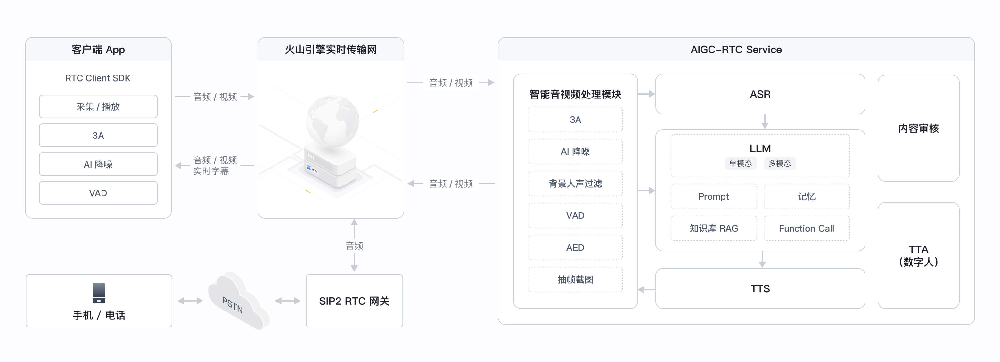
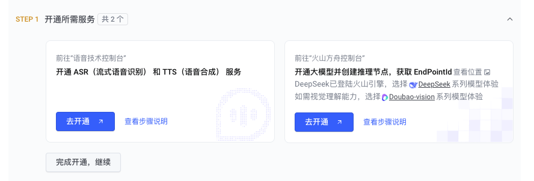
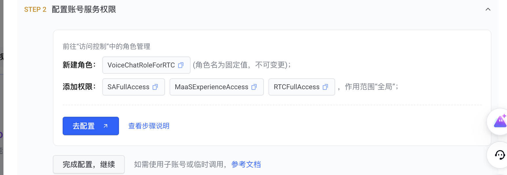
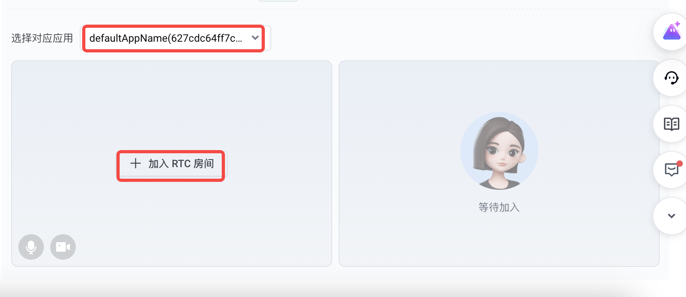
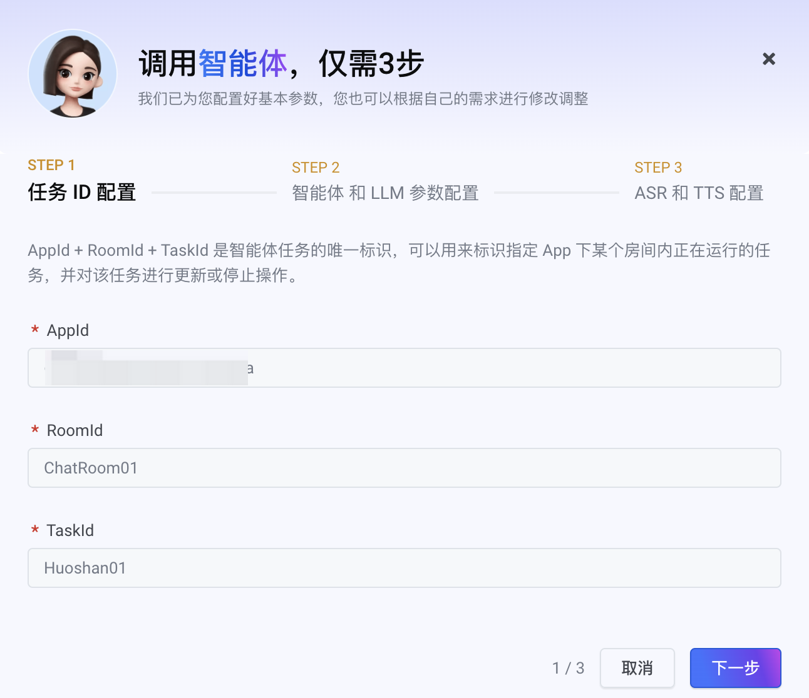
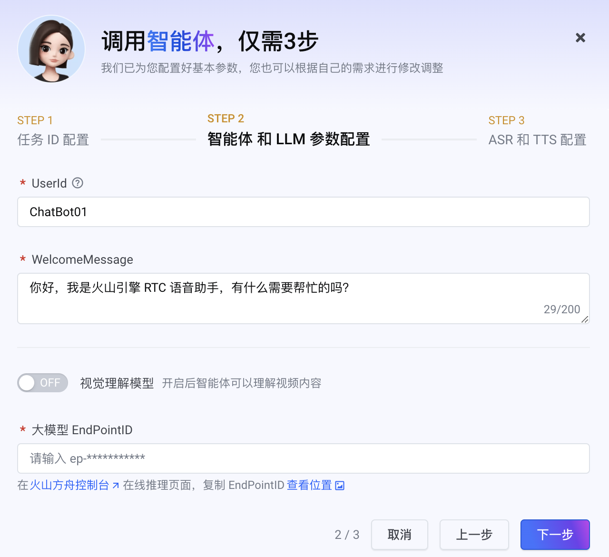
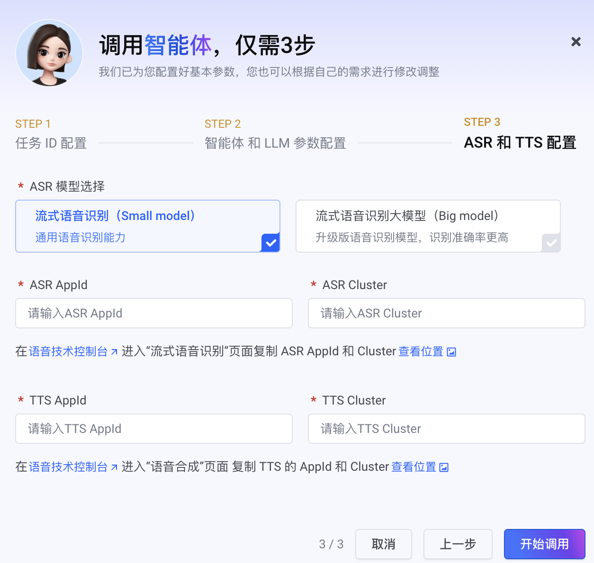

## 应用介绍

超低延迟的 AI 实时对话应用。整合大模型, 语音识别, 语音合成等人工智能技术，实现音视频数据的高效采集、处理和传输，快速实现用户与大模型间流畅、自然、真人感的实时通话功能。

### 效果预览

[演示视频](https://portal.volccdn.com/obj/volcfe/cloud-universal-doc/upload_5a2661e94d2474b95a54475798558b66.mp4)

### 直接体验

https://demo.volcvideo.com/aigc/login

### 应用优势

**智能打断**

支持全双工通信及音频帧级别的人声检测（VAD），随时插话打断，交流更自然。

**端上降噪**

通过 RTC SDK 实现对复杂环境的音频降噪能力，有效降低背景噪音、背景音乐的干扰，提高用户语音打断的准确性。

**超低时延**

基于全链路流式处理，RTC+ASR+LLM+TTS 整体链路时延缩短至 1 秒。

**抗弱网**

通过智能接入、RTC 云端协同优化，在复杂和弱网环境下确保低延时和传输可靠性，避免因丢字引起大模型理解错误。

**快速接入、易集成**

一站式集成，企业只需调用标准的 OpenAPI 接口即可配置所需的语音识别（ASR）、 语音合成（TTS）和大模型（LLM）服务，快速实现 AI 实时交互应用。

**多平台支持**

支持 iOS、Android、Windows、Linux、macOS、Web、Flutter、Unity、Electron 和微信小程序多端，满足不同场景的应用需求。


### 相关模型

> 介绍当前应用使用到的所有模型，以及每个模型所起的作用

当前实时对话式AI产品方案支持的模型包括方舟平台上线的全量豆包大模型，以及方舟平台认证的第三方合作模型，如DeepSeek模型，模型详细信息见方舟平台官网。

### 流程架构


通过火山引擎 RTC 实现音视频数据的高效采集、自定义处理和超低时延传输。在云端，提供了智能音视频处理模块，包括音频 3A、AI降噪和抽帧截图等能力，以减少环境噪音和设备性能对对话式 AI 体验的影响。此外，方案搭载火山方舟大模型服务平台，深度整合语音识别（ASR）、语音合成（TTS）、大语言模型（LLM）和知识库 RAG 等服务，简化语音到文本及文本到语音的转换过程，提供强大的智能对话、自然语言处理和多模态交互能力，助力应用快速实现用户与云端大模型之间的实时语音通话和多模态交互。

## 费用说明

[实时对话式 AI 计费](https://www.volcengine.com/docs/6348/1392584)。

## 环境准备

参看[开通服务](https://www.volcengine.com/docs/6348/1315561)。

## 快速入门

RTC 提供了便捷的测试验证平台，支持快速配置，无代码快速跑通对话式 AI 功能进行验证测试，实现高效开发和部署。

1. 开通 RTC 服务。
	

参看[开通服务](https://www.volcengine.com/docs/6348/69865)开通 RTC 服务。开通服务后 RTC 会为你自动创建一个默认应用，你也可以根据需要重新创建新的应用。

2. 进入[新手引导](https://console.volcengine.com/rtc/guide?)，点击 [跑通 Demo](https://console.volcengine.com/rtc/guide?) 进入快速配置页。
	


3. 开通语音识别、语音合成和大模型服务。
	

参看【步骤说明】开通语音识别-流式语音识别（ASR）、音频生成-语音合成（TTS）和大模型服务，并获得 ASR AppId、ASR Cluster、TTS AppId、TTS Cluster 和大模型 EndPointID。


4. 根据指引配置 `VoiceChatRoleForRTC`服务权限，以便 RTC 与语音识别、语音合成和大模型进行交互。
	



5. 加入与智能体对话的 RTC 房间。
	

点击【加入 RTC 房间】，自定义房间号和用户名，并生成临时鉴权 Token 创建并加入房间。此时会使用你创建 RTC 服务时生成的默认应用，你也可以点击应用下拉框创建新的应用。


6. 创建智能体并引入 RTC 房间。
	1. 点击【调用智能体】。
		
	2. 进行 任务 ID 配置。
		
	  此时会根据你在步骤 5 配置的信息自动填充任务 ID 配置。
	
	5. 进行智能体和 LLM 参数配置。
		
	  填入自定义的智能体名称、欢迎语和你在步骤 3 获得的火山方舟大模型 EndPointID。
	
	8. 进行 ASR 和 TTS 配置。
		
	  填入你在步骤 3 获得的 ASR AppId、 ASR Cluster、 TTS AppId 和 TTS Cluster，ASR 模型选择流式语音识别（Small model）。
	
	  点击【开始调用】完成配置，体验与 AI 智能体实时互动。
	

## 技术实现

[场景搭建](https://www.volcengine.com/docs/6348/1310560)

## 目录结构

https://github.com/volcengine/rtc-aigc-demo （开源github代码链接）

```Bash
.
├── LICENSE
├── README.md                    # 使用指南
├── Server                       # 本地服务端, 须通过服务端代理 OpenAPI 请求
│   ├── app.js                   # 服务端主体文件
│   ├── package.json
│   └── yarn.lock
├── craco.config.js
├── message.js
├── package.json
├── public
├── src
│   ├── App.tsx
│   ├── app
│   │   ├── api.ts               # 前端请求相关配置
│   │   ├── base.ts
│   │   └── type.ts
│   ├── assets                   # 前端媒体资源
│   │   └── img
│   ├── components
│   │   ├── ...
│   │   └── AISettings           # AI 配置组件
│   ├── config
│   │   ├── common.ts            # ASR、LLM、TTS 配置
│   │   ├── config.ts            # 配置注入核心逻辑
│   │   └── index.ts
│   ├── index.less
│   ├── index.tsx
│   ├── interface.ts
│   ├── lib
│   │   ├── RtcClient.ts         # RTC 主调逻辑
│   │   ├── listenerHooks.ts     # RTC 回调逻辑
│   │   └── useCommon.ts         # React hooks
│   ├── pages
│   │   └── MainPage
│   ├── react-app-env.d.ts
│   ├── store
│   │   ├── index.ts
│   │   └── slices
│   ├── theme.less
│   └── utils
│       ├── handler.ts。         # 智能体行为和字幕相关处理逻辑
│       ├── logger.ts
│       ├── utils.less
│       └── utils.ts
├── structure.txt
├── tsconfig.json
└── yarn.lock
```

## 常见问题

Q1： 为什么智能体加入房间后无法互动几分钟后就自动退出了？

A1： 请检查启动智能体接口的参数值、格式等是否填写正确。如填写错误，可能会导致智能体进入房间但无法正常工作。

Q2：总是要大声说话智能体才能识别到我？

A2：可通过调用 `StartVoiceChat.Config.ASRConfig.VolumeGain` 降低采集音量以提高识别的灵敏度。