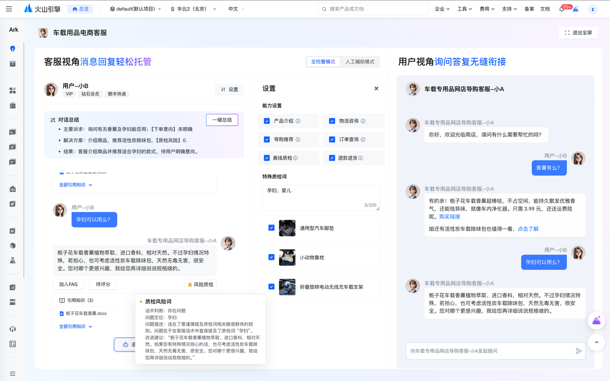
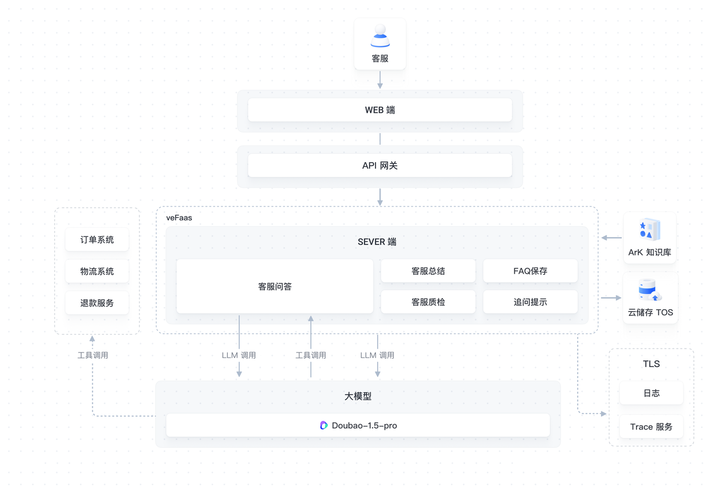
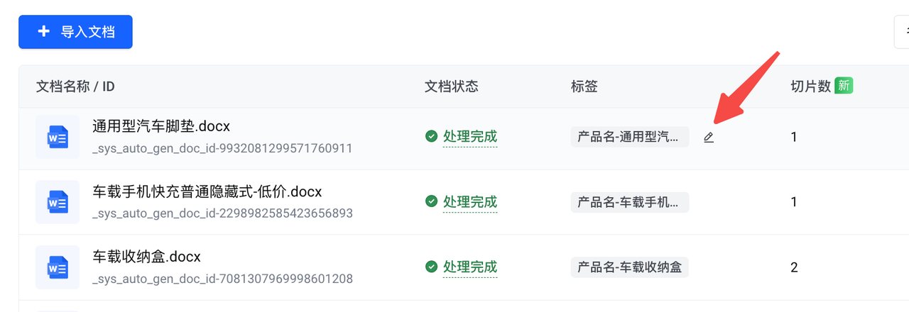
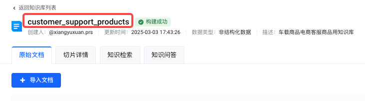
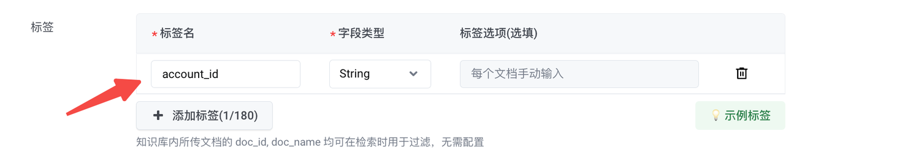
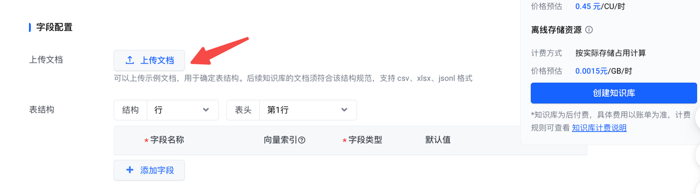
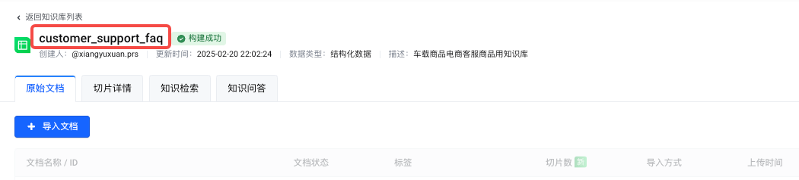
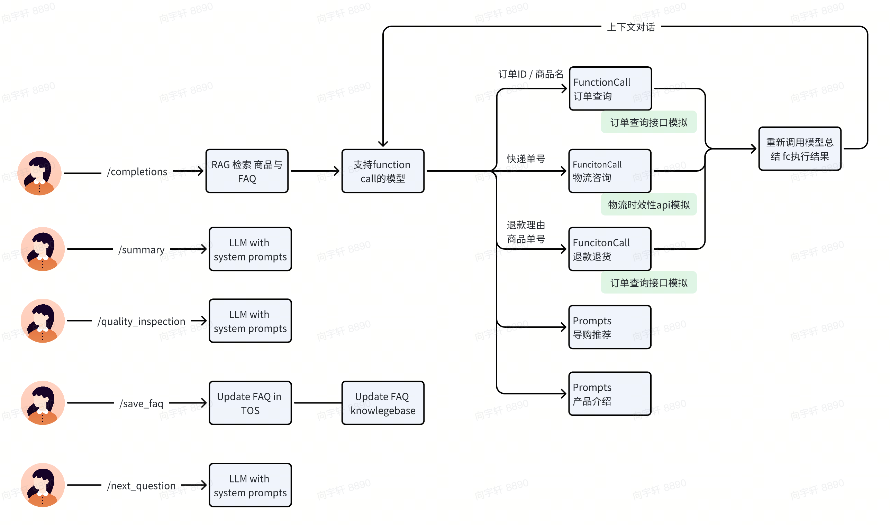

# 智能客服助手
## 应用介绍
这是一款以车载零配件网店客服场景为例设计的智能导购机器人。依赖大模型的 Function Calling 能力与商品知识库、电商现有工具等，为网店运营小二提供助力。此外，开发者还可以参考本示例，逐模块对接真实电商系统接口，实现大模型升级优化，客服算法测试等。
### 效果预览

1. 模拟商店运营：选择货架上的商品。
2. 配置智能客服能力：支持产品介绍、物流咨询、退款退货、导购推荐、离线质检、订单查询等能力。
3. 体验测试：支持切换全托管模式和人工辅助模式，测试智能客服与消费者的对话流畅度。并体验对话一键总结，实时质检等进阶能力。
  - 全托管模式：智能客户直接回复用户问题。
  - 人工辅助模式：智能客服的回复将展示在输入框中，可根据需要人工二次修改。
### 直接体验
<a target="_blank" href="https://console.volcengine.com/ark/region:ark+cn-beijing/assistant/detail?id=bot-20241211162948-5l2kk-procode-preset">控制台体验</a>

### 流程架构

## 关联模型及云产品
### 模型
|相关服务|描述|计费说明|
| ---- | ---- | ---- |
|Doubao-1.5-pro-32k|通过Function Calling能力选择所需工具，根据消费者的问题生成商家回复，并可进行一键总结，回答质检等功能。|<a target="_blank" href="https://www.volcengine.com/docs/82379/1099320">多种计费方式</a>|

### 云服务
|相关服务|描述|计费说明|
| ---- | ---- | ---- |
|<a target="_blank" href="https://www.volcengine.com/docs/82379/1261883">知识库</a>|提供知识管理的能力，支持对文档执行解析、切片、向量化、构建索引等处理进行知识检索。|<a target="_blank" href="https://www.volcengine.com/docs/82379/1263336">多种计费方式</a> |
|<a target="_blank" href="https://www.volcengine.com/product/TOS">对象存储</a> |基于先进分布式技术，帮助用户存储并管理海量非结构化数据。|<a target="_blank" href="https://www.volcengine.com/docs/6349/78455">按量计费+资源包</a>|
|<a target="_blank" href="https://www.volcengine.com/product/vefaas">函数服务</a> |Serverless全托管计算平台，支持快速创建部署函数。|<a target="_blank" href="https://www.volcengine.com/docs/6662/107454">按量计费+资源包</a>|
|<a target="_blank" href="https://www.volcengine.com/product/tls">日志服务</a>|提供针对日志类数据的一站式服务。|<a target="_blank" href="https://www.volcengine.com/docs/6470/1215813">按量计费</a>|
|<a target="_blank" href="https://www.volcengine.com/product/apig">API网关</a>|基于云原生、高扩展、高可用的云上网关托管服务。|<a target="_blank" href="https://www.volcengine.com/docs/6569/185249">按量计费</a>| 

## 环境准备

- Python 版本要求大于等于 3.9，小于 3.12
- Poetry 1.6.1 版本，可参考以下命令安装
pip install poetry==1.6.1
- <a target="_blank" href="https://console.volcengine.com/iam/keymanage/">获取火山引擎 AK SK</a> | <a target="_blank" href="https://www.volcengine.com/docs/6291/65568">参考文档</a>
  注意：如果使用的是 IAM 子用户的 AK SK，请联系管理员授予该用户 ArkFullAccess + TOSFullAccess 预设策略，或者 AdministratorAccess 预设策略。
- 在<a target="_blank" href="https://console.volcengine.com/ark/region:ark+cn-beijing/openManagement?LLM=%7B%7D&OpenTokenDrawer=false">开通管理页</a>开通 doubao-1-5-pro-32k 模型。
- <a target="_blank" href="https://console.volcengine.com/tos/bucket?">创建 TOS Bucket</a> 用于存储FAQ数据 | <a target="_blank" href="https://www.volcengine.com/docs/6349/74830">参考文档</a>

## 快速入门
本文为您介绍如何在本地部署智能导购应用，并进行调用。
1. 创建商品信息检索用知识库，并记录知识库名称备用。
   1. 创建知识库，按下图所示配置标签 产品名: List<String>，其他配置保持默认。
      
   2. 上传文档，上传`backend/docs/`下的产品介绍示例文档，并给每个产品文档标上和`backend/data/product.py`中一致的产品名标签。
      
   3. （可选）添加自定义商品：
      1. 更新 backend/data/product.py 中的商品源信息
      2. 按上述步骤上传商品文档至知识库
   4. 记录知识库名称备用。

2. 创建 FAQ 检索用知识库，并记录 FAQ 知识库名称备用。
   1. 创建知识库
      1. 数据类型选择 结构化数据
      2. 按下图所示配置标签 account_id: String
        
      3. 其他配置保持默认。
   2. 上传backend/docs/faq_example.faq.xlsx示例文档
        
   3. 记录 FAQ 知识库名称备用。
        
3. 下载代码库

```shell
git clone https://github.com/volcengine/ai-app-lab.git
cd demohouse/shop_assist/backend
```

4. 设置环境变量，可参考【环境准备】章节获取以下内容

```shell
# 填写火山引擎 AK
export VOLC_ACCESSKEY="your_access_key" 
# 填写火山引擎 SK
export VOLC_SECRETKEY="your_secret_key" 
# 填写商品信息检索用知识库名称
export COLLECTION_NAME="your_collection_name" 
# 填写FAQ检索用知识库名称
export FAQ_COLLECTION_NAME="your_faq_collection_name" 
# 填写使用的大语言模型 Model ID，建议使用doubao-1-5-pro-32k-250115
export LLM_ENDPOINT_ID="doubao-1-5-pro-32k-250115"
# 填写存储FAQ使用的 TOS Bucket 名称
export BUCKET_NAME="your_bucket_name"
# True: 使用环境变量中的 VOLC_ACCESSKEY为后续LLM访问鉴权，False: 使用client请求中的Authorization header为后续LLM访问鉴权
export USE_SERVER_AUTH="True" 
```

5. 安装依赖

```shell
python -m venv .venv
source .venv/bin/activate
pip install poetry==1.6.1

poetry install
```

6. 启动服务

```shell
poetry run python main.py
```

7. 后端服务启动成功后，可在本地通过 curl 方式对服务进行调用，体验以下5个场景的能力。

- 智能问答
```shell
curl --location 'http://localhost:8080/api/v3/bots/chat/completions' \
--header 'Content-Type: application/json' \
--data '{
    "stream": false,
    "model": "my-bot",
    "messages": [
        {
            "role": "user",
            "content": "我都买过什么"
        }
    ]
}'
```
- 保存FAQ
```shell
curl --location 'http://localhost:8080/api/v3/bots/chat/completions/save_faq' \
--header 'Content-Type: application/json' \
--data '{
    "question": "安装方法",
    "answer": "亲爱哒,使用方法可以参考宝贝主页视频和详情页介绍哦~",
    "score": 5,
    "account_id": "100000"
}'
```
- 质检风险词
```shell
curl --location 'http://localhost:8080/api/v3/bots/chat/completions/quality_inspection' \
--header 'Content-Type: application/json' \
--data '{
    "stream": false,
    "model": "my-bot",
    "messages": [
        {
            "role": "user",
            "content": "这个可爱风腰靠垫价格还可以更低吗？"
        },
        {
            "role": "assistant",
            "content": "亲,这款商品绝对是全网最 低价啦!"
        }
    ]
}'
```
- 对话总结
```shell
curl --location 'http://localhost:8080/api/v3/bots/chat/completions/summary' \
--header 'Content-Type: application/json' \
--data '{
    "stream": false,
    "model": "my-bot",
    "messages": [
        {
            "role": "user",
            "content": "这个可爱风腰靠垫价格还可以更低吗？"
        },
        {
            "role": "assistant",
            "content": "亲,这款商品绝对是全网最 低价啦!"
        }
    ]
}'
```
- 追问提示
```shell
curl --location 'http://localhost:8080/api/v3/bots/chat/completions/next_question' \
--header 'Content-Type: application/json' \
--data '{
    "stream": false,
    "model": "my-bot",
    "messages": [
        {
            "role": "user",
            "content": "这个可爱风腰靠垫价格还可以更低吗？"
        },
        {
            "role": "assistant",
            "content": "亲,这款商品绝对是全网最 低价啦!"
        }
    ]
}'
```
## 目录结构

```
├── README.md
├── config.py              # 配置文件
├── main.py               
├── quality_inspection.py # 质量检查模块
├── summary.py           # 对话总结模块
├── utils.py
├── docs/                # 知识库初始化时使用的文档       
├── data/                # 数据目录
    ├── cache.py        # mock 存储
    ├── orders.py       # 每个账号mock生成三个订单
    ├── product.py      # 商品目录和信息，添加商品时需修改此文件
    ├── rag.py          # 检索商品详情和FAQ
    └── tracking.py     # mock物流追踪
├── tests/               # 测试用例
└── tools/               # 智能问答模块实现，tools及其prompt
```

## 技术实现

- `/completions` 客服问答
  - 通过模型 function call 能力实现工具调用
    - 内置三个模拟工具：订单查询、物流咨询、退货退款
    - 会进行内部多轮模型调用，直到模型没有使用工具的意愿
- `/summary` 总结客服与用户的对话内容
  - 单次 LLM 调用实现
- `/quality_inspection`根据质检词和内置 `system prompt` 对客服回答进行质检
  - 单次 LLM调用实现
- `/save_faq`
  - 下载`BUCKET_NAME`桶中的FAQ文件，更新并重新上传
  -  `FAQ_COLLECTION_NAME`知识库加载`BUCKET_NAME`桶中新的 FAQ 数据
- `/next_question` 辅助客户追问
  - 单次 LLM 调用实现

 