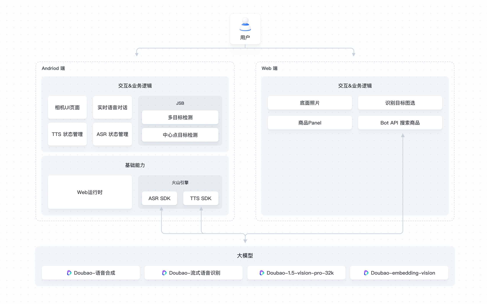

# 拍照购物SnapShop ReadMe

## 应用介绍

本应用深度整合视觉理解、图像向量化、物品识别、语音识别以及语音合成等大模型能力，旨在重塑拍照购物流程。用户仅需拍照或在实时视频场景下操作，就能触发物品识别，快速获取相关商品推荐，享受便捷、高效且有趣的智能购物新体验。

### 直接体验

您可以通过访问[火山方舟控制台](https://console.volcengine.com/ark/region:ark+cn-beijing/application/detail?id=bot-20250313161133-ggqlb&prev=application&projectName=default)在线体验。

### 流程架构

应用的流程架构如下所示。



## 关联模型及云产品

### 相关模型

| 相关服务                                                     | 描述                                                         | 计费说明                                                     |
| ------------------------------------------------------------ | ------------------------------------------------------------ | ------------------------------------------------------------ |
| [Doubao-流式语音识别](https://console.volcengine.com/ark/region:ark+cn-beijing/model/detail?Id=seedasr-streaming) | 将用户的语音提问转写为文本，以便于视觉大模型对用户问题的理解与回复。 | [多种计费方式](https://www.volcengine.com/docs/82379/1099320) |
| [Doubao-1.5-vision-pro-32k](https://console.volcengine.com/ark/region:ark+cn-beijing/model/detail?Id=doubao-1-5-vision-pro-32k) | 负责对商品进行视觉理解，并输出商品类型。                     | [多种计费方式](https://www.volcengine.com/docs/82379/1099320) |
| [Doubao-embedding-vision-241215](https://console.volcengine.com/ark/region:ark+cn-beijing/model/detail?Id=doubao-embedding-vision) | 进行商品图的向量化，方便召回商品。                           | [多种计费方式](https://www.volcengine.com/docs/82379/1099320) |
| [Doubao-语音合成](https://console.volcengine.com/ark/region:ark+cn-beijing/model/detail?Id=ve-tts) | 负责将模型生成的文本回答转化为自然流畅的语音输出。           | [多种计费方式](https://www.volcengine.com/docs/82379/1099320) |


## 技术实现

本拍照购物应用主要由 Android 客户端和 Web 前端两部分构成：

- **Android 端**：为用户提供移动设备上的购物支持，不仅集成了 Web 页面容器，还整合了物品识别、语音识别、语音合成等核心能力。
- **Web 前端**：负责搭建识别物体的 UI 交互页面，实现与大模型的物品识别交互。

本项目开源了拍照购物应用中的 Web 前端代码。Web 前端基于 React 技术栈实现，涵盖了处理大模型对话（包括文本和图片）、大模型流式输出等重要模块。开发者可以参考本工程中的大模型接口调用、会话管理等逻辑，方便地将其移植到其他前端工程中，从而显著提高开发效率。

**注意：由于本项目的运行依赖部分内部实现，因此此开源工程暂时无法进行整体编译运行。**

### 核心模块

本项目的核心模块结构如下：

```Shell
├── src
│   ├── api
│   │   └── llm.ts                      # LLM 对话实现
│   ├── routes                          # 路由配置
│   │   └── recognition                 # 识别中页面
│   ├── utils
│       └── index.ts                    # 工具函数
│   ├── App.tsx                         # 应用总入口
│   ├── index.tsx                       # 编译入口
```

### 对话实现

以下是请求 Bot 接口的代码示例，展示了如何与大模型进行交互：

```TypeScript
// 定义接口的基础 URL、使用的Bot ID以及 API Key
const BASE_URL = 'https://ark.cn-beijing.volces.com/api/v3';
const MODEL = 'bot-xxx';
const APIKEY = 'xxx';
const image_url = 'data:image/jpeg;base64,***' // 或图片url链接

const response = async (image_url: string) {
    const response = await fetch(`${BASE_URL}/bots/chat/completions`,{
      method: 'POST',
      headers: {
        'Content-Type': 'application/json',
        Authorization: `Bearer ${APIKEY}`,
        Accept: 'text/event-stream'
      },
      body: JSON.stringify({
        model: MODEL,
        stream: true,
        messages: [
          {
            role: 'user',
            content: [
              {
                type: 'image_url',
                image_url: {
                  url: image_url
                }
              }
            ]
          }
        ],
        metadata: {
          search: true
        }
      }),
    });
  }
```

### UI交互设计实现

1. **单 webview 入口**：本应用采用单 webview 入口的设计，实现了类似单页应用（SPA）的体验。将所有页面以组件的方式进行实现，确保用户在不同页面之间的切换流畅自然。以下是相关代码示例：

```typescript
import { useState } from 'react';

import Recognition from './routes/recognition';
import './index.css';

function App() {
  const [route] = useState('recognition');

  const renderRoute = () => {
    switch (route) {
      case 'recognition': {
        return <Recognition />;
      }
      default: {
        return <div>404</div>;
      }
    }
  };

  return (
    <div>
      {renderRoute()}
    </div>
  );
}

export default App;

```

## 目录结构

项目的目录结构如下：

```Bash
.
├── package.json                        # 项目依赖包管理
├── pnpm-lock.yaml
├── postcss.config.js
├── rsbuild.config.ts
├── postcss.config.cjs
├── src
│   ├── api
│   │   └── llm.ts                      # LLM 对话实现
│   ├── images
│   └── types
│       └── index.ts
│   ├── routes                          # 路由配置
│   │   └── recognition                 # 识别中页面
│   ├── utils                           # 工具函数
│       └── index.ts
│   ├── App.tsx                         # 应用总入口
│   ├── index.tsx                       # 编译入口
│   ├── index.css                       # 全局样式
├── tailwind.config.js                  # tailwind 配置
└── tsconfig.json
```