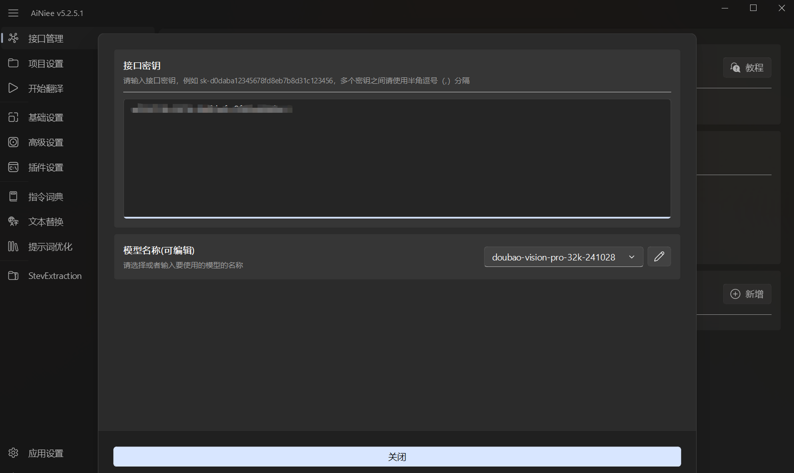

# AiNiee
## 简介

https://github.com/NEKOparapa/AiNiee
AiNiee 是一款专注于 Ai 翻译的工具，可以用来一键自动翻译游戏、小说、字幕等复杂的长文本内容。
## **方舟**上的准备

1. 获取 API Key 点击[这里](https://console.volcengine.com/ark/region:ark+cn-beijing/apiKey)。
2. 开通方舟模型点击[这里](https://console.volcengine.com/ark/region:ark+cn-beijing/openManagement)。
3. 获取模型 ID 点击[这里](https://www.volcengine.com/docs/82379/1330310#%E6%96%87%E6%9C%AC%E7%94%9F%E6%88%90)。

## 调用方舟

### 调用模型服务
配置模型服务，下面是几个核心配置：

 
* 模型名称：您需要模型对应的推理接入点ID，点击[这里](https://console.volcengine.com/ark/region:ark+cn-beijing/endpoint)可创建和选择。
* 接口密钥：获取方舟的API Key，点击[这里](https://console.volcengine.com/ark/region:ark+cn-beijing/apiKey?apikey=%7B%7D)。

### 
## 使用技巧

### 使用AiNiee自动批翻译
可以使用AiNiee一键导入游戏文本，AI自动批量翻译，省去手动劳动。
> 多格式: json/xlsx导出文件、Epub/TXT 小说、Srt/Vtt/Lrc 字幕、Word文档等。
> 多语言: 支持多种语言的互相翻译，例如中文、英文、日文、韩文、俄语等。
> 高效翻译: 拥有多文件批量翻译、多线程翻译、多key轮询、混合平台翻译等功能。
### 使用AiNiee进行动态调参
用户可根据需求调整翻译参数，如模型选择、API Key和代理设置，以优化翻译质量。
> 多平台: 支持国内外主流AI平台，可方便快速使用OpenAI、Google、Anthropic、DeepSeek 系列模型。
> 灵活配置: 自定义请求格式、平台、模型、翻译行数、线程数等。
### 使用AiNiee进行提示词与替换词管理
通过提示词和替换词库，统一翻译风格，提高术语一致性。
> 翻译优化: 针对复杂的长文本进行优化，AI术语表，COT翻译、动态Few-Shot、提示书编写、联系上下文、文本自适应处理、回复检查等。