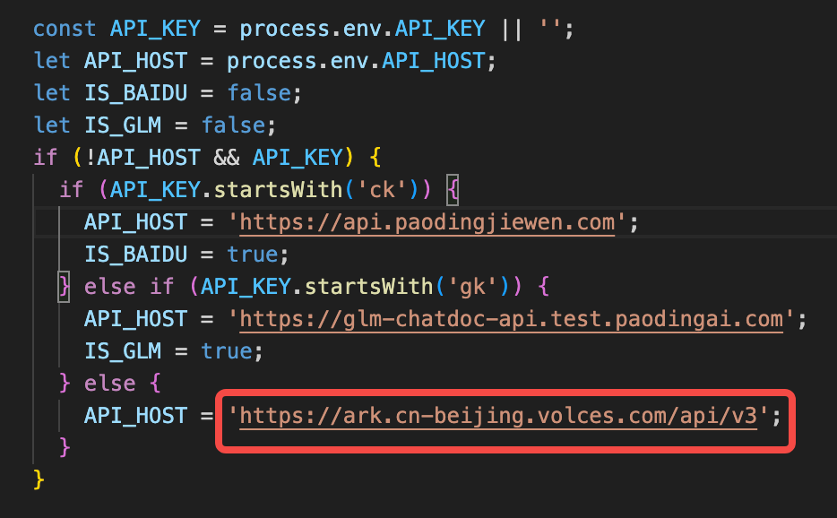

# ChatDOC API Demo
## 简介
https://github.com/chatdoc-com/ChatDOC-API-Demo
ChatDOC 是一款功能强大的 SaaS AI 产品，可让您与文档互动，即时检索答案以及引用来源。

## 方舟上的准备

1. 获取 API Key 点击[这里](https://console.volcengine.com/ark/region:ark+cn-beijing/apiKey)。
2. 开通方舟模型点击[这里](https://console.volcengine.com/ark/region:ark+cn-beijing/openManagement)。
3. 获取模型 ID 点击[这里](https://www.volcengine.com/docs/82379/1330310#%E6%96%87%E6%9C%AC%E7%94%9F%E6%88%90)。


## 调用方舟
### 调用模型服务
配置模型服务，需在env.mjs文件中写入baseURL：
</img>

然后，使用命令行设置API_KEY：
```
export API_KEY=<ARK_API_KEY>
```

获取方舟的API Key，点击[这里](https://console.volcengine.com/ark/region:ark+cn-beijing/apiKey)。

