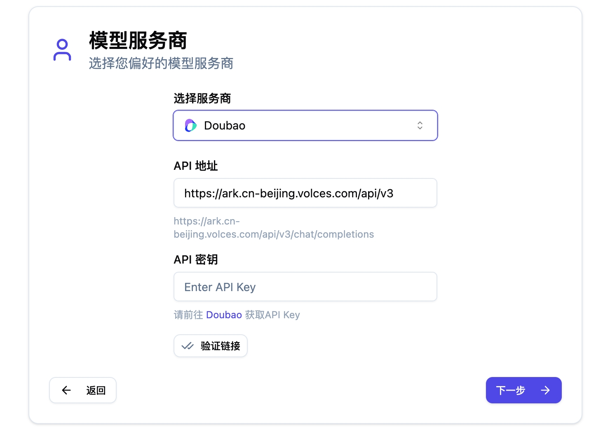

<!-- 软件名称 -->
# DeepChat
## 简介
<!-- 软件网址 -->
https://github.com/ThinkInAIXYZ/deepchat
<!-- 软件简介 -->
DeepChat 是一款基于自研 DeepSeek 大模型的智能桌面助手，提供永久免费的跨平台服务。作为 AI 生产力工具，它深度融合多模态交互能力，支持智能多轮对话、实时联网信息检索、多格式文件解析及个性化知识库管理等功能，助力用户高效完成复杂任务。该软件完全免费开放，无任何功能限制或订阅费用。
## 方舟上的准备
<!-- 调用方舟需要准备的步骤，无需更改 -->
1. 获取 API Key 点击[这里](https://console.volcengine.com/ark/region:ark+cn-beijing/apiKey)。
2. 开通方舟模型点击[这里](https://console.volcengine.com/ark/region:ark+cn-beijing/openManagement)。
3. 获取模型 ID 点击[这里](https://www.volcengine.com/docs/82379/1330310#%E6%96%87%E6%9C%AC%E7%94%9F%E6%88%90)。
4. 如果要联网能力或者知识库检索能力，参考[零代码应用操作指南](https://www.volcengine.com/docs/82379/1267885)创建应用，点击[这里](https://console.volcengine.com/ark/region:ark+cn-beijing/assistant)获取 Bot ID。

## 调用方舟
<!-- 支持集成的方式，包括关键配置，以及配置步骤 -->
### 调用模型服务
配置模型服务，下面是几个核心配置：

- `选择服务商`：豆包
- `API地址`：https://ark.cn-beijing.volces.com/api/v3
- `API密钥`：获取方舟的API Key，点击[这里](https://console.volcengine.com/ark/region:ark+cn-beijing/apiKey)。

