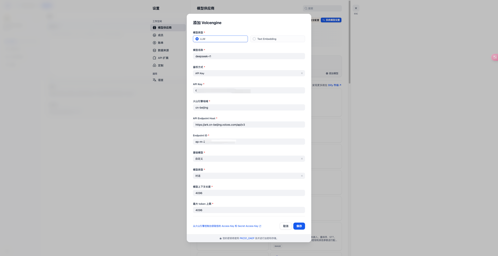

# Dify
## 简介
https://dify.ai/
开源的 LLM 应用开发平台。提供从 Agent 构建到 AI workflow 编排、RAG 检索、模型管理等能力，轻松构建和运营生成式 AI 原生应用。

## 方舟上的准备

1. 获取 API Key 点击[这里](https://console.volcengine.com/ark/region:ark+cn-beijing/apiKey)。
2. 开通方舟模型点击[这里](https://console.volcengine.com/ark/region:ark+cn-beijing/openManagement)。
3. 获取模型 ID 点击[这里](https://www.volcengine.com/docs/82379/1330310#%E6%96%87%E6%9C%AC%E7%94%9F%E6%88%90)。

## 调用方舟
### 调用模型服务
配置模型服务，下面是几个核心配置：
</img>
 

* `模型类型 `：LLM
* `模型名称`：您可以自定义您添加的模型的名称，如DeepSeek-R1。您也可以点击[这里](https://www.volcengine.com/docs/82379/1330310#%E6%96%87%E6%9C%AC%E7%94%9F%E6%88%90)，查询模型对应的Model ID。
* `鉴权方式`：API Key
* `API Key`：获取方舟的API Key，点击[这里](https://console.volcengine.com/ark/region:ark+cn-beijing/apiKey)。
* `火山引擎地域`：请填写您创建的模型推理服务所在的地域，如cn-beijing。
* `Endpoint ID`：获取您创建的模型推理服务的接入点 ID，点击[这里](https://console.volcengine.com/ark/region:ark+cn-beijing/endpoint?config=%7B%7D)。
* `基础模型`：自定义
* `模型上下文长度`：默认4096。您可以根据需要进行设置。
* `最大 token 上限`：默认4096。您可以根据需要进行设置。
