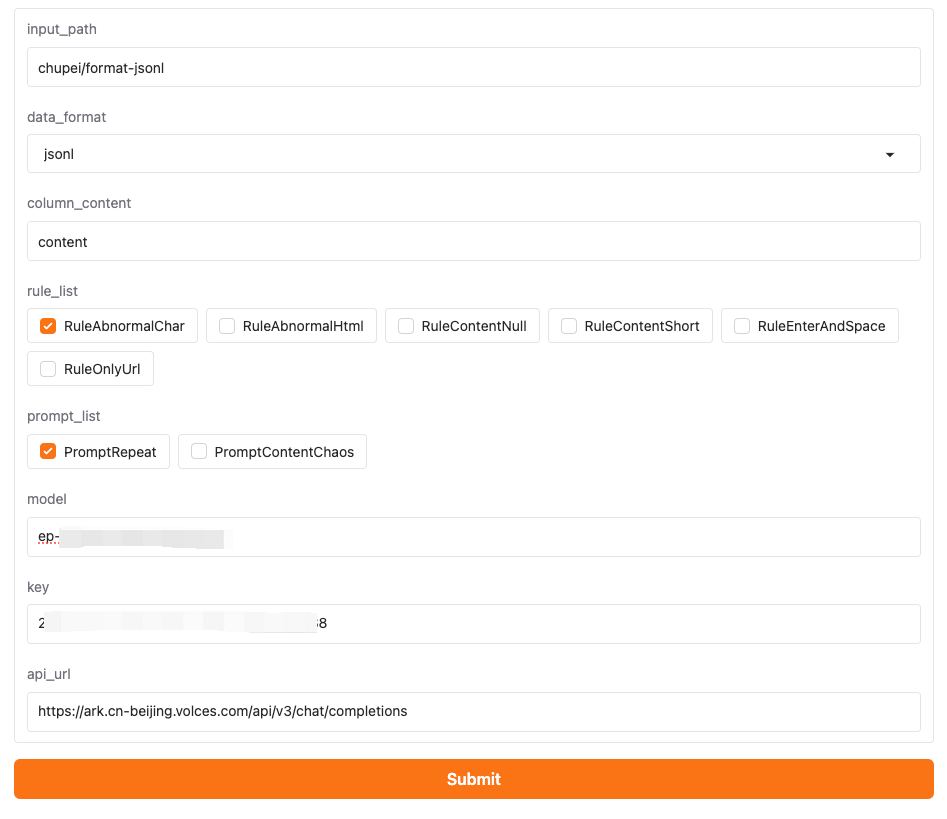

# Dingo
## 简介

https://github.com/DataEval/dingo
Dingo 是一款数据质量评估工具，可帮助您自动检测数据集中的数据质量问题。Dingo 提供多种内置规则和模型评估方法，同时还支持自定义评估方法。Dingo 支持常用的文本数据集和多模态数据集，包括预训练数据集、微调数据集和评估数据集。

## 方舟上的准备

1. 获取 API Key 点击[这里](https://console.volcengine.com/ark/region:ark+cn-beijing/apiKey)。
2. 开通方舟模型点击[这里](https://console.volcengine.com/ark/region:ark+cn-beijing/openManagement)。
3. 获取模型 ID 点击[这里](https://www.volcengine.com/docs/82379/1330310#%E6%96%87%E6%9C%AC%E7%94%9F%E6%88%90)。

## 调用方舟
### 调用模型服务
配置模型服务，下面是几个核心配置：
</img>

* `model `：获取您创建的模型推理服务的接入点 ID，点击[这里](https://console.volcengine.com/ark/region:ark+cn-beijing/endpoint?config=%7B%7D)
* `key`：填写API Key。获取方舟的API Key，点击[这里](https://console.volcengine.com/ark/region:ark+cn-beijing/apiKey)
* `api_url`：https://ark.cn-beijing.volces.com/api/v3/chat/completions

