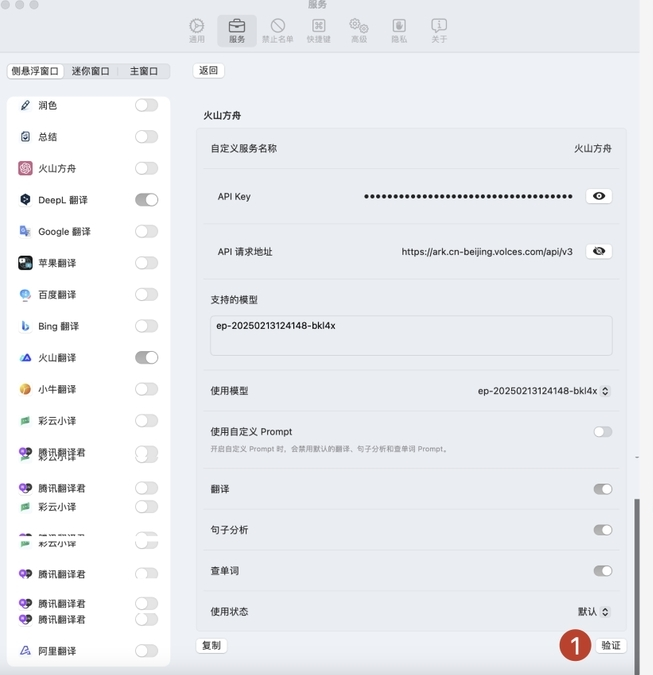

# Easydict
## 简介

https://github.com/tisfeng/Easydict
Easydict 开箱即用，能自动识别输入文本语言，支持输入翻译，划词翻译和 OCR 截图翻译，可同时查询多个翻译服务结果。
## **方舟**上的准备

1. 获取 API Key 点击[这里](https://console.volcengine.com/ark/region:ark+cn-beijing/apiKey)。
2. 开通方舟模型点击[这里](https://console.volcengine.com/ark/region:ark+cn-beijing/openManagement)。
3. 获取模型 ID 点击[这里](https://www.volcengine.com/docs/82379/1330310#%E6%96%87%E6%9C%AC%E7%94%9F%E6%88%90)。

## 调用方舟

### 调用模型服务
配置模型服务，下面是几个核心配置：

* API Key：获取方舟的API Key，点击[这里](https://console.volcengine.com/ark/region:ark+cn-beijing/apiKey)。
* API请求地址：https://ark.cn-beijing.volces.com/api/v3/chat/completions
* 支持的模型：您需要模型对应的Model ID，点击[这里](https://www.volcengine.com/docs/82379/1330310#%E6%96%87%E6%9C%AC%E7%94%9F%E6%88%90)可查询。

## 使用技巧

### **支持鼠标&快捷键划词翻译**
划词后自动显示查询图标，鼠标悬浮&快捷键即可（默认 `⌥ + D`）即可查询

