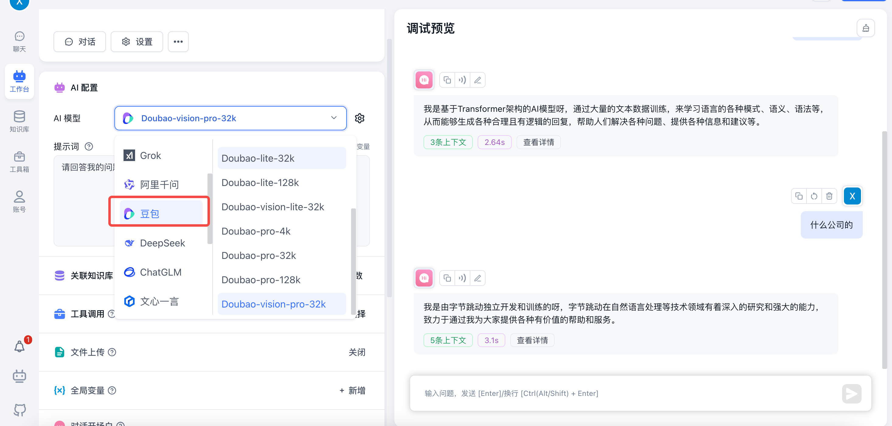

# FastGPT
## 简介

https://github.com/labring/FastGPT
FastGPT 是一个基于 LLM 大语言模型的知识库问答系统，提供开箱即用的数据处理、模型调用等能力。同时可以通过 Flow 可视化进行工作流编排，从而实现复杂的问答场景。

## 调用方舟

### 调用模型服务
在AI配置中，AI模型选择豆包的模型：

 
### 
## 使用技巧

### 应用编排能力
对话工作流、插件工作流、工具调用、Code sandbox、循环调用、用户选择、 表单输入。

### 知识库能力
多库复用，混用；chunk 记录修改和删除；支持手动输入，直接分段，QA 拆分导入；支持 txt，md，html，pdf，docx，pptx，csv，xlsx；支持url读取、CSV 批量导入；混合检索 & 重排；API 知识库；自定义文件读取服务；自定义分块服务
### 运营能力
免登录分享窗口、frame一键嵌入、聊天窗口嵌入支持自定义Icon，默认打开，拖拽等功能、统一查阅对话记录，并对数据进行标注
### 应用调试能力
知识库单点搜索测试、对话时反馈引用并可修改与删除、完整上下文呈现、完整模块中间值呈现、高级编排DeBug模式
### 其他
可视化模型配置、支持语音输入和输出 (可配置语音输入语音回答)、模糊输入提示、模板市场
 

 

 