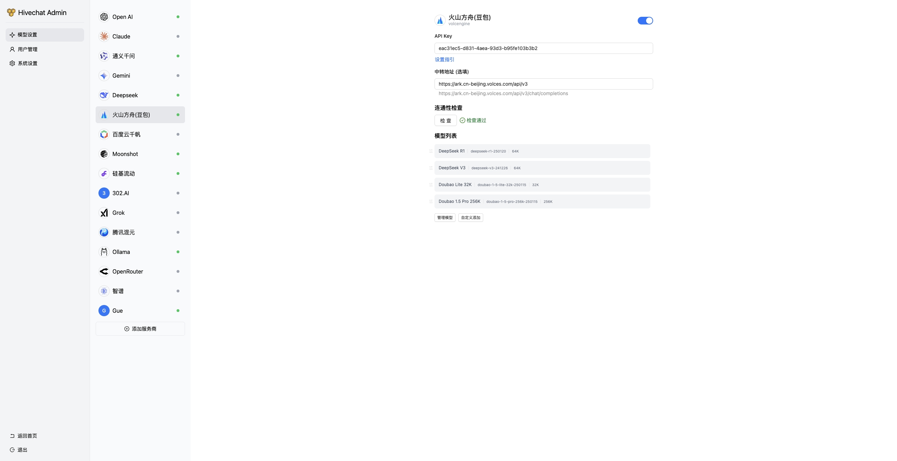

<!-- 软件名称 -->
# Hivechat
## 简介
<!-- 软件网址 -->
https://hivechat.org/
<!-- 软件简介 -->
专为中小团队设计的 AI 聊天应用，支持 Deepseek、Open AI、Claude、Gemini 等模型。
## 方舟上的准备
<!-- 调用方舟需要准备的步骤，无需更改 -->
1. 获取 API Key 点击[这里](https://console.volcengine.com/ark/region:ark+cn-beijing/apiKey)。
2. 开通方舟模型点击[这里](https://console.volcengine.com/ark/region:ark+cn-beijing/openManagement)。
3. 获取模型 ID 点击[这里](https://www.volcengine.com/docs/82379/1330310#%E6%96%87%E6%9C%AC%E7%94%9F%E6%88%90)。
4. 如果要联网能力或者知识库检索能力，参考[零代码应用操作指南](https://www.volcengine.com/docs/82379/1267885)创建应用，点击[这里](https://console.volcengine.com/ark/region:ark+cn-beijing/assistant)获取 Bot ID。

## 调用方舟
<!-- 支持集成的方式，包括关键配置，以及配置步骤 -->
### 调用模型服务
配置模型服务，下面是几个核心配置：

- `API Key`：获取方舟的API Key，点击[这里](https://console.volcengine.com/ark/region:ark+cn-beijing/apiKey)。
- `中转地址`：https://ark.cn-beijing.volces.com/api/v3

