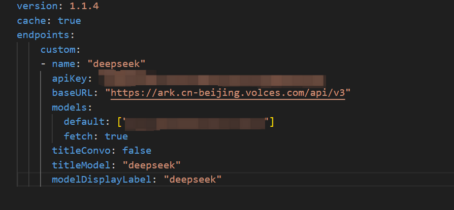

## LibreChat

github地址：https://github.com/danny-avila/LibreChat

官网地址：https://www.librechat.ai/ 

LibreChat是一款开源的多功能 AI 对话平台，支持多语言界面和多种 AI 模型（如 OpenAI、Google、Azure 等），提供类似 ChatGPT 的交互体验，并具备多模态聊天、对话预设、插件扩展等功能

## **方舟**上的准备

1. 获取 API Key 点击[这里](https://console.volcengine.com/ark/region:ark+cn-beijing/apiKey)。
2. 开通方舟模型点击[这里](https://console.volcengine.com/ark/region:ark+cn-beijing/openManagement)。
3. 获取模型 ID 点击[这里](https://www.volcengine.com/docs/82379/1330310#%E6%96%87%E6%9C%AC%E7%94%9F%E6%88%90)。

## 部署及调用方舟

1. 根据教程本地部署LibreChat
2. 在librechat.yaml文件中，添加下列模型配置

- apiKey：获取方舟的API Key，点击[这里](https://console.volcengine.com/ark/region:ark+cn-beijing/apiKey)。
- baseURL: "https://ark.cn-beijing.volces.com/api/v3"
- models-default：获取您创建的模型推理服务的接入点 ID，点击[这里](https://console.volcengine.com/ark/region:ark+cn-beijing/endpoint?config={})。
- 其余字段可自定义

