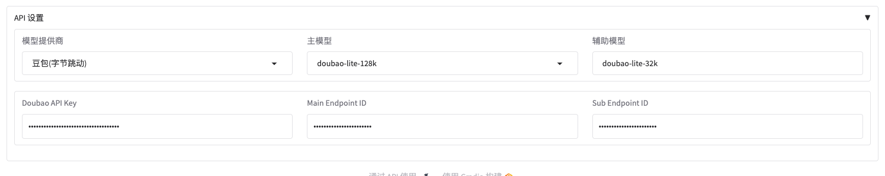

# Long-Novel-GPT
## 简介

https://github.com/MaoXiaoYuZ/Long-Novel-GPT
Long-Novel-GPT是一个基于大语言模型的长篇小说生成器。它采用层次化的大纲/章节/正文结构，以把握长篇小说的连贯剧情；通过大纲->章节->正文的精准映射来获取上下文，从而优化API调用成本；并根据自身或用户反馈不断进行优化，直至创作出心目中的长篇小说。

## 方舟上的准备

1. 获取 API Key 点击[这里](https://console.volcengine.com/ark/region:ark+cn-beijing/apiKey)。
2. 开通方舟模型点击[这里](https://console.volcengine.com/ark/region:ark+cn-beijing/openManagement)。
3. 获取模型 ID 点击[这里](https://www.volcengine.com/docs/82379/1330310#%E6%96%87%E6%9C%AC%E7%94%9F%E6%88%90)。

## 调用方舟

### 调用模型服务
配置模型服务，下面是几个核心配置：

* 主模型：您需要模型对应的Model ID，点击[这里](https://www.volcengine.com/docs/82379/1330310#%E6%96%87%E6%9C%AC%E7%94%9F%E6%88%90)可查询。
* Doubao API Key：获取方舟的API Key，点击[这里](https://console.volcengine.com/ark/region:ark+cn-beijing/apiKey)。

## 使用技巧

### 使用Long-Novel-GPT生成百万级别小说
Long-Novel-GPT-2.1版本完全支持生成百万级别小说的版本，而且是多窗口同步生成，速度非常快。同时你可以自由控制你需要生成的部分，对选中部分重新生成等等。而且，Long-Novel-GPT-2.1会自动管理上下文，在控制API调用费用的同时确保了生成剧情的连续。作章节支持创作无限长度的章节数，同理，剧情和正文均不限长度，LNGPT会自动进行切分，自动加入上下文，并自动采取多个线程同时创作。

 
