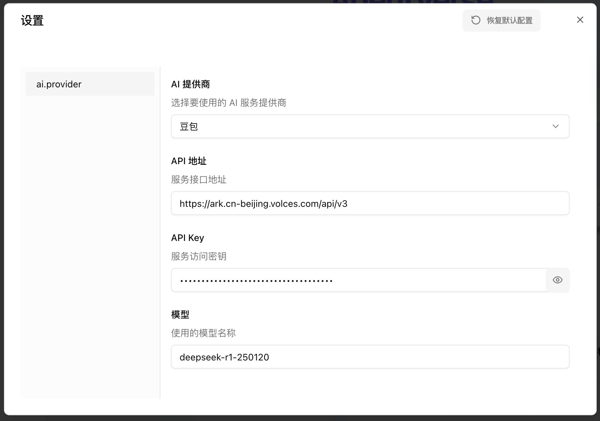

# MultiAgent Chat
## 简介

https://github.com/Peiiii/ai-agent-discussion 
一个开源的多智能体对话平台，支持多个主流 AI 模型，让 AI 们进行自主讨论、头脑风暴和知识探索，让多个 AI 智能体协同对话，激发思维的火花。

## **方舟**上的准备

1. 获取 API Key 点击[这里](https://console.volcengine.com/ark/region:ark+cn-beijing/apiKey)。
2. 开通方舟模型点击[这里](https://console.volcengine.com/ark/region:ark+cn-beijing/openManagement)。
3. 获取模型 ID 点击[这里](https://www.volcengine.com/docs/82379/1330310#%E6%96%87%E6%9C%AC%E7%94%9F%E6%88%90)。

## 调用方舟

### 调用模型服务
配置模型服务，下面是几个核心配置：

* API 地址：[https://ark.cn-beijing.volces.com/api/v3](https://ark.cn-beijing.volces.com/api/v3/chat/completions)
* API Key：获取方舟的API Key，点击[这里](https://console.volcengine.com/ark/region:ark+cn-beijing/apiKey)。
* AI模型名称：您需要模型对应的Model ID，点击[这里](https://www.volcengine.com/docs/82379/1330310#%E6%96%87%E6%9C%AC%E7%94%9F%E6%88%90)可查询。
