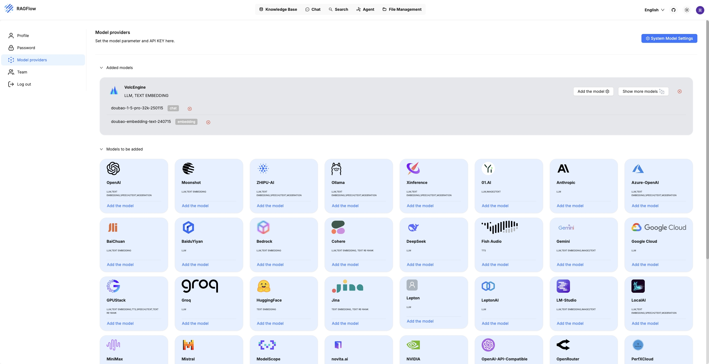
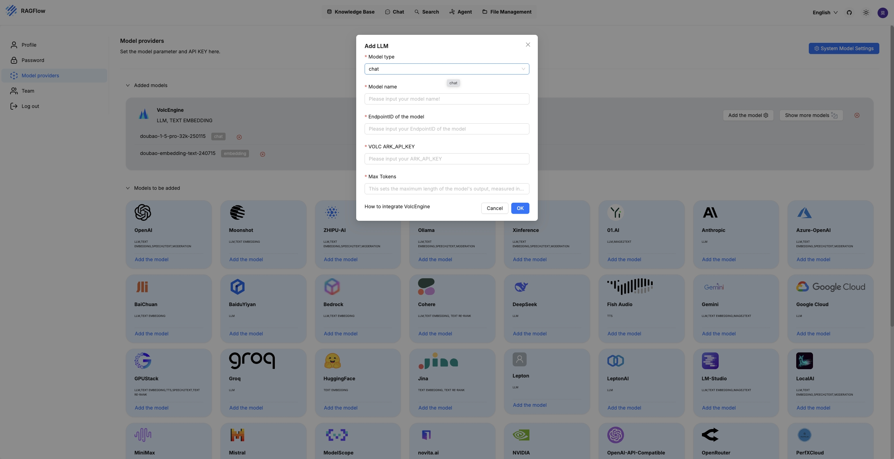
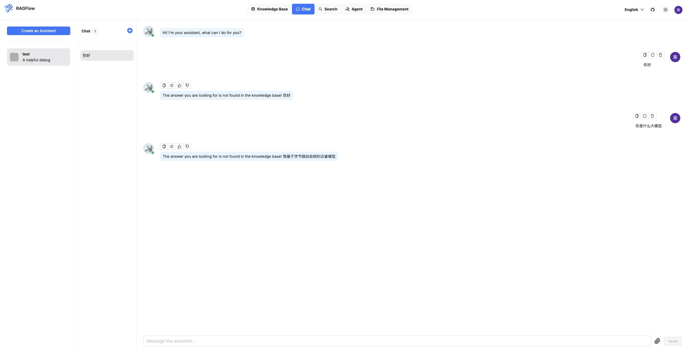
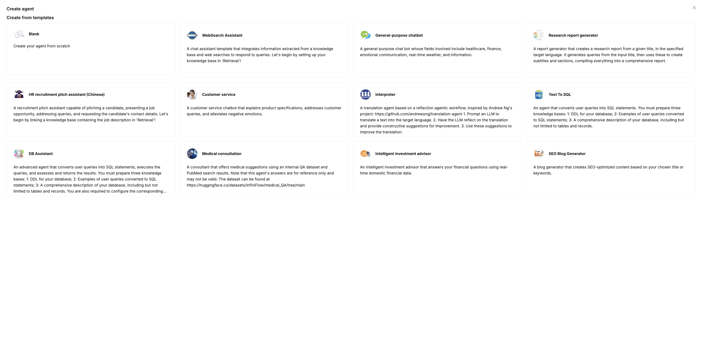

# RAGFlow
## 简介
https://ragflow.io/
RAGFlow是一款基于深度文档理解构建的开源 RAG（Retrieval-Augmented Generation）引擎。RAGFlow 可以为各种规模的企业及个人提供一套精简的 RAG 工作流程，结合大语言模型（LLM）针对用户各类不同的复杂格式数据提供可靠的问答以及有理有据的引用。

## **方舟**上的准备

1. 获取 API Key 点击[这里](https://console.volcengine.com/ark/region:ark+cn-beijing/apiKey)。
2. 开通方舟模型点击[这里](https://console.volcengine.com/ark/region:ark+cn-beijing/openManagement)。
3. 获取模型 ID 点击[这里](https://www.volcengine.com/docs/82379/1330310#%E6%96%87%E6%9C%AC%E7%94%9F%E6%88%90)。
4. 如果要联网能力或者知识库检索能力，参考[零代码应用操作指南](https://www.volcengine.com/docs/82379/1267885)创建应用，点击[这里](https://console.volcengine.com/ark/region:ark+cn-beijing/assistant)获取 Bot ID。

## 调用方舟
### 调用模型服务
配置模型服务，下面是几个核心配置：

>

* `API Provider `：VolcEngine
* `Base URL`：[https://ark.cn-beijing.volces.com/api/](https://ark.cn-beijing.volces.com/api/)v1
* `Model`：您需要模型对应的Model ID，点击[这里](https://www.volcengine.com/docs/82379/1330310#%E6%96%87%E6%9C%AC%E7%94%9F%E6%88%90)可查询。
* `API Key`：获取方舟的API Key，点击[这里](https://console.volcengine.com/ark/region:ark+cn-beijing/apiKey)。

### 
## 使用技巧
### 使用RAGFlow进行对话

### 使用RAGFlow创建Agent

