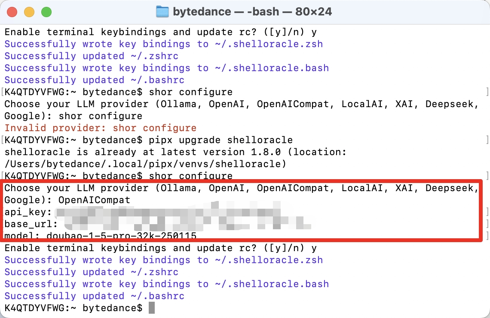

# ShellOracle
## 简介
https://github.com/djcopley/ShellOracle/
ShellOracle 是一款创新的终端实用程序，专为智能 shell 命令生成而设计，可为您的命令行交互带来全新的效率。ShellOracle 目前支持 Ollama、OpenAI、Deepseek、LocalAI 和 Grok.

## **方舟**上的准备

1. 获取 API Key 点击[这里](https://console.volcengine.com/ark/region:ark+cn-beijing/apiKey)。
2. 开通方舟模型点击[这里](https://console.volcengine.com/ark/region:ark+cn-beijing/openManagement)。
3. 获取模型 ID 点击[这里](https://www.volcengine.com/docs/82379/1330310#%E6%96%87%E6%9C%AC%E7%94%9F%E6%88%90)。
4. 如果要联网能力或者知识库检索能力，参考[零代码应用操作指南](https://www.volcengine.com/docs/82379/1267885)创建应用，点击[这里](https://console.volcengine.com/ark/region:ark+cn-beijing/assistant)获取 Bot ID。

## 调用方舟
### 调用模型服务
配置模型服务，下面是几个核心配置：

>

* `API Provider `：OpenAICompat
* `Base URL`：[https://ark.cn-beijing.volces.com/api/](https://ark.cn-beijing.volces.com/api/)v1
* `Model`：您需要模型对应的Model ID，点击[这里](https://www.volcengine.com/docs/82379/1330310#%E6%96%87%E6%9C%AC%E7%94%9F%E6%88%90)可查询。
* `API Key`：获取方舟的API Key，点击[这里](https://console.volcengine.com/ark/region:ark+cn-beijing/apiKey)。

### 
## 使用技巧
### 根据文本描述生成 shell 命令
按下Ctrl+F，输入文本描述要求语句，便可立刻生成shell命令

