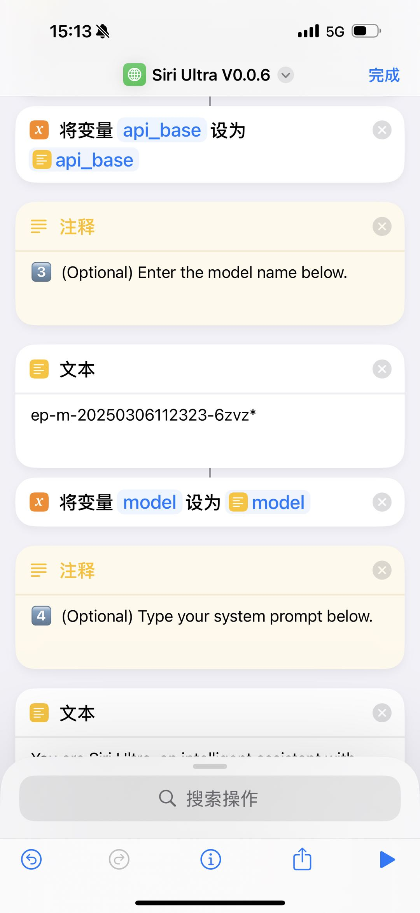
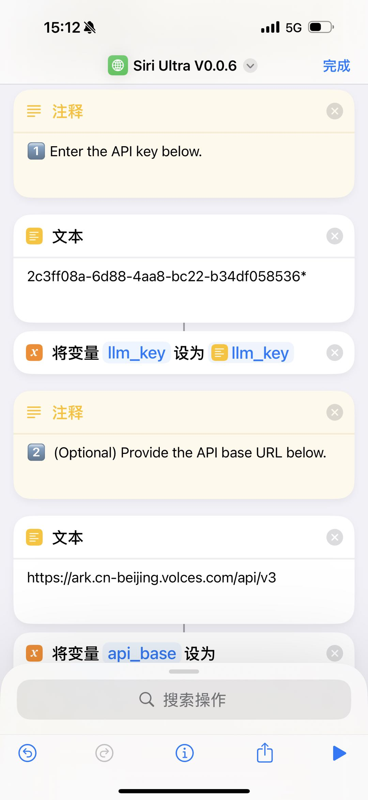

# Siri Ultra
## 简介
https://github.com/fatwang2/siri-ultra
Siri Ultra 是一个能在 iPhone 上使用的 AI 聊天快捷指令，无需下载任何 App，即可体验到最新的大模型。

* 通过 Siri 实时语音对话，也可以直接运行快捷指令进行文字对话
* 兼容各种大模型，包括 OpenAI、Gemini、DeepSeek 等
* 支持联网搜索（需单独配置搜索 key）
* 支持网页总结 （链接发给快捷指令即可）

## **方舟**上的准备

1. 获取 API Key 点击[这里](https://console.volcengine.com/ark/region:ark+cn-beijing/apiKey)。
2. 开通方舟模型点击[这里](https://console.volcengine.com/ark/region:ark+cn-beijing/openManagement)。
3. 获取模型 ID 点击[这里](https://www.volcengine.com/docs/82379/1330310#%E6%96%87%E6%9C%AC%E7%94%9F%E6%88%90)。
4. 如果要联网能力或者知识库检索能力，参考[零代码应用操作指南](https://www.volcengine.com/docs/82379/1267885)创建应用，点击[这里](https://console.volcengine.com/ark/region:ark+cn-beijing/assistant)获取 Bot ID。

## 调用方舟
### 调用模型服务
配置模型服务，下面是几个核心配置：

>

* `API Provider `：火山引擎
* `Base URL`：[https://ark.cn-beijing.volces.com/api/](https://ark.cn-beijing.volces.com/api/)v3
* `Model`：您需要模型对应的Model ID，点击[这里](https://www.volcengine.com/docs/82379/1330310#%E6%96%87%E6%9C%AC%E7%94%9F%E6%88%90)可查询。
* `API Key`：获取方舟的API Key，点击[这里](https://console.volcengine.com/ark/region:ark+cn-beijing/apiKey)。

## 使用技巧

* 语音模式：说 "Hey Siri" 后念出你设置的快捷指令名字，比如 Siri Ultra
* 文字模式：直接运行快捷指令

