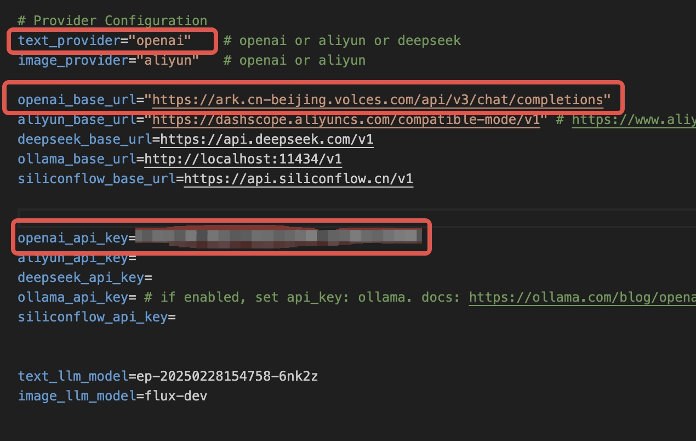
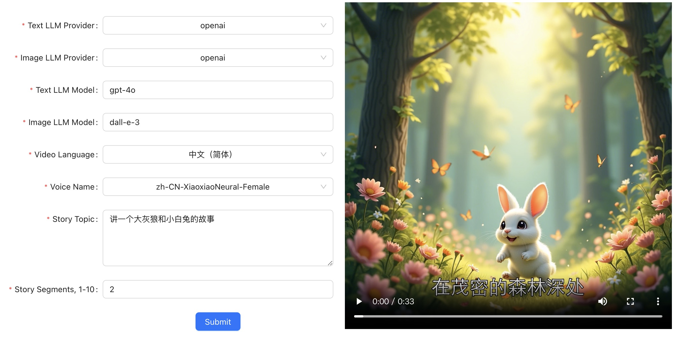

# Story-Flicks
## 简介
https://github.com/alecm20/story-flicks
该项目允许用户输入故事主题，并使用大型语言模型生成故事视频。视频包括AI生成的图像、故事内容、音频和字幕。

## 方舟上的准备

1. 获取 API Key 点击[这里](https://console.volcengine.com/ark/region:ark+cn-beijing/apiKey)。
2. 开通方舟模型点击[这里](https://console.volcengine.com/ark/region:ark+cn-beijing/openManagement)。
3. 获取模型 ID 点击[这里](https://www.volcengine.com/docs/82379/1330310#%E6%96%87%E6%9C%AC%E7%94%9F%E6%88%90)。

## 调用方舟
### 调用模型服务
配置模型服务，需进入backend/.env.example文件中修改相关内容。下面是几个核心配置：
</img>

* `text_provider`：openai
* `openai_base_url`：https://ark.cn-beijing.volces.com/api/v3
* `openai_api_key`：获取方舟的API Key，点击[这里](https://console.volcengine.com/ark/region:ark+cn-beijing/apiKey)。

## 使用技巧
根据界面中的字段，选择文本生成模型提供商、图片生成模型提供商、文本模型、图片模型、视频语言、语音、故事主题、故事片段，点击“生成”即可制作视频。生成的图片数量将与指定的片段数量相对应，每个片段一张图片。设置的片段越多，生成视频所需的时间越长。生成成功后，视频将显示在前端页面上。
</img>

