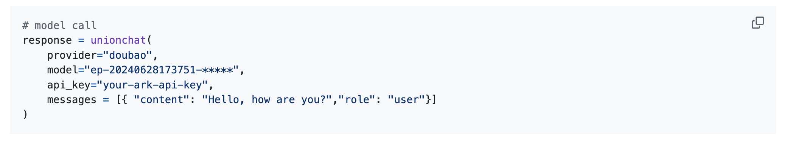

# UnionLLM
## 简介

https://github.com/EvalsOne/UnionLLM/tree/main
一款通过与OpenAI兼容的统一方式调用各种国内外各种大语言模型和Agent编排工具的轻量级开源Python工具包。

## **方舟**上的准备

1. 获取 API Key 点击[这里](https://console.volcengine.com/ark/region:ark+cn-beijing/apiKey)。
2. 开通方舟模型点击[这里](https://console.volcengine.com/ark/region:ark+cn-beijing/openManagement)。
3. 获取模型 ID 点击[这里](https://www.volcengine.com/docs/82379/1330310#%E6%96%87%E6%9C%AC%E7%94%9F%E6%88%90)。

## 调用方舟

### 调用模型服务
配置模型服务，可在接口中直接传入鉴权参数调用，下面是几个核心配置：

* provider：填写doubao
* model：您需要模型对应的Model ID，点击[这里](https://www.volcengine.com/docs/82379/1330310#%E6%96%87%E6%9C%AC%E7%94%9F%E6%88%90)可查询。
* api_key：获取方舟的API Key，点击[这里](https://console.volcengine.com/ark/region:ark+cn-beijing/apiKey)。
