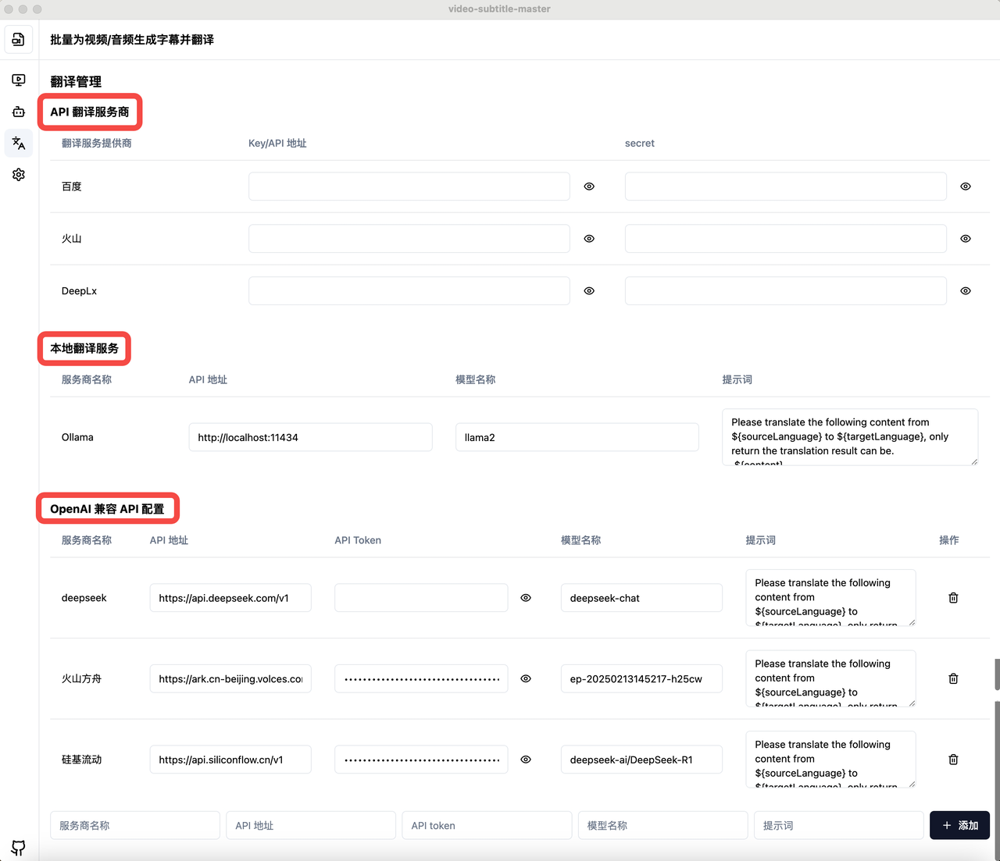
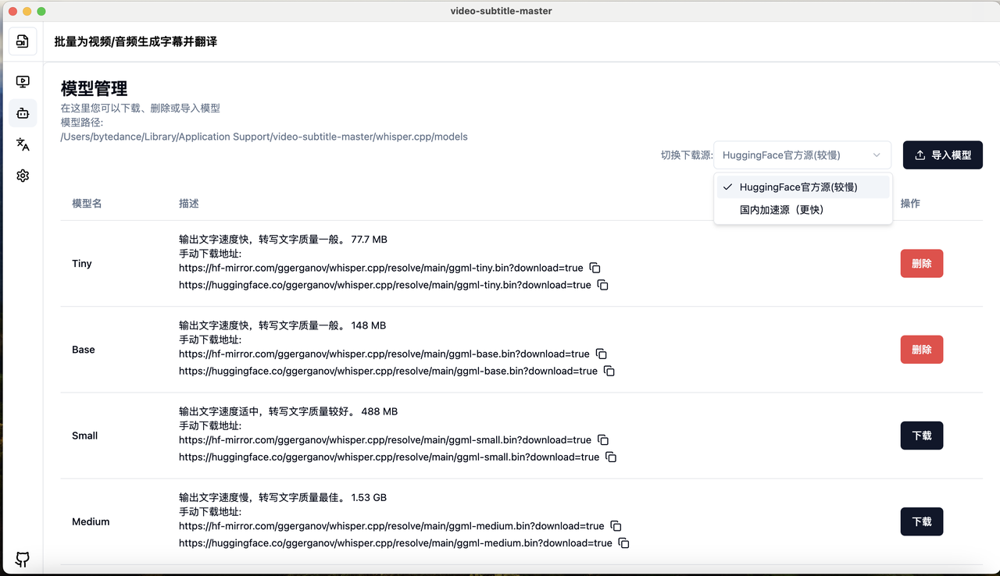

# Video Subtitle Master
## 简介

https://github.com/buxuku/video-subtitle-master
一款支持批量生成视频字幕并提供多种字幕翻译服务的本地运行的开源工具，适合需要高效处理大量视频字幕的用户。
## **方舟**上的准备

1. 获取 API Key 点击[这里](https://console.volcengine.com/ark/region:ark+cn-beijing/apiKey)。
2. 开通方舟模型点击[这里](https://console.volcengine.com/ark/region:ark+cn-beijing/openManagement)。
3. 获取模型 ID 点击[这里](https://www.volcengine.com/docs/82379/1330310#%E6%96%87%E6%9C%AC%E7%94%9F%E6%88%90)。

## 调用方舟

### 调用模型服务
配置模型服务，下面是几个核心配置：

* API地址：https://ark.cn-beijing.volces.com/api/v3/chat/completions
* API Token：获取方舟的API Key，点击[这里](https://console.volcengine.com/ark/region:ark+cn-beijing/apiKey)。
* 模型名称：您需要模型对应的Model ID，点击[这里](https://www.volcengine.com/docs/82379/1330310#%E6%96%87%E6%9C%AC%E7%94%9F%E6%88%90)可查询。

### 
## 使用技巧

### **支持定制字幕格式，可生成SRT文件上传至视频应用**
提供Apple Silicon适配，支持国内、国外镜像源
> 跨平台支持 mac 和 windows 系统

