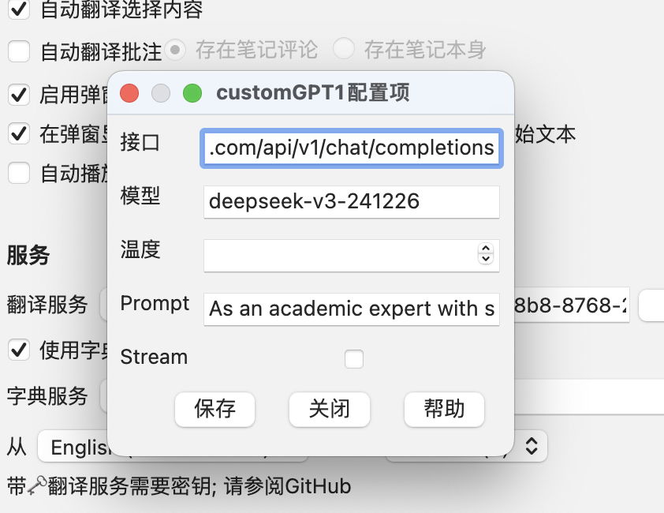
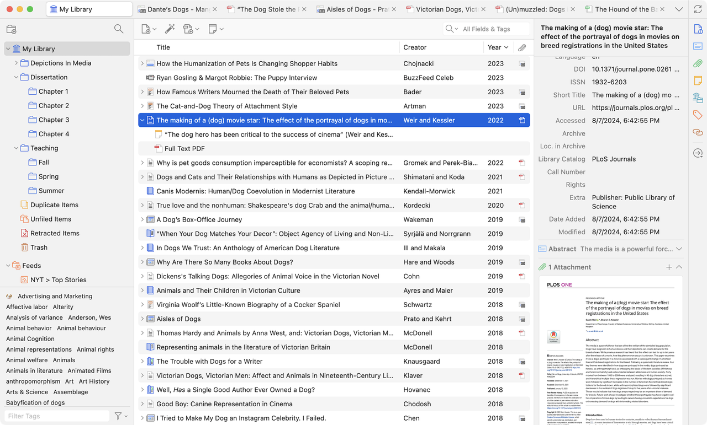

# Zotero
## 简介

https://github.com/zotero/zotero
一款免费且易于使用的工具，可帮助用户收集、整理、批注、引用并分享文献资料。

## **方舟**上的准备

1. 获取 API Key 点击[这里](https://console.volcengine.com/ark/region:ark+cn-beijing/apiKey)。
2. 开通方舟模型点击[这里](https://console.volcengine.com/ark/region:ark+cn-beijing/openManagement)。
3. 获取模型 ID 点击[这里](https://www.volcengine.com/docs/82379/1330310#%E6%96%87%E6%9C%AC%E7%94%9F%E6%88%90)。

## 调用方舟

### 调用模型服务
配置模型服务，下面是几个核心配置：

* API Key：获取方舟的API Key，点击[这里](https://console.volcengine.com/ark/region:ark+cn-beijing/apiKey)。
* 接口：[https://ark.cn-beijing.volces.com/api/v1/chat/completions](https://ark.cn-beijing.volces.com/api/v3/chat/completions)
* 支持的模型：您需要模型对应的Model ID，点击[这里](https://www.volcengine.com/docs/82379/1330310#%E6%96%87%E6%9C%AC%E7%94%9F%E6%88%90)可查询。

## 使用技巧

### **文献管理**
用户可在文献管理中分别完成引用管理、文件管理、笔记管理等功能。

