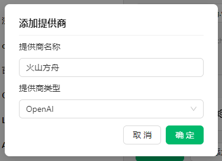
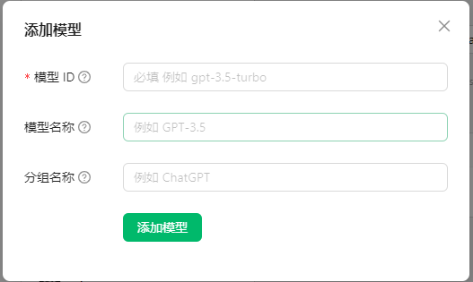
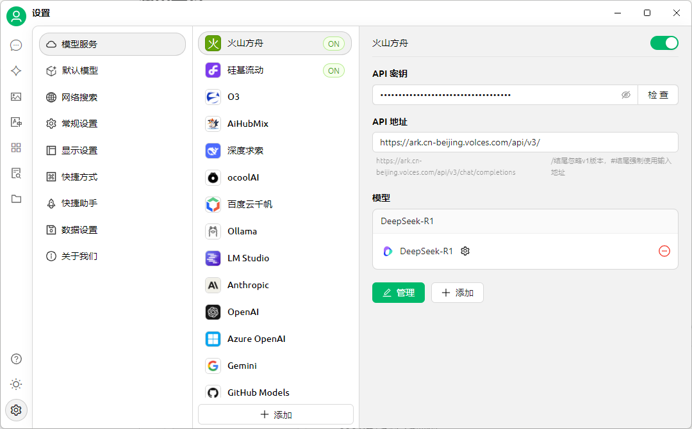

## Cherry-studio

Github地址：https://github.com/CherryHQ/cherry-studio
官网地址：https://cherry-ai.com/

cherry-studio是一款支持多个大语言模型（LLM）服务商的桌面客户端

## **方舟**上的准备

1. 获取 API Key 点击[这里](https://console.volcengine.com/ark/region:ark+cn-beijing/apiKey)。
2. 开通方舟模型点击[这里](https://console.volcengine.com/ark/region:ark+cn-beijing/openManagement)。
3. 获取模型 ID 点击[这里](https://www.volcengine.com/docs/82379/1330310#%E6%96%87%E6%9C%AC%E7%94%9F%E6%88%90)。

## 部署及调用方舟

1. 在官网下载软件
2. 打开软件设置—选择模型服务—点击添加

3. 添加模型

* 模型ID：获取模型 ID 点击[这里](https://www.volcengine.com/docs/82379/1330310#%E6%96%87%E6%9C%AC%E7%94%9F%E6%88%90)。
* 模型名称：自定义
* 分组名称：自定义

4. 修改以下配置

* API密钥：获取方舟的API Key，点击[这里](https://console.volcengine.com/ark/region:ark+cn-beijing/apiKey)。
* API地址：https://ark.cn-beijing.volces.com/api/v3/

