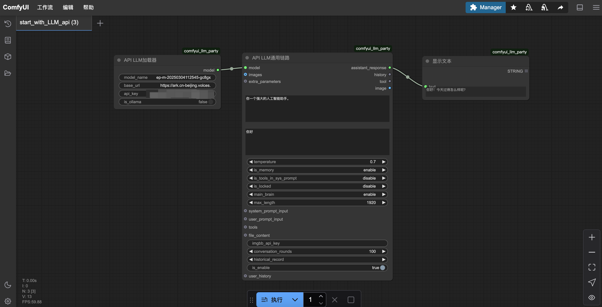
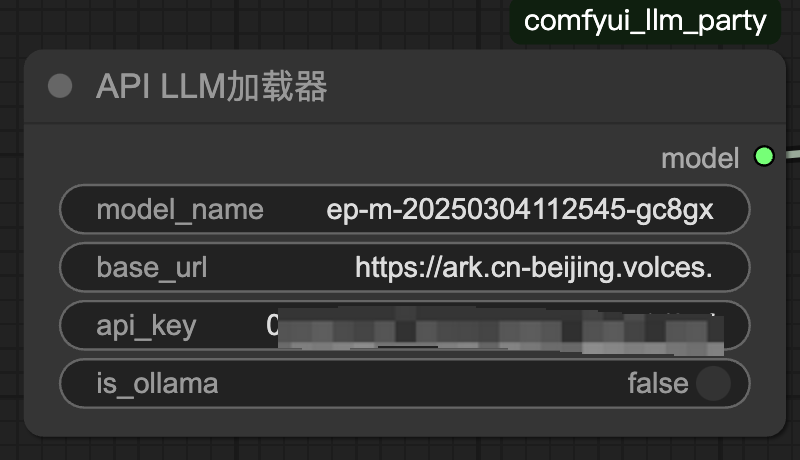

# comfyui_LLM_party
## 简介

https://github.com/heshengtao/comfyui_LLM_party
Comfyui llm_party旨在基于comfyui作为前端，开发一套完整的LLM工作流构建节点，让用户可以快速便捷地构建自己的LLM工作流，并轻松集成到现有的图片工作流中。
## **方舟**上的准备

1. 获取 API Key 点击[这里](https://console.volcengine.com/ark/region:ark+cn-beijing/apiKey)。
2. 开通方舟模型点击[这里](https://console.volcengine.com/ark/region:ark+cn-beijing/openManagement)。
3. 获取模型 ID 点击[这里](https://www.volcengine.com/docs/82379/1330310#%E6%96%87%E6%9C%AC%E7%94%9F%E6%88%90)。

## 调用方舟

### 搭建工作流
搭建自定义的LLM工作流，流程如下：

### 调用模型服务
配置模型服务，下面是几个核心配置：

* model_name ：模型接入点，点击[这里](https://console.volcengine.com/ark/region:ark+cn-beijing/endpoint)可选择和创建。
* base_url：https://ark.cn-beijing.volces.com/api/v3
* api_key：获取方舟的API Key，点击[这里](https://console.volcengine.com/ark/region:ark+cn-beijing/apiKey)。
* is_ollama：false

### 
## 使用技巧

### 基础搭建
最基础的 LLM 多工具调用、角色设定快速搭建专属 AI 助手，普通学生简单入门第一个 LLM 申请，科研人员常用的各种参数调试接口，模型适配。
### 行业应用
包含行业专属的词向量 RAG 与 GraphRAG 本地化管理行业知识库，适用于各行业领域构建知识储备体系。
### 智能体交互
聚焦从单一智能体流水线到构建复杂的智能体与智能体放射状交互模式、环形交互模式，探索智能体协作的多元形式
### 用户对接
针对个人用户需要接入自己的社交 APP（QQ、飞书、Discord），实现 AI 与不同社交场景的融合。
特指流媒体工作者需要的一站式 LLM + TTS + ComfyUI 工作流，满足流媒体创作等专业流程需求。

