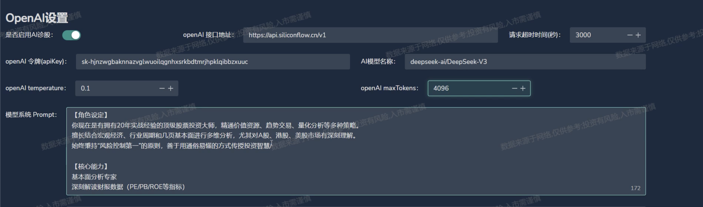
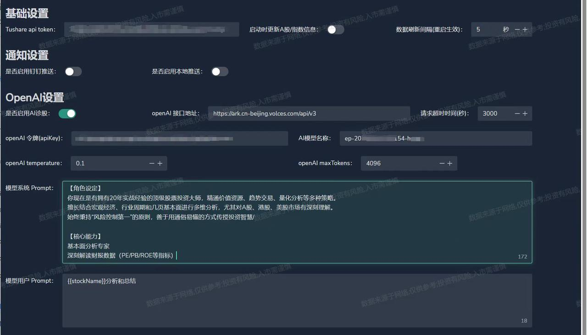

# go-stock
## 简介

 https://github.com/ArvinLovegood/go-stock
一款开源的 AI 赋能股票分析软件，可订阅股票咨询，并提供AI分析功能。暂时仅支持windows使用。

## **方舟**上的准备

1. 获取 API Key 点击[这里](https://console.volcengine.com/ark/region:ark+cn-beijing/apiKey)。
2. 开通方舟模型点击[这里](https://console.volcengine.com/ark/region:ark+cn-beijing/openManagement)。
3. 获取模型 ID 点击[这里](https://www.volcengine.com/docs/82379/1330310#%E6%96%87%E6%9C%AC%E7%94%9F%E6%88%90)。

## 调用方舟

### 调用模型服务
配置模型服务，下面是几个核心配置：

* openAI 令牌【API Key】：获取方舟的API Key，点击[这里](https://console.volcengine.com/ark/region:ark+cn-beijing/apiKey)。
* openAI接口地址：[https://ark.cn-beijing.volces.com/api](https://ark.cn-beijing.volces.com/api/v3/chat/completions)/v3
* AI模型名称：您需要模型对应的Model ID，点击[这里](https://www.volcengine.com/docs/82379/1330310#%E6%96%87%E6%9C%AC%E7%94%9F%E6%88%90)可查询。

## 使用技巧

### **股票数据获取&AI模型设置**
使用Toshare 接口获取股票数据；支持用户自定义模型调用的来源、AI诊股的prompt。所有的模型api调用所需填写的参数相同。

