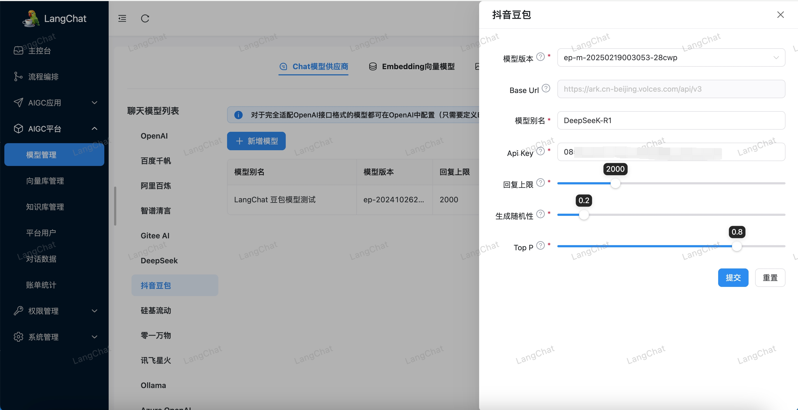

# langchat
## 简介

https://github.com/tycoding/langchat
LangChat是Java生态下企业级AIGC项目解决方案，集成RBAC和AIGC大模型能力，帮助企业快速定制AI知识库、企业AI机器人。
## **方舟**上的准备

1. 获取 API Key 点击[这里](https://console.volcengine.com/ark/region:ark+cn-beijing/apiKey)。
2. 开通方舟模型点击[这里](https://console.volcengine.com/ark/region:ark+cn-beijing/openManagement)。
3. 获取模型 ID 点击[这里](https://www.volcengine.com/docs/82379/1330310#%E6%96%87%E6%9C%AC%E7%94%9F%E6%88%90)。

## 调用方舟

### 调用模型服务
配置模型服务，下面是几个核心配置：

 
* 模型版本 ：模型接入点，点击[这里](https://console.volcengine.com/ark/region:ark+cn-beijing/endpoint)可选择和创建。
* Base Url：https://ark.cn-beijing.volces.com/api/v3
* 模型别名：自定义模型的别名，建议填写接入点对应的模型名称。
* Api Key：获取方舟的API Key，点击[这里](https://console.volcengine.com/ark/region:ark+cn-beijing/apiKey?apikey=%7B%7D)。
* 回复上限：控制模型输出的Tokens长度上限，通常 100 Tokens 约等于150个中文汉字。
* 生成随机性：调高参数会使得模型的输出更多样性和创新性，反之降低参数将会减少多样性。
* Top P：模型在生成输出时会从概率最高的词汇开始选择，直到这些词汇的总概率累积达到Top p值。

### 
## 使用技巧

### 多模态
支持集成国内外数十家AI大模型。
> 包括DeepSeek / Gitee AI / 阿里通义 / 百度千帆 / 抖音豆包 / 智谱清言 / 零一万物 / 讯飞星火 / OpenAI / Gemini / Ollama / Azure / Claude 等大模型
### 动态配置
支持在页面上可视化动态配置大模型参数、Api Key、Embedding模型和向量数据库等信息，无感刷新、无需每次重启服务。
### RAG
支持知识库和高级RAG。
> 知识库：支持向量化知识库文档，定制化Prompt对话场景。支持不同的知识库关联不同的模型和向量数据库。
>高级RAG：支持Embedding模型，从知识库中精确搜索；集成Web Search等RAG插件。
### Function Call
支持定制化Tool工具类，实现本地函数调用，从第三方加载数据并提供给LLM。