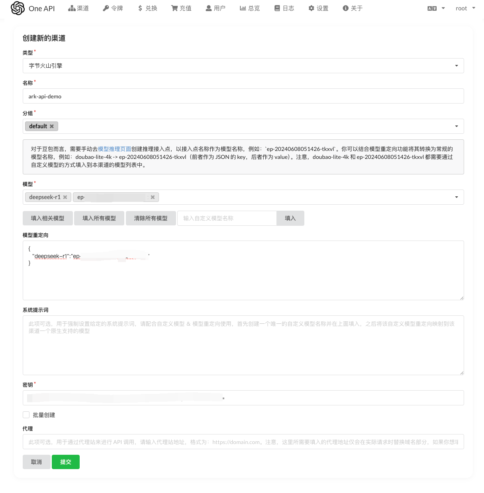

# one-api
## 简介

https://github.com/songquanpeng/one-api
LLM API 管理 & 分发系统，支持各类主流模型，统一 API 适配，可用于 key 管理与二次分发。单可执行文件，提供 Docker 镜像，一键部署，开箱即用。

## 方舟上的准备

1. 获取 API Key 点击[这里](https://console.volcengine.com/ark/region:ark+cn-beijing/apiKey)。
2. 开通方舟模型点击[这里](https://console.volcengine.com/ark/region:ark+cn-beijing/openManagement)。
3. 获取模型 ID 点击[这里](https://www.volcengine.com/docs/82379/1330310#%E6%96%87%E6%9C%AC%E7%94%9F%E6%88%90)。

## 调用方舟
### 调用模型服务
配置模型服务，下面是几个核心配置：
</img>

* `类型 `：字节火山引擎
* `名称`：您可以自定义名称
* `分组`：默认为“default”，您可以根据需要修改
* `模型`：包括两部分：选择常规模型名称；输入接入点 ID 为自定义模型名称。获取您创建的模型推理服务的接入点 ID，点击[这里](https://console.volcengine.com/ark/region:ark+cn-beijing/endpoint?config=%7B%7D)
* `模型重定向`：结合模型重定向功能将其转换为常规的模型名称。例如：doubao-lite-4k -> ep-20240xxxxxxxxx-tkxvl（前者作为 JSON 的 key，后者作为 value）
* `密钥`：填写API Key。获取方舟的API Key，点击[这里](https://console.volcengine.com/ark/region:ark+cn-beijing/apiKey)

## 使用技巧
### 使用 one-api 接入模型
以 FastGPT 为例，可参考教程：https://doc.tryfastgpt.ai/docs/development/modelconfig/one-api/
