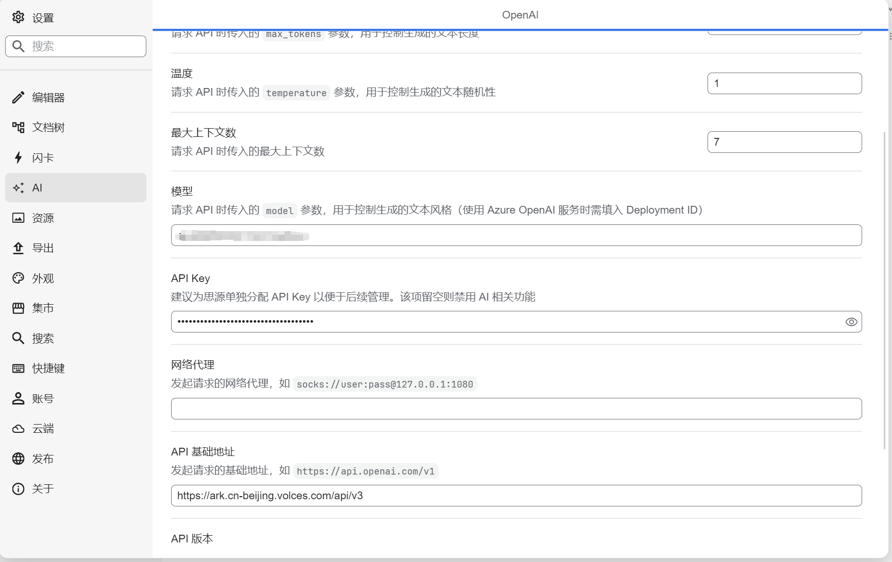
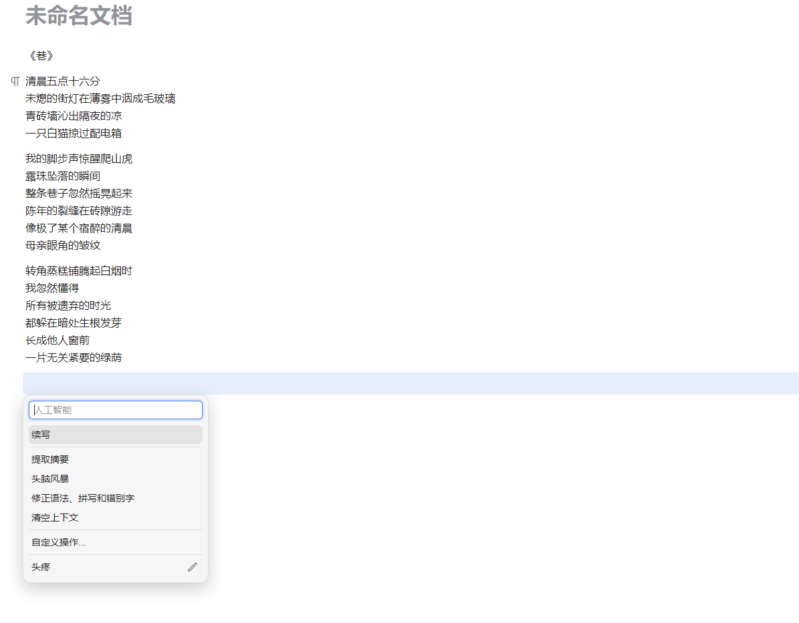

## 思源笔记

https://github.com/siyuan-note/siyuan
思源笔记是一款隐私优先的个人知识管理系统，支持细粒度块级引用和 Markdown 所见即所得。

## **方舟**上的准备

1. 获取 API Key 点击[这里](https://console.volcengine.com/ark/region:ark+cn-beijing/apiKey)。
2. 开通方舟模型点击[这里](https://console.volcengine.com/ark/region:ark+cn-beijing/openManagement)。
3. 获取模型 ID 点击[这里](https://www.volcengine.com/docs/82379/1330310#%E6%96%87%E6%9C%AC%E7%94%9F%E6%88%90)。

## 调用方舟

- API Provider ：OpenAI
- API基础地址：[https://ark.cn-beijing.volces.com/api/v3](https://ark.cn-beijing.volces.com/api/v3/)
- 模型：您需要模型对应的推理接入点ID。通过[这里](https://www.volcengine.com/docs/82379/1099522)查询
- API Key：获取方舟的API Key，点击[这里](https://console.volcengine.com/ark/region:ark+cn-beijing/apiKey)。

## 使用技巧

随时唤醒AI辅助文档编写

