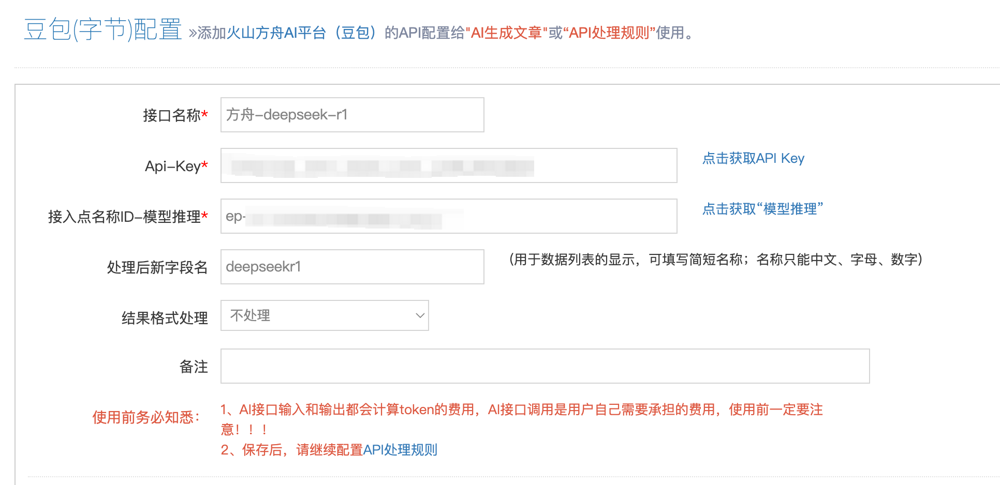

# 简数采集器
## 简介
https://www.keydatas.com/
【简数采集器】是新一代的网页数据采集器，完全在线配置和云采集，不仅提供网页文章全自动采集、定时采集、定时自动导出发送等基本功能，还创新实现了**智能识别和鼠标可视化点选生成采集规则(不用手写规则)**等特色功能。

## 方舟上的准备

1. 获取 API Key 点击[这里](https://console.volcengine.com/ark/region:ark+cn-beijing/apiKey)。
2. 开通方舟模型点击[这里](https://console.volcengine.com/ark/region:ark+cn-beijing/openManagement)。
3. 获取模型 ID 点击[这里](https://www.volcengine.com/docs/82379/1330310#%E6%96%87%E6%9C%AC%E7%94%9F%E6%88%90)。

## 调用方舟
### 调用模型服务
配置模型服务，下面是几个核心配置：
</img>

* `接口名称 `：您可以自定义您添加的模型的名称，如DeepSeek-R1。
* `鉴权方式`：API Key
* `Api-Key`：获取方舟的API Key，点击[这里](https://console.volcengine.com/ark/region:ark+cn-beijing/apiKey)。
* `接入点名称ID`-模型推理：获取您创建的模型推理服务的接入点 ID，点击[这里](https://console.volcengine.com/ark/region:ark+cn-beijing/endpoint?config=%7B%7D)。

