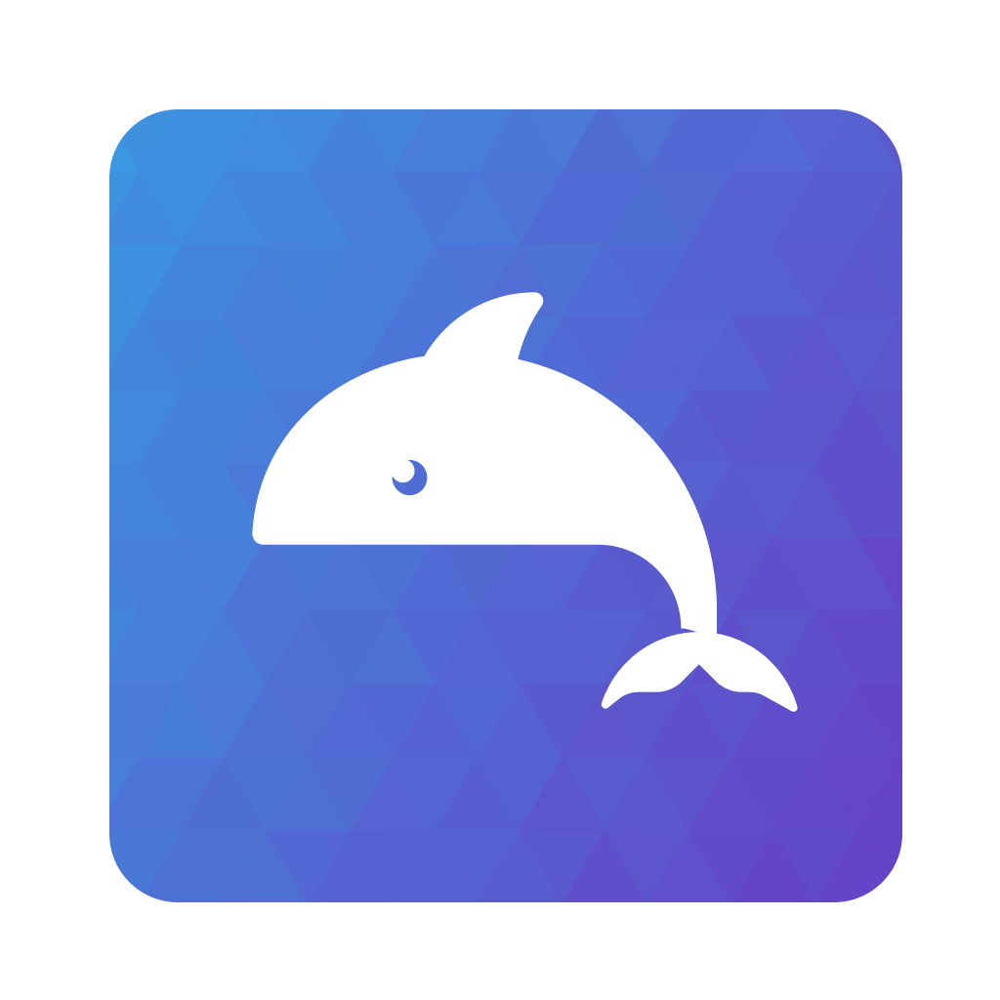
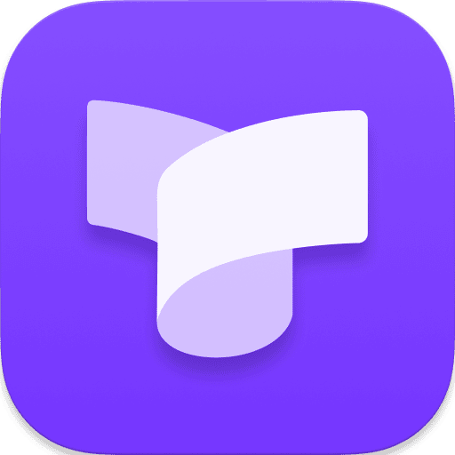
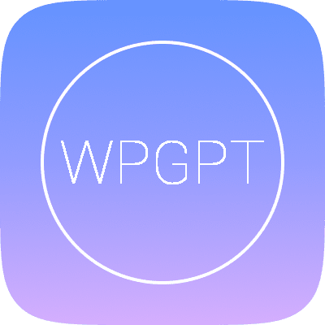

 
 

# 火山方舟实用集成

**您可以轻松将方舟的大模型集成到各种软件中。**

 请访问[火山方舟平台](https://console.volcengine.com/ark/region:ark+cn-beijing/apiKey)获取你的 API key ，海外用户请访问[ModelArk](https://docs.byteplus.com/en/docs/ModelArk/api)平台获取你的API Key 

  

应用程序
<table>
    <tr>
        <td width="15%">  </td>
        <td width="15%"> <a href=" 应用程序/ChatboxAI/readme.md">Chatbox</a> </td>
        <td width="70%"> 一款 AI 客户端应用和智能助手，支持众多先进的 AI 模型和 API，可在 Windows、MacOS、Android、iOS、Linux 和网页版上使用。 </td>
    </tr>
    <tr>
        <td width="15%">  </td>
        <td width="15%"> <a href=" 应用程序/思源笔记/readme.md">思源笔记</a> </td>
        <td width="70%"> 思源笔记是一款隐私优先的个人知识管理系统，支持细粒度块级引用和 Markdown 所见即所得。 </td>
    </tr>
    <tr>
        <td width="15%">  </td>
        <td width="15%"> <a href=" 应用程序/AiNiee/readme.md">AiNiee</a> </td>
        <td width="70%"> AiNiee 是一款专注于 Ai 翻译的工具，可以用来一键自动翻译游戏、小说、字幕等复杂的长文本内容。 </td>
    </tr>
    <tr>
        <td width="15%">  </td>
        <td width="15%"> <a href=" 应用程序/akinterpreter/readme.md">akinterpreter</a> </td>
        <td width="70%"> akinterpreter 是一款借助 LLM API 搭建的金融市场查询分析工具，调用开源的 akshare（超 900 函数查多类金融数据且高频更新）与付费但数据优质稳定的 tushare，经简单配置，可用自然语言快速完成金融数据查询与分析 。 </td>
    </tr>
    <tr>
        <td width="15%">  </td>
        <td width="15%"> <a href=" 应用程序/AstrBot/AstrBot✅.md">Astrbot</a> </td>
        <td width="70%"> AstrBot 是一个松耦合、异步、支持多消息平台部署、具有易用的插件系统和完善的大语言模型（LLM）接入功能的聊天机器人及开发框架。 </td>
    </tr>
    <tr>
        <td width="15%">  </td>
        <td width="15%"> <a href=" 应用程序/ChatDOC_API_Demo/readme.md">ChatDOC</a> </td>
        <td width="70%"> ChatDOC 是一款功能强大的 SaaS AI 产品，可让您与文档互动，即时检索答案以及引用来源。 </td>
    </tr>
    <tr>
        <td width="15%">  </td>
        <td width="15%"> <a href=" 应用程序/ChatGPT-Next-Web/readme.md">ChatGPT-Next-Web</a> </td>
        <td width="70%"> ChatGPT-Next-Web是一款零代码快速搭建全平台智能对话中枢，无缝兼容主流大语言模型（LLM）。 </td>
    </tr>
    <tr>
        <td width="15%">  </td>
        <td width="15%"> <a href=" 应用程序/cherry-studio/readme.md">Cherry-studio</a> </td>
        <td width="70%"> cherry-studio是一款支持多个大语言模型（LLM）服务商的桌面客户端 </td>
    </tr>
    <tr>
        <td width="15%">  </td>
        <td width="15%"> <a href=" 应用程序/comfyui_LLM_party/readme.md">Comfyui llm_party</a> </td>
        <td width="70%"> Comfyui llm_party旨在基于comfyui作为前端，开发一套完整的LLM工作流构建节点，让用户可以快速便捷地构建自己的LLM工作流，并轻松集成到现有的图片工作流中。 </td>
    </tr>
    <tr>
        <td width="15%">  </td>
        <td width="15%"> <a href=" 应用程序/DeepChat/readme.md">DeepChat</a> </td>
        <td width="70%"> DeepChat 是一款基于自研 DeepSeek 大模型的智能桌面助手，提供永久免费的跨平台服务。作为 AI 生产力工具，它深度融合多模态交互能力，支持智能多轮对话、实时联网信息检索、多格式文件解析及个性化知识库管理等功能，助力用户高效完成复杂任务。该软件完全免费开放，无任何功能限制或订阅费用。 </td>
    </tr>
    <tr>
        <td width="15%">  </td>
        <td width="15%"> <a href=" 应用程序/Dify/readme.md">Dify</a> </td>
        <td width="70%"> 开源的 LLM 应用开发平台。提供从 Agent 构建到 AI workflow 编排、RAG 检索、模型管理等能力，轻松构建和运营生成式 AI 原生应用。 </td>
    </tr>
    <tr>
        <td width="15%">  </td>
        <td width="15%"> <a href=" 应用程序/Dingo/readme.md">Dingo</a> </td>
        <td width="70%"> Dingo 是一款数据质量评估工具，可帮助您自动检测数据集中的数据质量问题。Dingo 提供多种内置规则和模型评估方法，同时还支持自定义评估方法。Dingo 支持常用的文本数据集和多模态数据集，包括预训练数据集、微调数据集和评估数据集。 </td>
    </tr>
    <tr>
        <td width="15%">  </td>
        <td width="15%"> <a href=" 应用程序/docapi/README.md">Docapi</a> </td>
        <td width="70%"> 一款基于大型语言模型（LLM）的 API 文档生成工具，目前支持 Flask、Django 框架。通过 DocAPI，您可以快速生成、更新和展示 API 文档，大幅提升开发效率。 </td>
    </tr>
    <tr>
        <td width="15%">  </td>
        <td width="15%"> <a href=" 应用程序/Easydict/readme.md">Easydict</a> </td>
        <td width="70%"> Easydict 开箱即用，能自动识别输入文本语言，支持输入翻译，划词翻译和 OCR 截图翻译，可同时查询多个翻译服务结果。 </td>
    </tr>
    <tr>
        <td width="15%">  </td>
        <td width="15%"> <a href=" 应用程序/FastGPT/readme.md">FastGPT</a> </td>
        <td width="70%"> FastGPT 是一个基于 LLM 大语言模型的知识库问答系统，提供开箱即用的数据处理、模型调用等能力。同时可以通过 Flow 可视化进行工作流编排，从而实现复杂的问答场景。 </td>
    </tr>
    <tr>
        <td width="15%">  </td>
        <td width="15%"> <a href=" 应用程序/go-stack/readme.md">Go-stock</a> </td>
        <td width="70%"> 一款开源的 AI 赋能股票分析软件，可订阅股票咨询，并提供AI分析功能。暂时仅支持windows使用。 </td>
    </tr>
    <tr>
        <td width="15%">  </td>
        <td width="15%"> <a href=" 应用程序/Hivechat/readme.md">HiveChat</a> </td>
        <td width="70%"> 专为中小团队设计的 AI 聊天应用，支持 Deepseek、Open AI、Claude、Gemini 等模型。 </td>
    </tr>
    <tr>
        <td width="15%">  </td>
        <td width="15%"> <a href=" 应用程序/lagi/readme.md">Lagi</a> </td>
        <td width="70%"> 一个开源的多智能体对话平台，支持多个主流 AI 模型，让 AI 们进行自主讨论、头脑风暴和知识探索，让多个 AI 智能体协同对话，激发思维的火花。 </td>
    </tr>
    <tr>
        <td width="15%">  </td>
        <td width="15%"> <a href=" 应用程序/langchat/readme.md">Langchat</a> </td>
        <td width="70%"> 专为中小团队设计的 AI 聊天应用，支持 Deepseek、Open AI、Claude、Gemini 等模型。 </td>
    </tr>
    <tr>
        <td width="15%">  </td>
        <td width="15%"> <a href=" 应用程序/LibreChat/readme.md"> LibreChat</a> </td>
        <td width="70%"> LibreChat是一款开源的多功能 AI 对话平台，支持多语言界面和多种 AI 模型（如 OpenAI、Google、Azure 等），提供类似 ChatGPT 的交互体验，并具备多模态聊天、对话预设、插件扩展等功能。 </td>
    </tr>
    <tr>
        <td width="15%">  </td>
        <td width="15%"> <a href=" 应用程序/Long-Novel-GPT/readme.md">Long-Novel-GPT</a> </td>
        <td width="70%"> Long-Novel-GPT是一个基于大语言模型的长篇小说生成器。它采用层次化的大纲/章节/正文结构，以把握长篇小说的连贯剧情；通过大纲->章节->正文的精准映射来获取上下文，从而优化API调用成本；并根据自身或用户反馈不断进行优化，直至创作出心目中的长篇小说。 </td>
    </tr>
    <tr>
        <td width="15%">  </td>
        <td width="15%"> <a href=" 应用程序/meet-libai/readme.md">meet-libai</a> </td>
        <td width="70%"> 遇见李白（meet-libai）通过构建李白知识图谱，结合大模型训练出专业的AI智能体，以生成式对话应用的形式，推动李白文化的普及与推广。 </td>
    </tr>
    <tr>
        <td width="15%">  </td>
        <td width="15%"> <a href=" 应用程序/MoneyPrinterTurbo/MoneyPrinterTurbo✅.md">MoneyPrinterTurbo</a> </td>
        <td width="70%"> 只需提供一个视频主题或关键词，就可以全自动生成视频文案、视频素材、视频字幕、视频背景音乐，然后合成一个高清的短视频。 </td>
    </tr>
    <tr>
        <td width="15%">  </td>
        <td width="15%"> <a href=" 应用程序/MultiAgentChat/readme.md">MultiAgent Chat</a> </td>
        <td width="70%"> 一个开源的多智能体对话平台，支持多个主流 AI 模型，让 AI 们进行自主讨论、头脑风暴和知识探索，让多个 AI 智能体协同对话，激发思维的火花。 </td>
    </tr>
    <tr>
        <td width="15%">  </td>
        <td width="15%"> <a href=" 应用程序/one-api/readme.md">one-api</a> </td>
        <td width="70%"> LLM API 管理 & 分发系统，支持各类主流模型，统一 API 适配，可用于 key 管理与二次分发。单可执行文件，提供 Docker 镜像，一键部署，开箱即用。 </td>
    </tr>
    <tr>
        <td width="15%">  </td>
        <td width="15%"> <a href=" 应用程序/RAGFlow/readme.md">RAGFlow</a> </td>
        <td width="70%"> RAGFlow是一款基于深度文档理解构建的开源 RAG（Retrieval-Augmented Generation）引擎。RAGFlow 可以为各种规模的企业及个人提供一套精简的 RAG 工作流程，结合大语言模型（LLM）针对用户各类不同的复杂格式数据提供可靠的问答以及有理有据的引用。 </td>
    </tr>
    <tr>
        <td width="15%">  </td>
        <td width="15%"> <a href=" 应用程序/RSS翻译器/readme.md">RSS翻译器</a> </td>
        <td width="70%"> RSS Translator 是一款实时智能翻译全球订阅内容的应用，定位在于打破语言边界，让多语种资讯同步触达。 </td>
    </tr>
    <tr>
        <td width="15%">  </td>
        <td width="15%"> <a href=" 应用程序/ShellOracle/readme.md">ShellOracle</a> </td>
        <td width="70%"> ShellOracle 是一款创新的终端实用程序，专为智能 shell 命令生成而设计，可为您的命令行交互带来全新的效率。ShellOracle 目前支持 Ollama、OpenAI、Deepseek、LocalAI 和 Grok. </td>
    </tr>
    <tr>
        <td width="15%">  </td>
        <td width="15%"> <a href=" 应用程序/Story_Flicks/readme.md">Story-Flicks</a> </td>
        <td width="70%"> 该项目允许用户输入故事主题，并使用大型语言模型生成故事视频。视频包括AI生成的图像、故事内容、音频和字幕。 </td>
    </tr>
    <tr>
        <td width="15%">  </td>
        <td width="15%"> <a href=" 应用程序/UnionLLM/readme.md">UnionLLM</a> </td>
        <td width="70%"> 一款通过与OpenAI兼容的统一方式调用各种国内外各种大语言模型和Agent编排工具的轻量级开源Python工具包。
</td>
    </tr>
    <tr>
        <td width="15%">  </td>
        <td width="15%"> <a href=" 应用程序/VideoSubtitleMaster/readme.md">Video Subtitle Master</a> </td>
        <td width="70%"> 一款支持批量生成视频字幕并提供多种字幕翻译服务的本地运行的开源工具，适合需要高效处理大量视频字幕的用户。 </td>
    </tr>
    <tr>
        <td width="15%">  </td>
        <td width="15%"> <a href=" 应用程序/Zotero/readme.md">Zotero</a> </td>
        <td width="70%"> 一款免费且易于使用的工具，可帮助用户收集、整理、批注、引用并分享文献资料。
 </td>
    </tr>
    <tr>
        <td width="15%">  </td>
        <td width="15%"> <a href=" 应用程序/SiriUltra/readme.md">Siri Ultra</a> </td>
        <td width="70%"> Siri Ultra 是一个能在 iPhone 上使用的 AI 聊天快捷指令，无需下载任何 App，即可体验到最新的大模型。

 </td>
    </tr>
    <tr>
        <td width="15%">  </td>
        <td width="15%"> <a href=" 应用程序/简数采集器/readme.md">简数采集器</a> </td>
        <td width="70%"> 简数采集器是新一代的网页数据采集器，完全在线配置和云采集，不仅提供网页文章全自动采集、定时采集、定时自动导出发送等基本功能，还创新实现了**智能识别和鼠标可视化点选生成采集规则(不用手写规则)**等特色功能。
 </td>
    </tr>
</table>

即时通讯插件
<table>
    <tr>
        <td width="15%">  </td>
        <td width="15%"> <a href="即时通讯插件/huixiangdou/readme.md">茴香豆</a> </td>
        <td width="70%"> 茴香豆是一个基于LLM的领域特定知识助手，能够处理群聊中的复杂场景，回答用户问题而不引起消息泛滥。它提供算法管道来回答技术问题，并且部署成本低，只需LLM模型满足4个特点就能回答大部分用户问题。茴香豆在运行的场景中能够处理各种问题，并且欢迎加入他们的微信群体验最新版本。
 </td>
    </tr>
    <tr>
        <td width="15%">  </td>
        <td width="15%"> <a href="即时通讯插件/LangBot/readme.md">Langbot</a> </td>
        <td width="70%"> 支持扩展、多模态-大模型原生即时通信机器人平台，适配所有主流消息平台

 </td>
    </tr>
    <tr>
        <td width="15%">  </td>
        <td width="15%"> <a href="即时通讯插件/wechat-bot/wechat-bot.md">wechat-bot</a> </td>
        <td width="70%"> wechat-bot是一款基于Python的开源项目，利用itchat库处理微信消息，支持自定义功能和持久化存储。该项目旨在帮助开发者构建高效、个性化的微信聊天机器人 。
 </td>
    </tr>
</table>

浏览器插件
<table>
    <tr>
        <td width="15%">  </td>
        <td width="15%"> <a href="浏览器插件/馆长/readme.md">沉浸式导读</a> </td>
        <td width="70%"> 一款 AI 驱动的网页阅读助手，通过实时引导解读、知识导图和智能批注，帮助用户高效理解文章内容，支持自定义模型，界面简洁，适合专业阅读和学习场景。
 </td>
    </tr>
    <tr>
        <td width="15%">  </td>
        <td width="15%"> <a href="浏览器插件/划词翻译/readme.md">沉浸式翻译</a> </td>
        <td width="70%"> 一款支持网页、PDF、EPUB 电子书及视频双语字幕实时翻译的免费插件，提供跨平台（手机 / 电脑）沉浸式双语阅读体验，帮助用户打破语言壁垒，高效获取全球信息。
 </td>
    </tr>
    <tr>
        <td width="15%">  </td>
        <td width="15%"> <a href="浏览器插件/馆长/readme.md">馆长</a> </td>
        <td width="70%"> 一款革新性的开源浏览器翻译插件，能带来母语般阅读体验，支持 20 余种包括传统及 AI 大模型的翻译引擎（如微软、谷歌、DeepL、OpenAI 等），具备双语对照功能，有丰富自定义选项可满足多样场景需求。
 </td>
    </tr>
    <tr>
        <td width="15%">  </td>
        <td width="15%"> <a href="浏览器插件/划词翻译/readme.md">划词翻译</a> </td>
        <td width="70%"> 一款支持划词搜索、逐段对照及 PDF 翻译的多引擎浏览器插件，兼容欧路词典同步学习记录，持续更新并新增自定义大模型与多文档格式支持。
 </td>
    </tr>
    <tr>
        <td width="15%">  </td>
        <td width="15%"> <a href="浏览器插件/流畅阅读/readme.md">流畅阅读</a> </td>
        <td width="70%"> 一款革新性的开源浏览器翻译插件，能带来母语般阅读体验，支持 20 余种包括传统及 AI 大模型的翻译引擎（如微软、谷歌、DeepL、OpenAI 等），具备双语对照功能，有丰富自定义选项可满足多样场景需求。
 </td>
    </tr>
    <tr>
        <td width="15%">  </td>
        <td width="15%"> <a href="浏览器插件/欧路翻译/readme.md">欧路翻译</a> </td>
        <td width="70%"> 一款支持划词搜索、逐段对照及 PDF 翻译的多引擎浏览器插件，兼容欧路词典同步学习记录，持续更新并新增自定义大模型与多文档格式支持。
 </td>
    </tr>
    <tr>
        <td width="15%">  </td>
        <td width="15%"> <a href="浏览器插件/Bob/Bob.md">Bob</a> </td>
        <td width="70%"> Bob，一款专为 macOS 平台打造的强大翻译与 OCR 软件。无论您正在使用何种应用程序，只需轻松操作，Bob 便能即时响应，为您提供精准翻译与高效 OCR 服务。它秉持即用即走的设计理念，让您的翻译与文字识别需求，在简单、快捷、高效的体验中轻松实现 。
 </td>
    </tr>
    <tr>
        <td width="15%">  </td>
        <td width="15%"> <a href="浏览器插件/ChatGPT Box/readme.md">ChatGPT Box</a> </td>
        <td width="70%"> 一款深度集成 ChatGPT 的浏览器插件，支持多平台实时对话、网页总结、翻译等 AI 功能，提供多 API 支持和自定义配置，适用于高效办公与智能交互场景。
 </td>
    </tr>
    <tr>
        <td width="15%">  </td>
        <td width="15%"> <a href="浏览器插件/OpenAITranslator/readme.md">OpenAI Translator</a> </td>
        <td width="70%"> 一款即用即走的翻译、OCR工具
 </td>
    </tr>
    <tr>
        <td width="15%">  </td>
        <td width="15%"> <a href="浏览器插件/page-assist/readme.md">page-assist</a> </td>
        <td width="70%"> 一款在 Chrome、Firefox 等多浏览器可用的浏览器插件，能使用本地 AI 模型（如 Ollama、Gemini Nano 等）辅助上网，有侧边栏和 Web UI，能搜索、与网页或文档聊天，数据本地存储，支持多格式文件，且持续开发迭代 。
 </td>
    </tr>
    <tr>
        <td width="15%">  </td>
        <td width="15%"> <a href="浏览器插件/RssFlow/readme.md">RSS Flow </a> </td>
        <td width="70%"> RSS Flow 是一款现代智能 RSS 阅读器，具备 RSS 一键订阅与智能更新、多模型 AI 摘要（可自定义、离线读）、多维阅读视图、智能工具箱（全文搜索等）及个性化设置（暗黑模式等）。支持主流格式，数据本地存，免费使用，适合多种人群，在 Chrome 简单配置即可开启智能阅读。
 </td>
    </tr>
    <tr>
        <td width="15%">  </td>
        <td width="15%"> <a href="浏览器插件/Trancy/readme.md">Trancy</a> </td>
        <td width="70%"> 一款专为语言学习者设计的全能工具，除了支持YouTube/Netflix双语字幕，Trancy还提供了网页AI划词翻译和全文翻译等功能，可以巧妙地将内容转化为用户自己的语言学习资料。借助Trancy，可以体验高效且有趣的沉浸式语言学习。
 </td>
    </tr>
</table>

VSCode插件
<table>
    <tr>
        <td width="15%">  </td>
        <td width="15%"> <a href="VSCode插件/Cline/Cline.md">Cline</a> </td>
        <td width="70%"> 一款集成于VSCode 的智能编程助手工具，旨在通过接入多种大语言模型（LLM）API 提供强大的代码生成功能、优化建议和实时语法检查，从而显著提升开发者的编程效率. 它支持多语言模型，能够根据用户需求生成高质量的代码片段，并且具备类似Cursor 等工具的功能，成为开发者在日常编程中的得力助手。
 </td>
    </tr>
    <tr>
        <td width="15%">  </td>
        <td width="15%"> <a href="VSCode插件/Continue/readme.md">Continue</a> </td>
        <td width="70%"> 利用其开源 IDE 扩展和模型、规则、提示、文档和其他构建块的中心，来创建、共享和使用自定义 AI 代码助手。

 </td>
    </tr>
    <tr>
        <td width="15%">  </td>
        <td width="15%"> <a href="VSCode插件/Roo_Code/readme.md">Roo Code</a> </td>
        <td width="70%"> Roo Code（原名 Roo Cline）是一款内置于编辑器中的人工智能自主编码代理。无论您是开始新项目、维护现有代码还是学习新技术，它都能帮助您更快、更智能地编写代码。
 </td>
    </tr>
</table>

WordPress插件
<table>
    <tr>
        <td width="15%">  </td>
        <td width="15%"> <a href="WordPress插件/小半WordPress_AI助手/readme.md">小半 WordPress ai助手</a> </td>
        <td width="70%"> WordPress ai助手插件，可实现：ai对话聊天(文字、图片、文件分析)、ai对话语音播放、ai文章生成、ai文章总结、ai文章翻译、ai生成PPT、ai文档分析、文章内容语音播放。
 </td>
    </tr>
    <tr>
        <td width="15%">  </td>
        <td width="15%"> <a href="WordPress插件/Linkreate/readme.md">Linkreat</a> </td>
        <td width="70%"> 一款可以24小时自动发布原创文章的WordPress插件，支持AI根据已有的长尾关键词、文章标签、网站内容定时生成原创文章，自动生成文章图片并插入到文章内容，支持批量生成或上传长尾关键词生成文章，网站前端AI客服、批量采集，支持生成英文等语言文章，集成主流AI API以及自定义API通用接口等。

 </td>
    </tr>
    <tr>
        <td width="15%">  </td>
        <td width="15%"> <a href="WordPress插件/WPGPT/readme.md">WPGPT</a> </td>
        <td width="70%"> WPGPT 是一款专为 WordPress 用户设计的智能写作插件，它旨在帮助内容创作者、博主、站长以及企业快速生成高质量文章，大幅提升写作效率。
 </td>
    </tr>
</table>