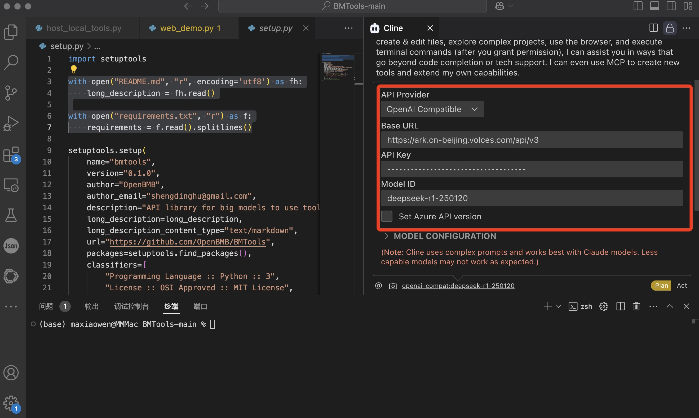
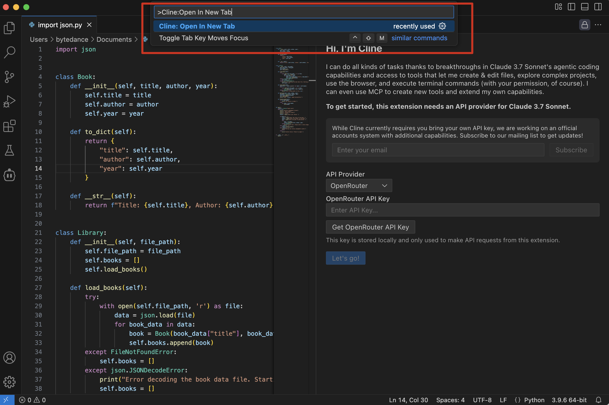
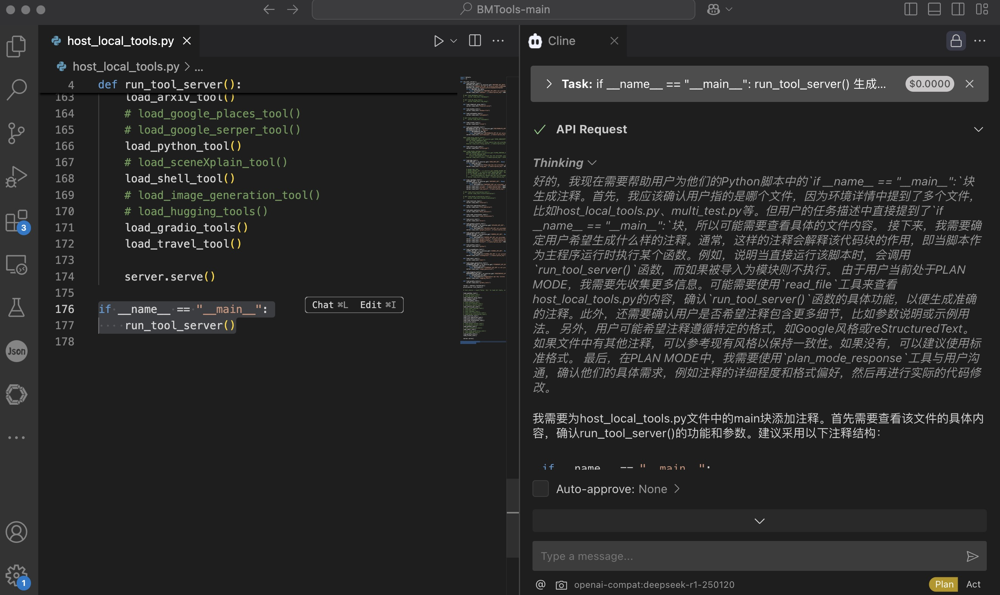

# Cline
## 简介

https://cline.bot/
一款集成于VSCode 的智能编程助手工具，旨在通过接入多种大语言模型（LLM）API 提供强大的代码生成功能、优化建议和实时语法检查，从而显著提升开发者的编程效率. 它支持多语言模型，能够根据用户需求生成高质量的代码片段，并且具备类似Cursor 等工具的功能，成为开发者在日常编程中的得力助手。
## **方舟**上的准备

1. 获取 API Key 点击[这里](https://console.volcengine.com/ark/region:ark+cn-beijing/apiKey)。
2. 开通方舟模型点击[这里](https://console.volcengine.com/ark/region:ark+cn-beijing/openManagement)。
3. 获取模型 ID 点击[这里](https://www.volcengine.com/docs/82379/1330310#%E6%96%87%E6%9C%AC%E7%94%9F%E6%88%90)。

## 调用方舟

### 调用模型服务
配置模型服务，下面是几个核心配置：

* 自定义API接口地址：https://ark.cn-beijing.volces.com/api/v3
* APIKEY：获取方舟的API Key，点击[这里](https://console.volcengine.com/ark/region:ark+cn-beijing/apiKey)。
* 模型：您需要模型对应的Model ID，点击[这里](https://www.volcengine.com/docs/82379/1330310#%E6%96%87%E6%9C%AC%E7%94%9F%E6%88%90)可查询。

### 
## 使用技巧

### 点击CMD/CTRL + Shift + P打开vs code命令面板，输入Cline: Open In New Tab
点击CMD/CTRL + Shift + P打开vs code命令面板，输入Cline: Open In New Tab。
> Cline 支持 OpenRouter、Anthropic、OpenAI、Google Gemini、AWS Bedrock、Azure 和 GCP Vertex 等 API 提供商。您还可以配置任何与 OpenAI 兼容的 API，或通过 LM Studio/Ollama 使用本地模型。

### 使用Cline助手进行智能问答
配置好大模型后在输入框里输入请求，点击发送等待回答。
> 支持代码解读、生成注释、文字生成代码等功能。

