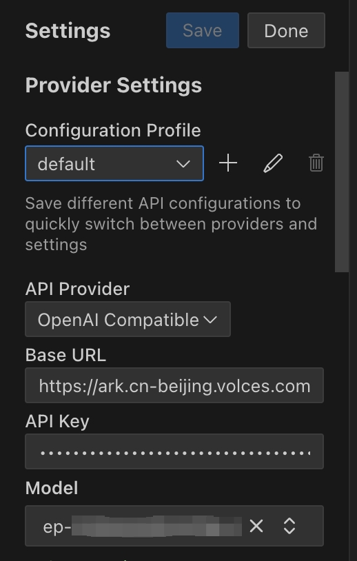

# Roo Code
## 简介
https://github.com/RooVetGit/Roo-Code
Roo Code（原名 Roo Cline）是一款内置于编辑器中的人工智能自主编码代理。无论您是开始新项目、维护现有代码还是学习新技术，它都能帮助您更快、更智能地编写代码。

## 方舟上的准备

1. 获取 API Key 点击[这里](https://console.volcengine.com/ark/region:ark+cn-beijing/apiKey)。
2. 开通方舟模型点击[这里](https://console.volcengine.com/ark/region:ark+cn-beijing/openManagement)。
3. 获取模型 ID 点击[这里](https://www.volcengine.com/docs/82379/1330310#%E6%96%87%E6%9C%AC%E7%94%9F%E6%88%90)。

## 调用方舟
### 调用模型服务
配置模型服务，下面是几个核心配置：
</img>

* `API Provider`：OpenAI Compatible
* `Base URL`：https://ark.cn-beijing.volces.com/api/v3
* `Model ID`：获取您创建的模型推理服务的接入点 ID，点击[这里](https://console.volcengine.com/ark/region:ark+cn-beijing/endpoint?config=%7B%7D)。

