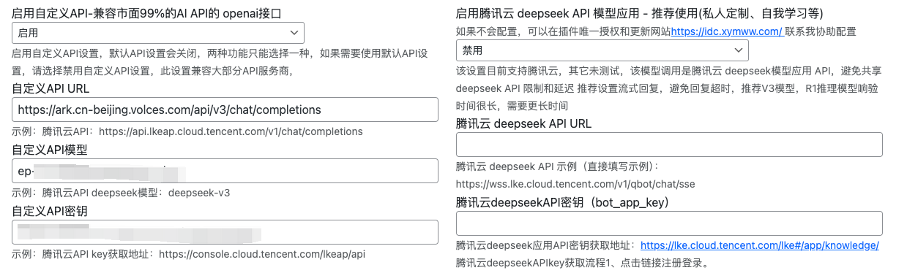

## Linkreat
https://idc.xymww.com/zui-xin-ban-wordpress-mian-fei-ai-wen-zhang-nei-rong-tu.html

一款可以24小时自动发布原创文章的WordPress插件，支持AI根据已有的长尾关键词、文章标签、网站内容定时生成原创文章，自动生成文章图片并插入到文章内容，支持批量生成或上传长尾关键词生成文章，网站前端AI客服、批量采集，支持生成英文等语言文章，集成主流AI API以及自定义API通用接口等。

## 方舟上的准备

1. 获取 API Key 点击[这里](https://console.volcengine.com/ark/region:ark+cn-beijing/apiKey)。
2. 开通方舟模型点击[这里](https://console.volcengine.com/ark/region:ark+cn-beijing/openManagement)。
3. 获取模型 ID 点击[这里](https://www.volcengine.com/docs/82379/1330310#%E6%96%87%E6%9C%AC%E7%94%9F%E6%88%90)。

## 调用方舟

### 调用模型服务
配置模型服务，下面是几个核心配置：

</img>

* `启用自定义API`：启用
* `自定义API URL`：https://ark.cn-beijing.volces.com/api/v3/chat/completions
* `自定义API模型 `：获取您创建的模型推理服务的接入点 ID，点击[这里](https://console.volcengine.com/ark/region:ark+cn-beijing/endpoint?config=%7B%7D)。
* `模型`：deepseek-v3-241226
* `自定义API`密钥：获取方舟的API Key，点击[这里](https://console.volcengine.com/ark/region:ark+cn-beijing/apiKey)。
* `启用腾讯云 deepseek API模型应用`：禁用

