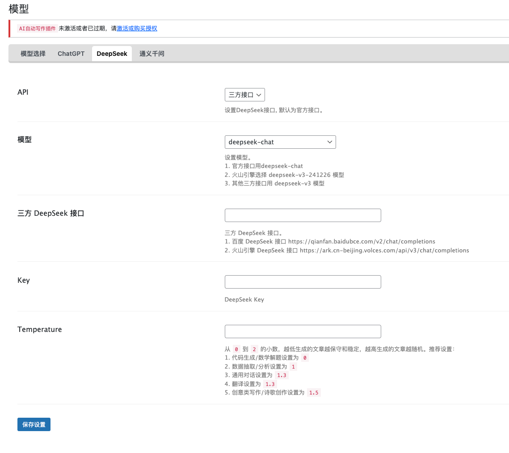

# WPGPT

## 简介
http://www.imwpweb.com/7675.html
WPGPT 是一款专为 WordPress 用户设计的智能写作[插件](http://www.imwpweb.com/category/plugins)，它旨在帮助内容创作者、博主、站长以及企业快速生成高质量文章，大幅提升写作效率。

## 方舟上的准备

1. 获取 API Key 点击[这里](https://console.volcengine.com/ark/region:ark+cn-beijing/apiKey)。
2. 开通方舟模型点击[这里](https://console.volcengine.com/ark/region:ark+cn-beijing/openManagement)。
3. 获取模型 ID 点击[这里](https://www.volcengine.com/docs/82379/1330310#%E6%96%87%E6%9C%AC%E7%94%9F%E6%88%90)。

## 调用方舟

### 调用模型服务
配置模型服务，下面是几个核心配置：
> 仅支持接入火山方舟的deepseek模型，其他模型无法使用

</img>

* `API `：三方接口
* `模型`：deepseek-v3-241226
* `三方 DeepSeek 接口`：https://ark.cn-beijing.volces.com/api/v3/chat/completions
* `Key`：获取方舟的API Key，点击[这里](https://console.volcengine.com/ark/region:ark+cn-beijing/apiKey)。
* `Temperature`：从 `0` 到 `2` 的小数，越低生成的文章越保守和稳定，越高生成的文章越随机。

## 使用技巧
### 使用AI自动写作插件辅助写作

1. **自定义角色**

在【角色管理】中，点击「添加」，可以自定义角色提示词，可以让写出的文章更符合您的需求。
</img>

2. **绑定角色**

进入【分类】，绑定角色，这个分类下自动写作的文章将会使用该角色。
</img>

3. **生成文章/提纲**

在【标题库】添加或导入标题后，进入【生成文章】/【生成提纲】，点击生成，即可生成创作内容。需要注意的是生成的时间可能会比较长，大约在 10-30s 左右，您可能需要耐心等待。
