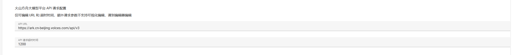

## Langbot

Github地址：https://github.com/RockChinQ/LangBot
官方文档：https://docs.langbot.app/

支持扩展、多模态-大模型原生即时通信机器人平台，适配所有主流消息平台

## **方舟**上的准备

1. 获取 API Key 点击[这里](https://console.volcengine.com/ark/region:ark+cn-beijing/apiKey)。
2. 开通方舟模型点击[这里](https://console.volcengine.com/ark/region:ark+cn-beijing/openManagement)。
3. 获取模型 ID 点击[这里](https://www.volcengine.com/docs/82379/1330310#%E6%96%87%E6%9C%AC%E7%94%9F%E6%88%90)。

## 部署及调用方舟

1. 根据官网指引完成LangBot和消息平台的部署
2. 打开 WebUI

- provide.json—模型接口秘钥：填写API Key 
- provide.json—大模型请求器：填写API地址：https://ark.cn-beijing.volces.com/api/v3/
- provide.json—将`所使用的模型名称`改为你想要使用的模型` name`

3. 打开data/metadata/llm-models.json 文件

   将需要的模型服务的配置改成

   "name":"获取模型 ID 点击[这里](https://www.volcengine.com/docs/82379/1330310#%E6%96%87%E6%9C%AC%E7%94%9F%E6%88%90)"

   "requester": "volcark-chat-completions",

   "token_mgr": "volcark"