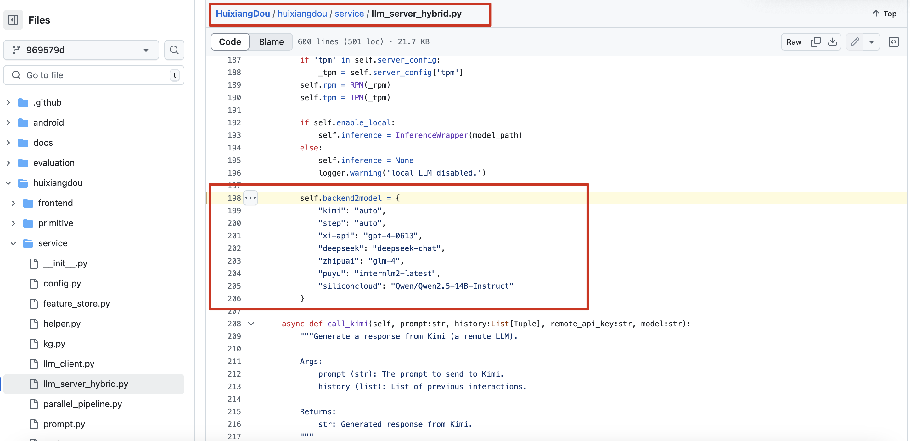
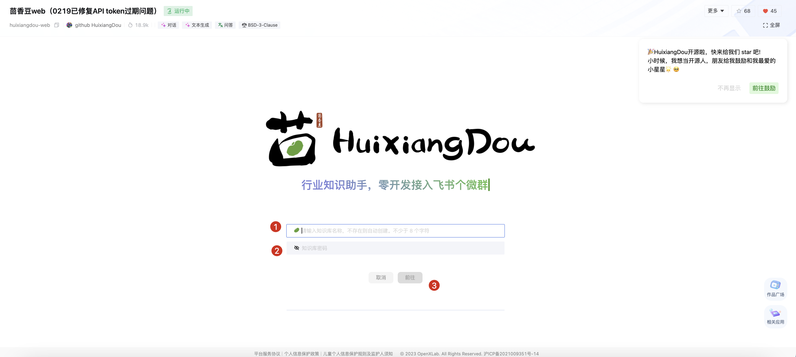

# 茴香豆
## 简介

https://openxlab.org.cn/apps/detail/tpoisonooo/huixiangdou-web
茴香豆是一个基于LLM的领域特定知识助手，能够处理群聊中的复杂场景，回答用户问题而不引起消息泛滥。它提供算法管道来回答技术问题，并且部署成本低，只需LLM模型满足4个特点就能回答大部分用户问题。茴香豆在运行的场景中能够处理各种问题，并且欢迎加入他们的微信群体验最新版本。
## **方舟**上的准备

1. 获取 API Key 点击[这里](https://console.volcengine.com/ark/region:ark+cn-beijing/apiKey)。
2. 开通方舟模型点击[这里](https://console.volcengine.com/ark/region:ark+cn-beijing/openManagement)。
3. 获取模型 ID 点击[这里](https://www.volcengine.com/docs/82379/1330310#%E6%96%87%E6%9C%AC%E7%94%9F%E6%88%90)。

## 调用方舟

### 调修改GitHub源码配置
可以通过修改源码来加入自己的llm api：

* 源码地址：

[https://github.com/InternLM/HuixiangDou/blob/969579dbc0ababb9c49b8120e3a1f38f95c69891/huixiangdou/service/llm_server_hybrid.py#L198](https://github.com/InternLM/HuixiangDou/blob/969579dbc0ababb9c49b8120e3a1f38f95c69891/huixiangdou/service/llm_server_hybrid.py#L198)

* 自定义API接口地址：https://ark.cn-beijing.volces.com/api/v3/chat/completions
* APIKEY：获取方舟的API Key，点击[这里](https://console.volcengine.com/ark/region:ark+cn-beijing/apiKey)。
* 模型：您需要模型对应的Model ID，点击[这里](https://www.volcengine.com/docs/82379/1330310#%E6%96%87%E6%9C%AC%E7%94%9F%E6%88%90)可查询。

## 使用技巧

### 制作自己的知识库并接入个人微信/飞书
第一次使用知识库时直接输入知识库名称和密码即可，点击发布则创建成功
> 知识库支持上传多份文件，您可以自定义符合需求的知识库。

### 
